# Streetrace Agent Runner - Architecture Document

**Views and Beyond Architecture Documentation**

---

## 1. System Design

### 1.1 C4 Context Diagram

The Streetrace Agent Runner operates within an ecosystem of users, external systems, and the Streetrace Portal cloud service.

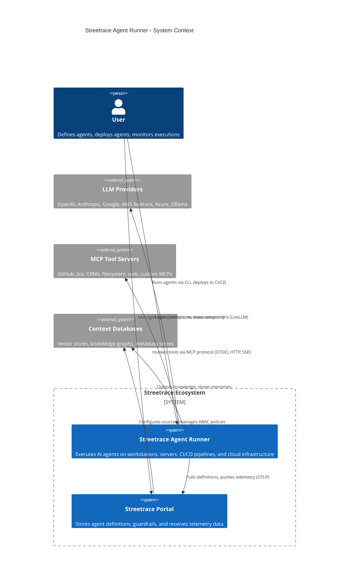
```mermaid
C4Context
    title Streetrace Agent Runner - System Context

    Person(user, "User", "Defines agents, deploys agents, monitors executions")

    System_Boundary(streetrace_system, "Streetrace Ecosystem") {
        System(runner, "Streetrace Agent Runner", "Executes AI agents on workstations, servers, CI/CD pipelines, and cloud infrastructure")
        System(portal, "Streetrace Portal", "Stores agent definitions, guardrails, and receives telemetry data")
    }

    System_Ext(llm_providers, "LLM Providers", "OpenAI, Anthropic, Google, AWS Bedrock, Azure, Ollama")
    System_Ext(mcp_tools, "MCP Tool Servers", "GitHub, Jira, CRMs, filesystem, web, custom MCPs")
    System_Ext(context_db, "Context Databases", "Vector stores, knowledge graphs, metadata stores")

    Rel(user, runner, "Runs agents via CLI, deploys to CI/CD")
    Rel(user, portal, "Manages agent definitions, views telemetry")
    Rel(runner, portal, "Pulls definitions, pushes telemetry (OTLP)")
    Rel(runner, llm_providers, "Sends prompts, receives completions (LiteLLM)")
    Rel(runner, mcp_tools, "Invokes tools via MCP protocol (STDIO, HTTP, SSE)")
    Rel(runner, context_db, "Queries knowledge, stores memories")
    Rel(portal, context_db, "Configures sources, manages ABAC policies")
```

### 1.2 C4 Container Diagram

The Streetrace Agent Runner is composed of multiple containers that work together to load, execute, and monitor AI agent workloads.


```mermaid
C4Container
    title Streetrace Agent Runner - Container Diagram

    Person(user, "User")

    System_Boundary(runner, "Streetrace Agent Runner") {
        Container(interactive_shell, "Interactive Shell", "Python, prompt_toolkit, Rich", "User interface for interactive agent sessions")
        Container(autonomous_runner, "Autonomous Runner", "Python", "Non-interactive single-prompt execution for CI/CD")
        Container(workload_loader, "Workload Loader", "Python", "Loads DSL, YAML, and Python agent definitions")
        Container(workload_runner, "Workload Runner", "Python, Google ADK", "Executes agent ReAct loops and manages events")
        Container(tool_provider, "Tool Provider", "Python", "Discovers and provides tools to agents")
        Container(session_manager, "Session Manager", "Python, JSON", "Manages conversation state and persistence")
        Container(observability, "Observability", "OpenTelemetry", "Traces agent runs via OTLP")
        Container(guardrails, "Guardrails", "Python, DSL handlers", "Validates inputs, outputs, and tool calls [TODO]")
        Container(shared_memory, "Shared Memory", "Python", "Cross-session knowledge management [TODO]")
        Container(context_knowledge, "Context Knowledge", "Python", "RAG integration with context databases [TODO]")
        Container(feedback_loops, "Feedback Loops", "Python", "Collects user satisfaction signals [TODO]")
        Container(chat_api, "Chat API", "Python, FastAPI", "OpenAI-compatible chat endpoint [TODO]")
        Container(a2a_server, "A2A Server", "Python", "Agent-to-Agent protocol server [TODO]")
        Container(mcp_server, "MCP Server", "Python", "Exposes agent as MCP tool server [TODO]")
    }

    System_Ext(portal, "Streetrace Portal")
    System_Ext(llm, "LLM Providers")
    System_Ext(mcp_tools, "MCP Tool Servers")

    Rel(user, interactive_shell, "Runs interactively")
    Rel(user, autonomous_runner, "Runs via CLI/CI")
    Rel(interactive_shell, workload_runner, "Uses shared Supervisor")
    Rel(autonomous_runner, workload_runner, "Uses shared Supervisor")
    Rel(workload_runner, workload_loader, "Loads agent via WorkloadManager")
    Rel(workload_loader, tool_provider, "Gets tools for workload")
    Rel(workload_runner, session_manager, "Manages session")
    Rel(workload_runner, guardrails, "Validates data flows")
    Rel(workload_runner, llm, "Sends prompts")
    Rel(tool_provider, mcp_tools, "Invokes MCP tools")
    Rel(observability, portal, "Pushes traces (OTLP)")
    Rel(workload_loader, portal, "Pulls definitions")
    Rel(shared_memory, context_knowledge, "Stores/retrieves memories")
```

---

## 2. Container Component Diagrams

### 2.1 Interactive Shell Components

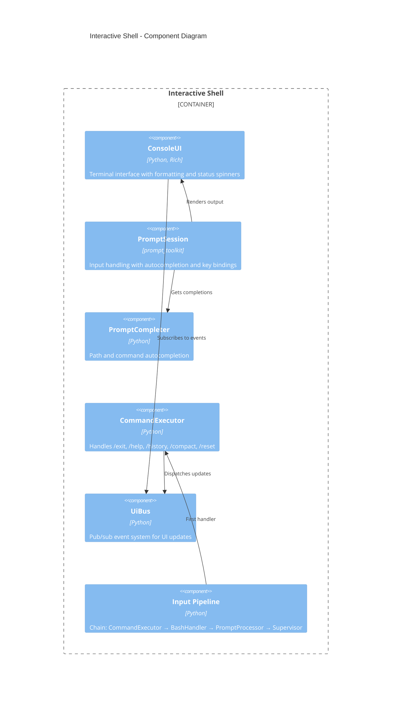
```mermaid
C4Component
    title Interactive Shell - Component Diagram

    Container_Boundary(interactive_shell, "Interactive Shell") {
        Component(console_ui, "ConsoleUI", "Python, Rich", "Terminal interface with formatting and status spinners")
        Component(prompt_session, "PromptSession", "prompt_toolkit", "Input handling with autocompletion and key bindings")
        Component(completer, "PromptCompleter", "Python", "Path and command autocompletion")
        Component(command_executor, "CommandExecutor", "Python", "Handles /exit, /help, /history, /compact, /reset")
        Component(ui_bus, "UiBus", "Python", "Pub/sub event system for UI updates")
        Component(input_pipeline, "Input Pipeline", "Python", "Chain: CommandExecutor → BashHandler → PromptProcessor → Supervisor")
    }

    Rel(prompt_session, completer, "Gets completions")
    Rel(prompt_session, console_ui, "Renders output")
    Rel(console_ui, ui_bus, "Subscribes to events")
    Rel(input_pipeline, command_executor, "First handler")
    Rel(command_executor, ui_bus, "Dispatches updates")
```

**Note:** The Input Pipeline's final handler is the Supervisor (Workload Runner), which is shared with the Autonomous Runner. Both entry points use the same execution infrastructure.

### 2.2 Autonomous Runner Components

The Autonomous Runner shares the same Workload Runner (Supervisor) as the Interactive Shell. The key difference is the entry flow - it processes a single prompt and exits rather than maintaining a conversation loop.

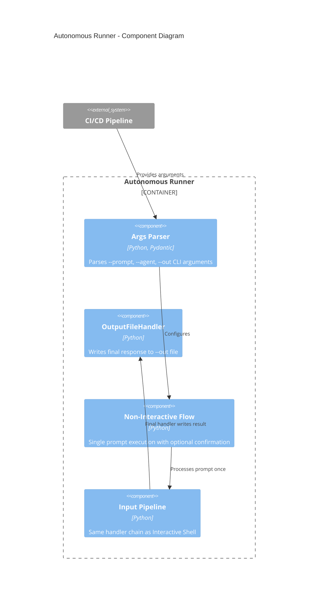
```mermaid
C4Component
    title Autonomous Runner - Component Diagram

    Container_Boundary(autonomous_runner, "Autonomous Runner") {
        Component(args_parser, "Args Parser", "Python, Pydantic", "Parses --prompt, --agent, --out CLI arguments")
        Component(output_handler, "OutputFileHandler", "Python", "Writes final response to --out file")
        Component(non_interactive_flow, "Non-Interactive Flow", "Python", "Single prompt execution with optional confirmation")
        Component(input_pipeline, "Input Pipeline", "Python", "Same handler chain as Interactive Shell")
    }

    System_Ext(ci_cd, "CI/CD Pipeline")

    Rel(ci_cd, args_parser, "Provides arguments")
    Rel(args_parser, non_interactive_flow, "Configures")
    Rel(non_interactive_flow, input_pipeline, "Processes prompt once")
    Rel(input_pipeline, output_handler, "Final handler writes result")
```

**Note:** The Input Pipeline includes the shared Supervisor (Workload Runner) which orchestrates the actual agent execution. See Section 2.4 for Workload Runner details.

### 2.3 Workload Loader Components

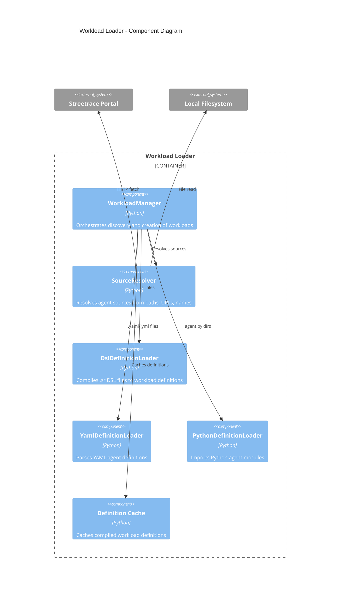
```mermaid
C4Component
    title Workload Loader - Component Diagram

    Container_Boundary(workload_loader, "Workload Loader") {
        Component(workload_manager, "WorkloadManager", "Python", "Orchestrates discovery and creation of workloads")
        Component(source_resolver, "SourceResolver", "Python", "Resolves agent sources from paths, URLs, names")
        Component(dsl_loader, "DslDefinitionLoader", "Python", "Compiles .sr DSL files to workload definitions")
        Component(yaml_loader, "YamlDefinitionLoader", "Python", "Parses YAML agent definitions")
        Component(python_loader, "PythonDefinitionLoader", "Python", "Imports Python agent modules")
        Component(definition_cache, "Definition Cache", "Python", "Caches compiled workload definitions")
    }

    System_Ext(portal, "Streetrace Portal")
    System_Ext(filesystem, "Local Filesystem")

    Rel(workload_manager, source_resolver, "Resolves sources")
    Rel(source_resolver, portal, "HTTP fetch")
    Rel(source_resolver, filesystem, "File read")
    Rel(workload_manager, dsl_loader, ".sr files")
    Rel(workload_manager, yaml_loader, ".yaml/.yml files")
    Rel(workload_manager, python_loader, "agent.py dirs")
    Rel(workload_manager, definition_cache, "Caches definitions")
```

### 2.4 Workload Runner Components

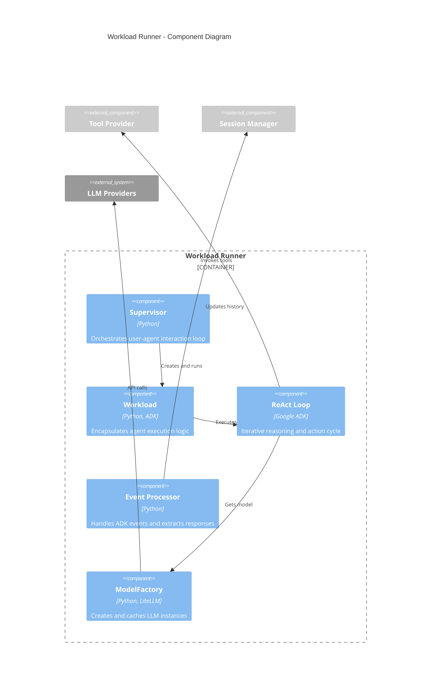
```mermaid
C4Component
    title Workload Runner - Component Diagram

    Container_Boundary(workload_runner, "Workload Runner") {
        Component(supervisor, "Supervisor", "Python", "Orchestrates user-agent interaction loop")
        Component(workload, "Workload", "Python, ADK", "Encapsulates agent execution logic")
        Component(react_loop, "ReAct Loop", "Google ADK", "Iterative reasoning and action cycle")
        Component(event_processor, "Event Processor", "Python", "Handles ADK events and extracts responses")
        Component(model_factory, "ModelFactory", "Python, LiteLLM", "Creates and caches LLM instances")
    }

    Component_Ext(tool_provider, "Tool Provider")
    Component_Ext(session_manager, "Session Manager")
    System_Ext(llm, "LLM Providers")

    Rel(supervisor, workload, "Creates and runs")
    Rel(workload, react_loop, "Executes")
    Rel(react_loop, model_factory, "Gets model")
    Rel(react_loop, tool_provider, "Invokes tools")
    Rel(model_factory, llm, "API calls")
    Rel(event_processor, session_manager, "Updates history")
```

### 2.5 Tool Provider Components

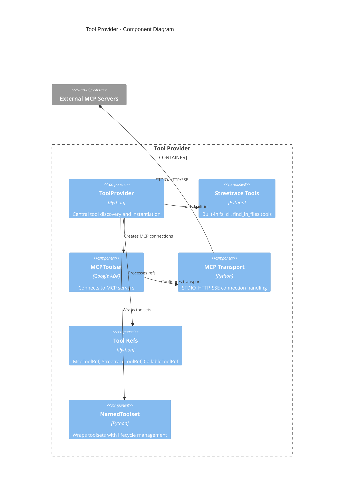
```mermaid
C4Component
    title Tool Provider - Component Diagram

    Container_Boundary(tool_provider, "Tool Provider") {
        Component(provider_core, "ToolProvider", "Python", "Central tool discovery and instantiation")
        Component(streetrace_tools, "Streetrace Tools", "Python", "Built-in fs, cli, find_in_files tools")
        Component(mcp_toolset, "MCPToolset", "Google ADK", "Connects to MCP servers")
        Component(mcp_transport, "MCP Transport", "Python", "STDIO, HTTP, SSE connection handling")
        Component(tool_refs, "Tool Refs", "Python", "McpToolRef, StreetraceToolRef, CallableToolRef")
        Component(named_toolset, "NamedToolset", "Python", "Wraps toolsets with lifecycle management")
    }

    System_Ext(mcp_servers, "External MCP Servers")

    Rel(provider_core, tool_refs, "Processes refs")
    Rel(provider_core, streetrace_tools, "Loads built-in")
    Rel(provider_core, mcp_toolset, "Creates MCP connections")
    Rel(mcp_toolset, mcp_transport, "Configures transport")
    Rel(mcp_transport, mcp_servers, "STDIO/HTTP/SSE")
    Rel(provider_core, named_toolset, "Wraps toolsets")
```

### 2.6 Session Manager Components

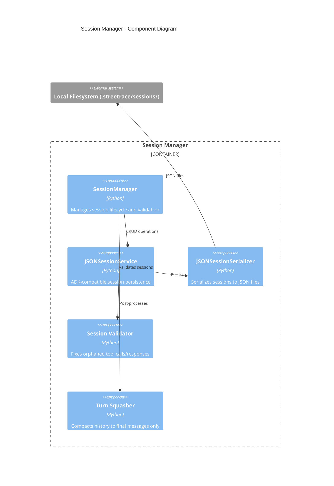
```mermaid
C4Component
    title Session Manager - Component Diagram

    Container_Boundary(session_manager, "Session Manager") {
        Component(manager_core, "SessionManager", "Python", "Manages session lifecycle and validation")
        Component(session_service, "JSONSessionService", "Python", "ADK-compatible session persistence")
        Component(json_serializer, "JSONSessionSerializer", "Python", "Serializes sessions to JSON files")
        Component(session_validator, "Session Validator", "Python", "Fixes orphaned tool calls/responses")
        Component(turn_squasher, "Turn Squasher", "Python", "Compacts history to final messages only")
    }

    System_Ext(filesystem, "Local Filesystem (.streetrace/sessions/)")

    Rel(manager_core, session_service, "CRUD operations")
    Rel(session_service, json_serializer, "Persists")
    Rel(json_serializer, filesystem, "JSON files")
    Rel(manager_core, session_validator, "Validates sessions")
    Rel(manager_core, turn_squasher, "Post-processes")
```

### 2.7 Observability Components

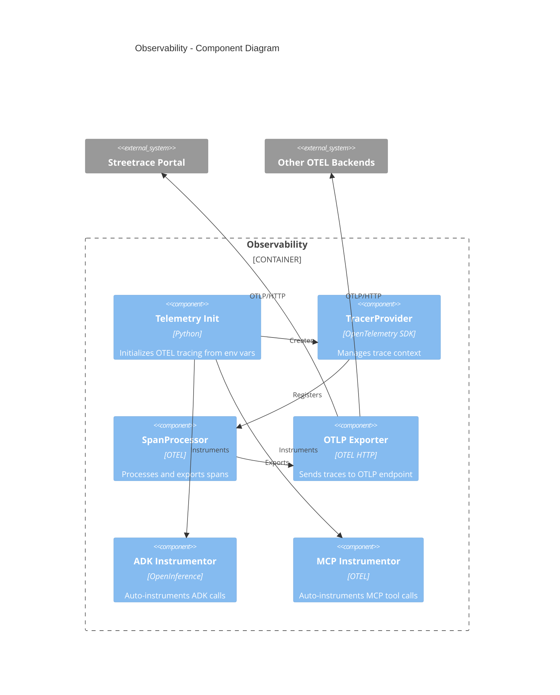
```mermaid
C4Component
    title Observability - Component Diagram

    Container_Boundary(observability, "Observability") {
        Component(telemetry_init, "Telemetry Init", "Python", "Initializes OTEL tracing from env vars")
        Component(tracer_provider, "TracerProvider", "OpenTelemetry SDK", "Manages trace context")
        Component(span_processor, "SpanProcessor", "OTEL", "Processes and exports spans")
        Component(otlp_exporter, "OTLP Exporter", "OTEL HTTP", "Sends traces to OTLP endpoint")
        Component(adk_instrumentor, "ADK Instrumentor", "OpenInference", "Auto-instruments ADK calls")
        Component(mcp_instrumentor, "MCP Instrumentor", "OTEL", "Auto-instruments MCP tool calls")
    }

    System_Ext(portal, "Streetrace Portal")
    System_Ext(other_otel, "Other OTEL Backends")

    Rel(telemetry_init, tracer_provider, "Creates")
    Rel(tracer_provider, span_processor, "Registers")
    Rel(span_processor, otlp_exporter, "Exports")
    Rel(otlp_exporter, portal, "OTLP/HTTP")
    Rel(otlp_exporter, other_otel, "OTLP/HTTP")
    Rel(telemetry_init, adk_instrumentor, "Instruments")
    Rel(telemetry_init, mcp_instrumentor, "Instruments")
```

### 2.8 Guardrails Components (TODO)

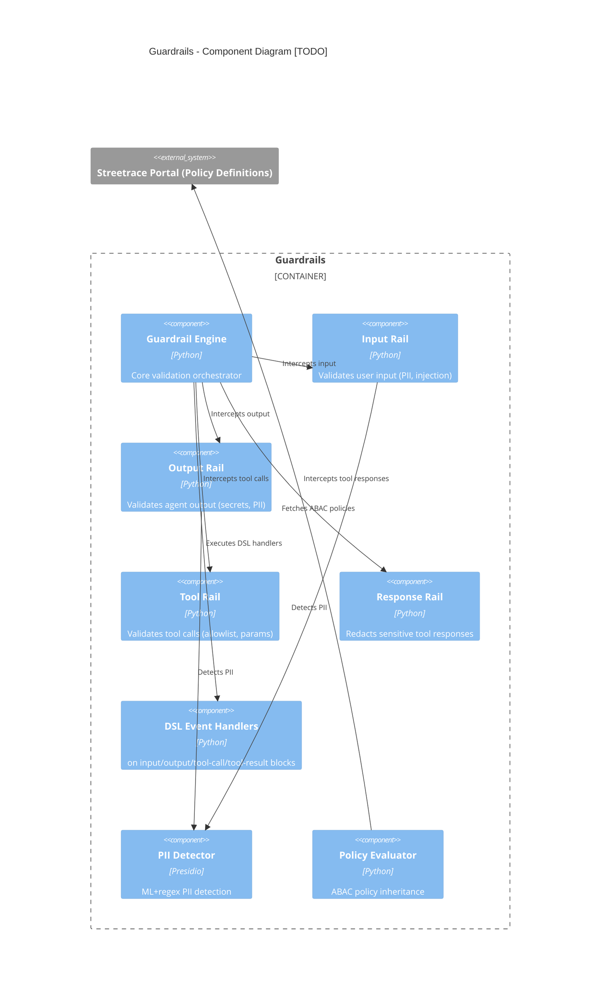
```mermaid
C4Component
    title Guardrails - Component Diagram [TODO]

    Container_Boundary(guardrails, "Guardrails") {
        Component(guardrail_engine, "Guardrail Engine", "Python", "Core validation orchestrator")
        Component(input_rail, "Input Rail", "Python", "Validates user input (PII, injection)")
        Component(output_rail, "Output Rail", "Python", "Validates agent output (secrets, PII)")
        Component(tool_rail, "Tool Rail", "Python", "Validates tool calls (allowlist, params)")
        Component(response_rail, "Response Rail", "Python", "Redacts sensitive tool responses")
        Component(dsl_handlers, "DSL Event Handlers", "Python", "on input/output/tool-call/tool-result blocks")
        Component(pii_detector, "PII Detector", "Presidio", "ML+regex PII detection")
        Component(policy_evaluator, "Policy Evaluator", "Python", "ABAC policy inheritance")
    }

    System_Ext(portal, "Streetrace Portal (Policy Definitions)")

    Rel(guardrail_engine, input_rail, "Intercepts input")
    Rel(guardrail_engine, output_rail, "Intercepts output")
    Rel(guardrail_engine, tool_rail, "Intercepts tool calls")
    Rel(guardrail_engine, response_rail, "Intercepts tool responses")
    Rel(guardrail_engine, dsl_handlers, "Executes DSL handlers")
    Rel(input_rail, pii_detector, "Detects PII")
    Rel(output_rail, pii_detector, "Detects PII")
    Rel(policy_evaluator, portal, "Fetches ABAC policies")
```

### 2.9 Shared Memory Components (TODO)

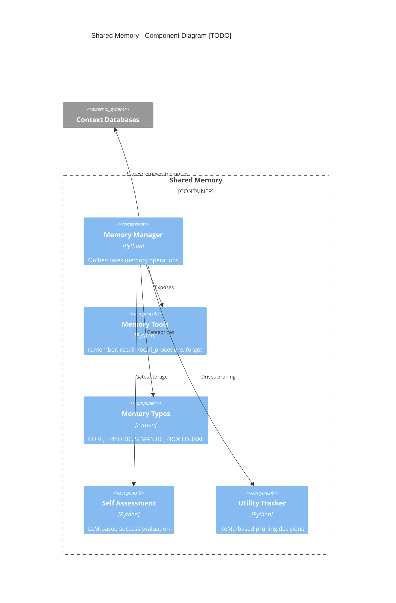
```mermaid
C4Component
    title Shared Memory - Component Diagram [TODO]

    Container_Boundary(shared_memory, "Shared Memory") {
        Component(memory_manager, "Memory Manager", "Python", "Orchestrates memory operations")
        Component(memory_tools, "Memory Tools", "Python", "remember, recall, recall_procedure, forget")
        Component(memory_types, "Memory Types", "Python", "CORE, EPISODIC, SEMANTIC, PROCEDURAL")
        Component(self_assessment, "Self Assessment", "Python", "LLM-based success evaluation")
        Component(utility_tracker, "Utility Tracker", "Python", "ReMe-based pruning decisions")
    }

    System_Ext(context_db, "Context Databases")

    Rel(memory_manager, memory_tools, "Exposes")
    Rel(memory_manager, memory_types, "Categorizes")
    Rel(memory_manager, context_db, "Stores/retrieves memories")
    Rel(memory_manager, self_assessment, "Gates storage")
    Rel(memory_manager, utility_tracker, "Drives pruning")
```

### 2.10 Context Knowledge Components (TODO)

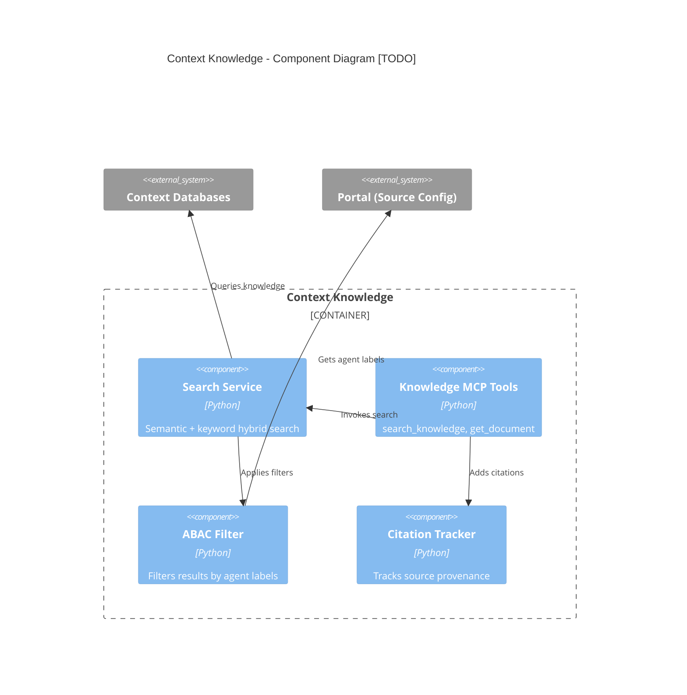
```mermaid
C4Component
    title Context Knowledge - Component Diagram [TODO]

    Container_Boundary(context_knowledge, "Context Knowledge") {
        Component(search_service, "Search Service", "Python", "Semantic + keyword hybrid search")
        Component(mcp_tools, "Knowledge MCP Tools", "Python", "search_knowledge, get_document")
        Component(abac_filter, "ABAC Filter", "Python", "Filters results by agent labels")
        Component(citation_tracker, "Citation Tracker", "Python", "Tracks source provenance")
    }

    System_Ext(context_db, "Context Databases")
    System_Ext(portal, "Portal (Source Config)")

    Rel(search_service, context_db, "Queries knowledge")
    Rel(search_service, abac_filter, "Applies filters")
    Rel(mcp_tools, search_service, "Invokes search")
    Rel(mcp_tools, citation_tracker, "Adds citations")
    Rel(abac_filter, portal, "Gets agent labels")
```

---

## 3. Streetrace Cloud Integration

### 3.1 Portal Involvement Overview

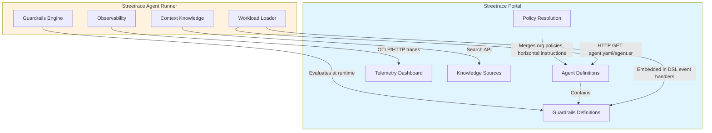
```mermaid
flowchart TB
    subgraph Portal["Streetrace Portal"]
        AD[Agent Definitions]
        GD[Guardrails Definitions]
        TD[Telemetry Dashboard]
        KS[Knowledge Sources]
        PR[Policy Resolution]
    end

    subgraph Runner["Streetrace Agent Runner"]
        WL[Workload Loader]
        GE[Guardrails Engine]
        OB[Observability]
        CK[Context Knowledge]
    end

    WL -->|"HTTP GET agent.yaml/agent.sr"| AD
    WL -->|"Embedded in DSL event handlers"| GD
    AD -.->|"Contains"| GD
    PR -->|"Merges org policies, horizontal instructions"| AD
    GE -->|"Evaluates at runtime"| GD
    OB -->|"OTLP/HTTP traces"| TD
    CK -->|"Search API"| KS

    style Portal fill:#e1f5fe
    style Runner fill:#fff3e0
```

**Resolution Logic:** When the Portal serves an agent definition, it performs complex resolution under the hood:
- **Org-level policies**: Default guardrails applied to all agents in the organization
- **Horizontal instructions**: Cross-cutting concerns (e.g., "always include security context")
- **Agent-specific overrides**: DSL event handlers defined in the agent itself (restrict-only semantics)

The Workload Loader receives the fully-resolved definition, with guardrails embedded as DSL event handlers (`on input do`, `after tool-result do`, etc.).

### 3.2 Data Flows

| Flow | Direction | Protocol | Description |
|------|-----------|----------|-------------|
| Agent Definitions | Portal → Runner | HTTP | YAML/DSL agent definitions fetched by URL |
| Guardrails Policies | Portal → Runner | HTTP | ABAC policies with attribute conditions |
| Telemetry | Runner → Portal | OTLP/HTTP | Full traces including LLM calls, tool invocations, events |
| Knowledge Search | Runner → Portal | HTTP | RAG queries against indexed context databases |

### 3.3 Telemetry Span Structure

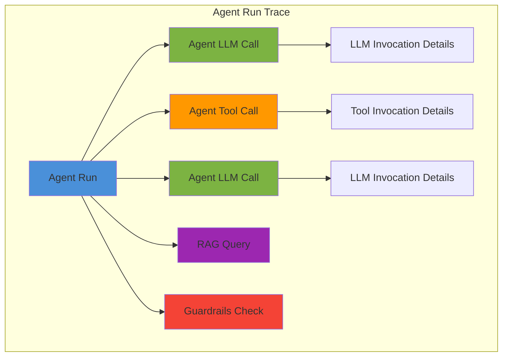
```mermaid
flowchart TB
    subgraph Trace["Agent Run Trace"]
        ROOT[Agent Run]

        ROOT --> LLM1[Agent LLM Call]
        LLM1 --> LLM1D[LLM Invocation Details]

        ROOT --> TOOL1[Agent Tool Call]
        TOOL1 --> TOOL1D[Tool Invocation Details]

        ROOT --> LLM2[Agent LLM Call]
        LLM2 --> LLM2D[LLM Invocation Details]

        ROOT --> RAG[RAG Query]
        ROOT --> GUARD[Guardrails Check]
    end

    style ROOT fill:#4a90d9
    style LLM1 fill:#7cb342
    style LLM2 fill:#7cb342
    style TOOL1 fill:#ff9800
    style RAG fill:#9c27b0
    style GUARD fill:#f44336
```

**Span Types:**
- **Agent Run**: Root span encompassing the entire workload execution
- **Agent LLM Call**: High-level LLM interaction within the ReAct loop
- **LLM Invocation Details**: Low-level API call metrics (tokens, latency, model)
- **Agent Tool Call**: High-level tool invocation decision
- **Tool Invocation Details**: MCP protocol execution, parameters, response
- **RAG Query**: Knowledge retrieval operations (TODO)
- **Guardrails Check**: Input/output/tool validation spans (TODO)

---

## 4. Integration Architecture

### 4.1 External Integration Patterns

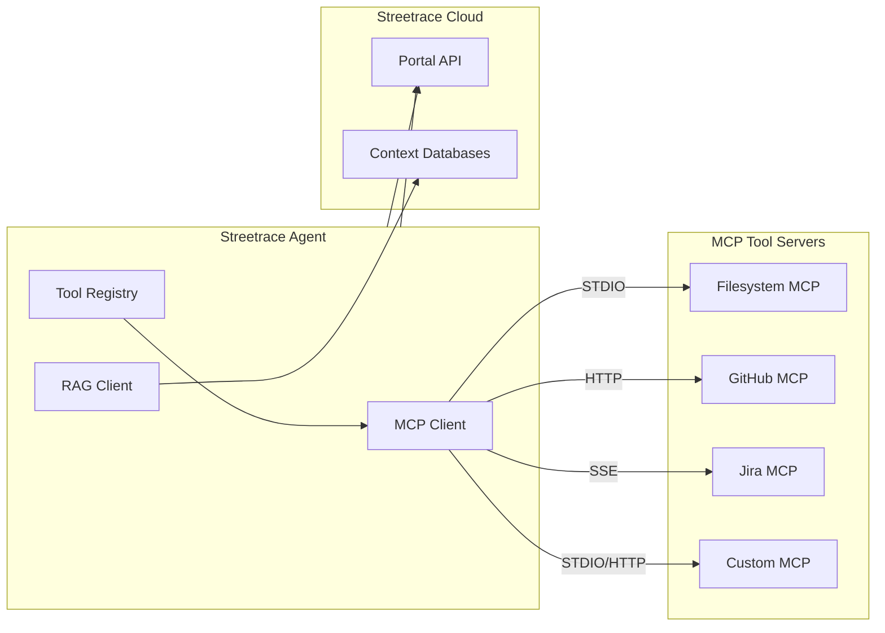
```mermaid
flowchart LR
    subgraph Agent["Streetrace Agent"]
        TR[Tool Registry]
        MCP[MCP Client]
        RAG[RAG Client]
    end

    subgraph MCP_Servers["MCP Tool Servers"]
        FS[Filesystem MCP]
        GH[GitHub MCP]
        JI[Jira MCP]
        CU[Custom MCP]
    end

    subgraph Cloud["Streetrace Cloud"]
        PO[Portal API]
        CD[Context Databases]
    end

    TR --> MCP
    MCP -->|STDIO| FS
    MCP -->|HTTP| GH
    MCP -->|SSE| JI
    MCP -->|STDIO/HTTP| CU

    RAG --> CD

    Agent -->|Definitions| PO
    Agent -->|"Telemetry (OTLP)"| PO
```

### 4.2 MCP Integration

**Supported Transports:**
- **STDIO**: Local process communication (most common)
- **HTTP**: Streamable HTTP for remote servers
- **SSE**: Server-Sent Events for real-time updates

**Tool Definitions in DSL:**
```streetrace
# Built-in Streetrace tools
tool fs = builtin streetrace.fs
tool cli = builtin streetrace.cli

# MCP server (STDIO transport via npx)
tool github = mcp "npx -y @anthropics/mcp-server-github"

# MCP server with authentication
tool jira = mcp "https://jira.example.com/mcp" with auth bearer "${env:JIRA_TOKEN}"

# Long-form MCP definition with headers
tool confluence:
    type: mcp
    url: "https://confluence.example.com/mcp"
    headers:
        Authorization: "Bearer ${env:CONFLUENCE_TOKEN}"
        X-Custom-Header: "value"
```

**Tool Groups (TODO):**
Tool groups allow defining subsets of tools with specific access patterns:
```streetrace
# Readonly filesystem access (expands to read_file, list_directory, find_in_files)
tool fs = builtin streetrace.fs_readonly

# Write-enabled filesystem (expands to full fs toolset)
tool fs = builtin streetrace.fs

# Safe CLI subset (expands to pre-approved commands only)
tool cli = builtin streetrace.cli_safe
```

**Note:** The current DSL does not support selecting specific functions from an MCP server. All tools exposed by the server are made available to the agent. Fine-grained tool filtering is planned for a future release.

### 4.3 Context Database Integration (TODO)

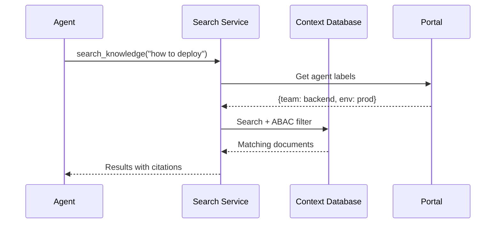
```mermaid
sequenceDiagram
    participant A as Agent
    participant S as Search Service
    participant CD as Context Database
    participant P as Portal

    A->>S: search_knowledge("how to deploy")
    S->>P: Get agent labels
    P-->>S: {team: backend, env: prod}
    S->>CD: Search + ABAC filter
    CD-->>S: Matching documents
    S-->>A: Results with citations
```

---

## 5. Infrastructure

### 5.1 Deployment Topology

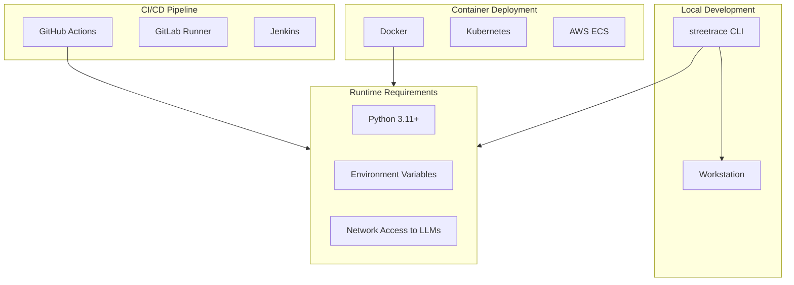
```mermaid
flowchart TB
    subgraph Local["Local Development"]
        CLI[streetrace CLI]
        WS[Workstation]
        CLI --> WS
    end

    subgraph CICD["CI/CD Pipeline"]
        GHA[GitHub Actions]
        GR[GitLab Runner]
        JK[Jenkins]
    end

    subgraph Container["Container Deployment"]
        DK[Docker]
        K8S[Kubernetes]
        ECS[AWS ECS]
    end

    subgraph Requirements["Runtime Requirements"]
        PY[Python 3.11+]
        ENV[Environment Variables]
        NET[Network Access to LLMs]
    end

    CLI --> Requirements
    GHA --> Requirements
    DK --> Requirements
```

### 5.2 Deployment Scenarios

| Scenario | Method | Session Persistence | Use Case |
|----------|--------|---------------------|----------|
| Local Interactive | `streetrace --model=gpt-4o` | `.streetrace/sessions/` | Development, exploration |
| CI/CD Single Prompt | `streetrace --prompt "..." --out result.md` | Ephemeral | Code review, PR comments |
| Server Deployment | `streetrace --session-id=$ID --app-name=bot` | Persistent across runs | Production agents |
| Docker | `docker run streetrace ...` | Volume mount | Isolated execution |
| GitHub Actions | `uses: streetrace-ai/github-action` | Run-scoped | Automated workflows |

### 5.3 Runtime Dependencies

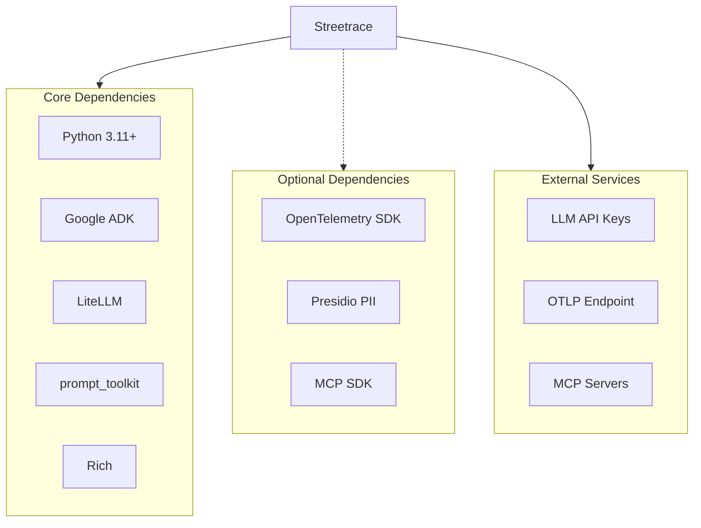
```mermaid
graph TB
    subgraph Core["Core Dependencies"]
        PY[Python 3.11+]
        ADK[Google ADK]
        LLML[LiteLLM]
        PT[prompt_toolkit]
        RICH[Rich]
    end

    subgraph Optional["Optional Dependencies"]
        OTEL[OpenTelemetry SDK]
        PRES[Presidio PII]
        MCP[MCP SDK]
    end

    subgraph External["External Services"]
        LLM[LLM API Keys]
        OTLP[OTLP Endpoint]
        MCPS[MCP Servers]
    end

    SR[Streetrace] --> Core
    SR -.-> Optional
    SR --> External
```

---

## 6. Security Architecture

### 6.1 Security Principles

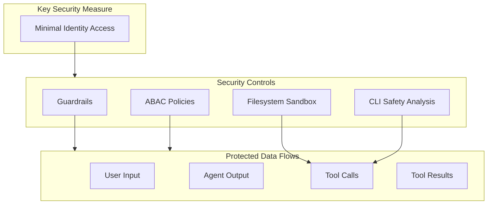
```mermaid
flowchart TB
    subgraph Principle["Key Security Measure"]
        MI[Minimal Identity Access]
    end

    subgraph Controls["Security Controls"]
        GR[Guardrails]
        FS[Filesystem Sandbox]
        CLI[CLI Safety Analysis]
        ABAC[ABAC Policies]
    end

    subgraph Flows["Protected Data Flows"]
        IN[User Input]
        OUT[Agent Output]
        TC[Tool Calls]
        TR[Tool Results]
    end

    MI --> Controls
    GR --> Flows
    FS --> TC
    CLI --> TC
    ABAC --> Flows
```

### 6.2 Guardrails Security Model (TODO)

**Five Interception Points:**

| Rail | Timing | Protection |
|------|--------|------------|
| Input Rail | On user input | Block prompt injection, mask PII |
| Instruction Rail | Before LLM call | Validate system prompts |
| Tool Rail | Before tool call | Allowlist/denylist, param validation |
| Response Rail | After tool response | Redact secrets, sensitive data |
| Output Rail | Before user display | Block PII leakage, enforce policies |

### 6.3 Filesystem Security

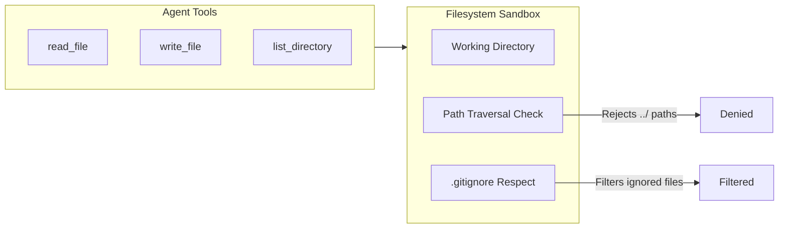
```mermaid
flowchart LR
    subgraph Agent["Agent Tools"]
        RF[read_file]
        WF[write_file]
        LD[list_directory]
    end

    subgraph Sandbox["Filesystem Sandbox"]
        WD[Working Directory]
        PT[Path Traversal Check]
        GI[.gitignore Respect]
    end

    Agent --> Sandbox
    PT -->|Rejects ../ paths| X[Denied]
    GI -->|Filters ignored files| F[Filtered]
```

### 6.4 CLI Safety

The `cli_safety.py` module analyzes shell commands before execution:

- **Dangerous Command Detection**: Detects `rm -rf`, `sudo`, destructive git operations
- **Argument Sanitization**: Validates command arguments
- **User Confirmation**: Prompts for approval on risky commands

### 6.5 ABAC Access Control (TODO)

```mermaid
flowchart TB
    subgraph Attributes["Agent Attributes"]
        AL[Labels: team, env, project]
        AR[Roles: admin, developer]
    end

    subgraph Policies["ABAC Policies"]
        OP[Org Policy]
        TP[Team Policy]
        AP[Agent Policy]
    end

    subgraph Resources["Protected Resources"]
        KN[Knowledge Sources]
        MM[Shared Memory]
        TL[Tools]
    end

    Attributes --> Policies
    Policies -->|"Restrict only (cannot expand)"| Resources
```

---

## 7. Data Architecture

### 7.1 Data Domain Overview

```mermaid
flowchart TB
    subgraph SessionData["Session Data"]
        CS[Conversation State]
        EH[Event History]
        TC[Tool Call Records]
    end

    subgraph ContextData["Context Knowledge (TODO)"]
        VS[Vector Store]
        KG[Knowledge Graph]
        MD[Metadata]
    end

    subgraph TelemetryData["Telemetry Data"]
        TR[Traces]
        SP[Spans]
        MT[Metrics]
    end

    subgraph ControlData["Control Data (TODO)"]
        GR[Guardrail Policies]
        AB[ABAC Rules]
        VL[Violation Logs]
    end

    Agent[Agent Execution] --> SessionData
    Agent --> ContextData
    Agent --> TelemetryData
    Agent --> ControlData
```

### 7.2 Session Management

**Storage Location:** `.streetrace/sessions/{app_name}/{user_id}/{session_id}.json`

**Session Lifecycle:**
```mermaid
stateDiagram-v2
    [*] --> Created: get_or_create_session()
    Created --> Active: First message
    Active --> Active: ReAct iterations
    Active --> Validated: validate_session()
    Validated --> Squashed: post_process()
    Squashed --> Active: Next user message
    Active --> [*]: /reset or new session
```

**Session Trimming:**
- Maximum 20 tool call/response pairs retained
- Older pairs automatically pruned on each interaction
- Final messages preserved via turn squashing

### 7.3 Context Knowledge Data Model (TODO)

TBD.

### 7.4 Shared Memory Data Model (TODO)

TBD.

### 7.5 Telemetry Data

**Trace Attributes:**
- `streetrace.workload.name`: Agent name
- `streetrace.workload.format`: DSL, YAML, or Python
- `streetrace.workload.identifier`: Source path or URL
- `streetrace.binary.version`: Streetrace version

**Instrumented Components:**
- Google ADK calls (via OpenInference)
- MCP tool calls (via OTEL MCP Instrumentor)
- LLM API calls (via LiteLLM)

### 7.6 Guardrail Violation Logs (TODO)

TBD.

---

## Appendix A: DSL Event Handlers

The Streetrace DSL supports event handlers for guardrail implementation:

```
event_handler: event_timing event_type "do" handler_body "end"

event_timing: "on" | "after"
event_type: "start" | "input" | "output" | "tool-call" | "tool-result"

guardrail_action: mask_action | block_action | warn_action | retry_action
```

**Example:**
```streetrace
on input do
    mask pii
    block if $input contains "api_key"
end

after tool-result do
    mask secrets
    warn if $tool_result.guardrails.passed == false
end
```

---

## Appendix B: Glossary

| Term | Definition |
|------|------------|
| **Workload** | The executable unit that encapsulates an agent's logic, tools, and configuration |
| **ReAct Loop** | Reasoning + Acting cycle where agent reasons about task, takes actions, observes results |
| **MCP** | Model Context Protocol - standard for tool integration |
| **A2A** | Agent-to-Agent protocol for inter-agent communication |
| **ABAC** | Attribute-Based Access Control |
| **DSL** | Domain-Specific Language for agent definition (`.sr` files) |
| **Rail** | A guardrail interception point in the agent lifecycle |

---

*Document Version: 1.0*
*Last Updated: 2025-01-26*
