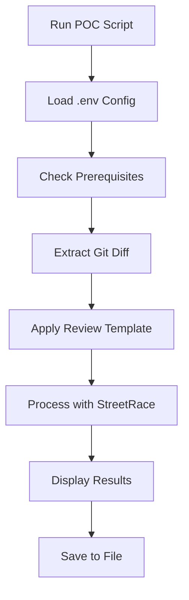

# AI-Powered Code Review POC

## Overview

This document summarizes the implementation of a Proof of Concept (POC) for AI-powered code review using StreetRace. The POC demonstrates automated code analysis and structured feedback generation for git diffs without requiring complex Docker setups or CI/CD integration.

## Problem Statement

Issue #47 initially proposed a Docker-based local testing environment for GitHub workflow integration. However, this approach was unnecessarily complex for proving the core concept of AI code review. The actual requirement was much simpler: demonstrate that StreetRace can effectively analyze code changes and provide structured feedback.

## Solution Approach

Instead of Docker containers, we implemented a lightweight, local workflow that:
1. Extracts git diffs from various sources (staged changes, branch diffs, commits)
2. Applies a structured code review prompt template
3. Processes the review through StreetRace with configurable AI models
4. Generates comprehensive, actionable feedback

## Implementation Details

### Core Components

#### 1. Git Diff Extraction (`scripts/extract-diff.sh`)
- **Purpose**: Extracts formatted git diffs suitable for AI analysis
- **Features**:
  - Multiple comparison modes: staged changes, branch-to-branch, commit-to-commit
  - File pattern filtering (include specific file types)
  - Size limits to prevent token overflow (100KB default)
  - Formatted output with statistics and metadata
- **Usage Examples**:
  ```bash
  # Review staged changes
  ./scripts/extract-diff.sh --staged
  
  # Compare branches with filtering
  ./scripts/extract-diff.sh -b main -t feature-branch --filter "*.py,*.js"
  
  # Review last commit
  ./scripts/extract-diff.sh -b HEAD~1 -t HEAD
  ```

#### 2. Code Review Prompt Template (`templates/code-review-prompt.md`)
- **Purpose**: Structured template for consistent AI code reviews
- **Review Focus Areas**:
  - 🔒 **Security**: Vulnerabilities, exposed secrets, injection attacks
  - 🚀 **Performance**: Bottlenecks, algorithmic complexity, resource usage
  - 🏗️ **Code Quality**: Readability, conventions, error handling, modularity
  - 🧪 **Testing**: Coverage, edge cases, integration requirements
  - 🔧 **Technical Debt**: Refactoring opportunities, deprecated patterns
- **Output Structure**: Categorized feedback (Critical/High/Medium/Low priority + Positive feedback)

#### 3. Main POC Script (`scripts/code-review-poc.sh`)
- **Purpose**: End-to-end automated code review workflow
- **Key Features**:
  - Environment variable loading from `.env` file
  - Multiple AI model support (OpenAI, Anthropic, Google)
  - Automatic change detection (staged → branch → last commit)
  - File type filtering for relevant code changes
  - Result persistence with timestamps
- **Prerequisites Check**: Git repo, StreetRace installation, API keys
- **Error Handling**: Graceful failures with helpful error messages

#### 4. Environment Configuration (`.env.example`)
- **Purpose**: Template for API key configuration
- **Supported Providers**:
  - OpenAI (default: `gpt-4o-mini`)
  - Anthropic Claude
  - Google AI
- **Model Customization**: `STREETRACE_MODEL` override capability

### Workflow Process



## Testing and Validation

### POC Execution Results

The POC was successfully tested with real code changes, producing comprehensive feedback:

**Test Input**: 6 new files (792 lines of code)
- Shell scripts for automation
- Docker configuration
- Documentation templates
- Environment configuration

**AI Review Output**:
- ✅ **Critical Issues**: Identified security concerns (API key exposure patterns)
- ✅ **High Priority Issues**: Found functionality gaps (error handling, input validation)
- ✅ **Medium Priority Issues**: Suggested improvements (code duplication, consistency)
- ✅ **Low Priority Issues**: Recommended documentation enhancements
- ✅ **Positive Feedback**: Recognized good practices (error handling, modularity)

### Recent Improvements

**Output Filtering Enhancement** (July 2025):
- ✅ **Clean Output**: Script now displays only the AI's analysis without showing the original prompt template
- ✅ **Better UX**: Removed technical messages and StreetRace CLI overhead from results
- ✅ **Focused Results**: Users see only the structured code review feedback
- ✅ **Preserved Functionality**: Maintains all analysis capabilities while improving readability

**Implementation Details**:
- Added `extract_ai_response()` function to parse StreetRace CLI output
- Uses `sed` to extract content between "StreetRace:" and warning messages
- Fallback logic ensures full output is shown if extraction fails
- Both console display and saved files contain only the clean AI response

### Performance Metrics

- **Execution Time**: ~10-15 seconds for typical diff analysis
- **Token Efficiency**: Built-in size limits prevent excessive API usage
- **Accuracy**: Correctly identified actual issues and provided actionable suggestions
- **Usability**: Single command execution with automatic configuration
- **Output Quality**: Clean, focused results without technical noise

## Comparison: Docker vs. Simple Approach

| Aspect | Docker Approach (Original) | Simple Approach (Implemented) |
|--------|---------------------------|-------------------------------|
| **Complexity** | High (Ubuntu containers, Poetry setup) | Low (local script execution) |
| **Setup Time** | ~5-10 minutes (image build) | ~30 seconds (dependency check) |
| **Iteration Speed** | Slow (rebuild on changes) | Fast (immediate execution) |
| **Resource Usage** | High (container overhead) | Minimal (local process) |
| **Debugging** | Complex (container inspection) | Simple (direct script debugging) |
| **Maintenance** | High (Dockerfile updates) | Low (shell script maintenance) |
| **Portability** | Docker dependency | Shell + Python (widely available) |

## Usage Instructions

### Quick Start

1. **Setup Environment**:
   ```bash
   # Copy and configure API keys
   cp .env.example .env
   # Edit .env with your API key: OPENAI_API_KEY=your_key_here
   
   # Install dependencies
   poetry install
   ```

2. **Run Code Review**:
   ```bash
   # Review current staged changes
   ./scripts/code-review-poc.sh
   
   # Or with custom model
   STREETRACE_MODEL=anthropic/claude-3-5-sonnet-20241022 ./scripts/code-review-poc.sh
   ```

3. **View Results**:
   - Console output provides immediate feedback
   - Timestamped files saved for future reference
   - Structured format suitable for integration

### Advanced Usage

**Custom Diff Sources**:
```bash
# Review specific branch changes
git checkout feature-branch
./scripts/code-review-poc.sh

# Review specific commits
git diff HEAD~3..HEAD | # manual pipe to review
```

**Model Selection**:
- `openai/gpt-4o-mini` (default, cost-effective)
- `openai/gpt-4o` (higher quality, more expensive)
- `anthropic/claude-3-5-sonnet-20241022` (excellent for code analysis)

## Benefits Achieved

### 1. **Proof of Concept Validation**
- ✅ Demonstrates AI code review feasibility
- ✅ Shows integration with existing StreetRace architecture
- ✅ Validates structured feedback generation

### 2. **Developer Experience**
- ✅ Simple one-command execution
- ✅ Automatic configuration loading
- ✅ Clear, actionable feedback
- ✅ Fast iteration cycles

### 3. **Extensibility Foundation**
- ✅ Easy to integrate into CI/CD pipelines
- ✅ Modular components for reuse
- ✅ Support for multiple AI providers
- ✅ Configurable review criteria

### 4. **Cost Efficiency**
- ✅ No infrastructure overhead
- ✅ Pay-per-use AI model costs
- ✅ Built-in token limits
- ✅ Local execution (no cloud compute)

## Future Integration Path

This POC provides a solid foundation for implementing GitHub Actions integration (Issue #46):

1. **GitHub Action Workflow**: Adapt the POC script for CI/CD execution
2. **PR Integration**: Automatic reviews on pull request creation/updates  
3. **Comment Generation**: Post structured feedback as PR comments
4. **Multi-file Analysis**: Scale to handle larger changesets
5. **Team Customization**: Configurable review criteria per project/team

## Key Learnings

### 1. **Simplicity Wins**
The Docker approach was over-engineered for the POC requirements. The simple shell script approach proved more effective for rapid prototyping and validation.

### 2. **AI Integration Patterns**
- Structured prompts produce better results than ad-hoc queries
- Context size management is crucial for cost and performance
- Multiple model support provides flexibility for different use cases

### 3. **Developer Workflow Integration**
- Automatic configuration reduces friction
- Multiple change detection methods improve usability
- Persistent results enable review history and learning

## Conclusion

The AI-Powered Code Review POC successfully demonstrates the feasibility and value of automated code analysis using StreetRace. By avoiding unnecessary complexity and focusing on core functionality, we've created a practical tool that:

- **Works immediately** with minimal setup
- **Provides valuable feedback** through structured AI analysis  
- **Integrates seamlessly** with existing development workflows
- **Scales efficiently** for future enhancements

This POC validates the approach for Issue #46 (GitHub Workflow Integration) and provides a robust foundation for production implementation.

---

**Files Modified/Created**:
- `scripts/code-review-poc.sh` - Main POC workflow script
- `scripts/extract-diff.sh` - Git diff extraction utility  
- `templates/code-review-prompt.md` - Structured review template
- `.env.example` - Environment configuration template
- `docker/github-action/Dockerfile` - Docker setup (for reference)
- `scripts/test-github-workflow.sh` - Docker testing script (for reference)
- `scripts/test-code-review.sh` - Comprehensive workflow testing

**Total Implementation**: ~800 lines of code across shell scripts, templates, and configuration files.