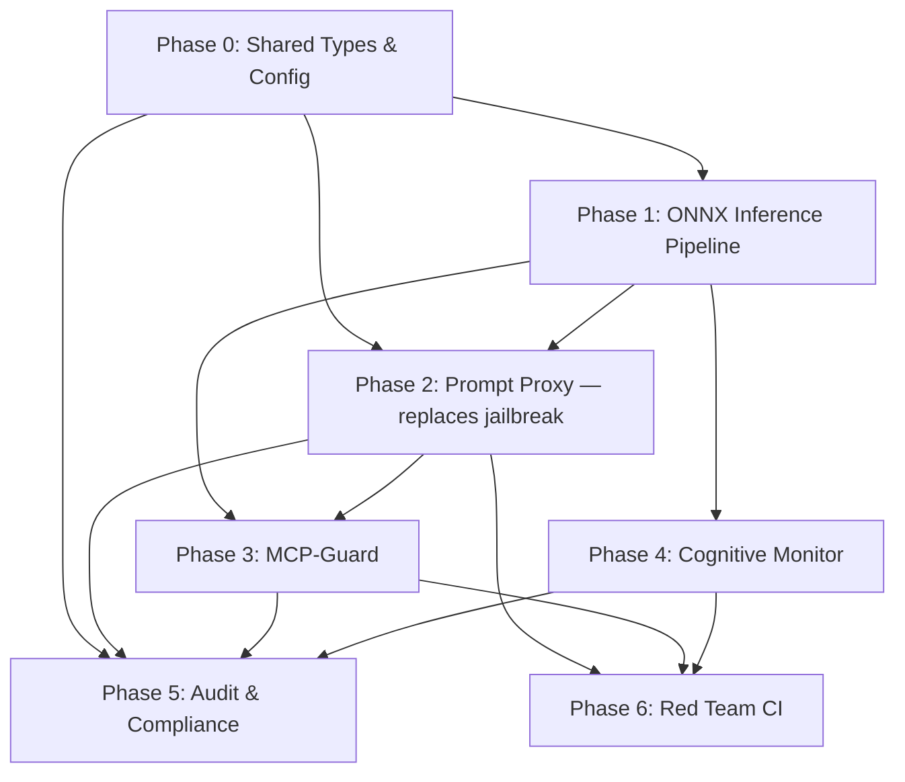

# RFC-020 Implementation Plan: Enterprise Guardrails

## Overview

This plan implements the Triple-Proxy guardrails architecture from
[RFC-020](../../../rfc/rfc/020-enterprise-guardrails.md), organized as seven
TDD-style phases matching the design documents plus a preparatory phase for
shared types and configuration.

Each phase follows the cycle: **write tests → implement → green tests →
coverage check → docs → commit**.

### Key Architectural Decisions

These decisions were made during plan review and are reflected in amendments to
the design docs. They govern the entire implementation.

**1. DSL composability — guardrails are library components, not platform
infrastructure.**
Guardrails run only when the DSL says so. Nothing runs by default. Users
compose guardrails via DSL handlers (`on input do`, `on tool-call do`, etc.).
"Safety by default" is an organizational policy concern implemented via ABAC
inheritance at the org level — Streetrace authors cannot decide what "safety"
means for users. All Streetrace examples, agents, and user docs must include
guardrails so users don't miss this knowledge by accident.

**2. `jailbreak` guardrail — replace, don't add alongside.**
The Prompt Proxy 3-stage pipeline replaces the existing `JailbreakGuardrail`
regex implementation under the same DSL name `jailbreak`. The current regex
implementation is inadequate (triggers false positives on benign content like
README files). `block if jailbreak` continues to work — the detection engine
behind it upgrades from 7 regexes to syntactic + semantic + content safety.

**3. `mcp_guard` and `cognitive_drift` — new DSL guardrail names.**
MCP-Guard registers as `mcp_guard`, Cognitive Monitor registers as
`cognitive_drift`. Users enable them explicitly:

```streetrace
on tool-call do
    block if mcp_guard
end

on tool-result do
    mask pii
    block if jailbreak
end

after output do
    block if cognitive_drift
end
```

**4. Session context threading — plugin sets invocation context on provider.**
The `GuardrailPlugin` receives ADK's `CallbackContext` (which holds
`session.id` and `session.state`) in every callback. Before invoking DSL
handlers, it calls `ctx.guardrails.set_invocation_context(session_id=...,
session_state=...)` on the `GuardrailProvider`. Guardrails that need session
state (Cognitive Monitor) read it from the provider. `WorkflowContext` does not
own session-level data — it is workflow-scoped.

**5. No silent degradation — fail loudly.**
If ONNX models are unavailable (missing, corrupted, checksum mismatch), the
pipeline raises `MissingDependencyError` with an actionable message. There is
no fallback to regex-only. Logging, telemetry, or UI messages alone do not
constitute error handling — they are silent degradation. If it works, it works
as expected; otherwise it fails loudly.

**6. No protocol extensions.**
The `Guardrail` protocol is not extended with new methods. All guardrails
implement the existing `check_str`/`mask_str` interface. Guardrails that need
session context obtain it from the `GuardrailProvider`'s per-invocation
context, not from the protocol signature. This keeps the protocol simple and
backward-compatible.

### Dependency Graph



---

## Phase 0: Shared Types & Configuration

**Design doc**: Cross-cutting (RFC-020 §Proposed Solution, all design docs)

**Goal**: Add shared result types, configuration models, and invocation context
threading to `GuardrailProvider`. No behavioral change to existing guardrails.

### Files to Create

| File | Purpose |
|------|---------|
| `src/streetrace/guardrails/__init__.py` | Package init, re-exports public API |
| `src/streetrace/guardrails/types.py` | `GuardrailAction` enum (allow/warn/block), `GuardrailResult` dataclass (action, confidence, detail, stage, proxy) |
| `src/streetrace/guardrails/config.py` | Pydantic models for configuration: `PromptProxyConfig`, `McpGuardConfig`, `CognitiveMonitorConfig`, `GuardrailsConfig` (top-level) |
| `tests/guardrails/__init__.py` | Test package |
| `tests/guardrails/test_types.py` | Tests for result types and enums |
| `tests/guardrails/test_config.py` | Tests for config validation |

### Files to Modify

| File | Change |
|------|--------|
| `src/streetrace/dsl/runtime/guardrail_provider.py` | Add `set_invocation_context(session_id, session_state)` method. Add confidence score to OTEL spans (`streetrace.guardrail.check.confidence`). |
| `src/streetrace/dsl/runtime/guardrail_plugin.py` | In each ADK callback, call `ctx.guardrails.set_invocation_context(...)` with session info from `CallbackContext` before invoking workflow handlers. Stop marking `callback_context` as `ARG002`. |

### Key Decisions

- New guardrail implementations go in `src/streetrace/guardrails/` (new
  package). The DSL runtime files (`dsl/runtime/guardrail*.py`) remain as the
  ADK integration surface.
- No protocol extensions — the `Guardrail` protocol keeps only `name`,
  `check_str`, `mask_str`.
- `GuardrailProvider` gains `set_invocation_context()` for per-callback session
  context, called by `GuardrailPlugin` before each handler invocation.

### Tests (write first)

1. `GuardrailAction` enum values: allow, warn, block
2. `GuardrailResult` construction with all fields; confidence clamped to [0, 1]
3. Config models: valid YAML round-trip; required fields enforced; threshold
   validation (0 < warn < block ≤ 1)
4. `GuardrailProvider.set_invocation_context`: session_id and session_state
   accessible after setting
5. `GuardrailPlugin`: `callback_context.session.id` threaded to provider in
   `after_model_callback`
6. `GuardrailPlugin`: `callback_context.session.id` threaded to provider in
   `before_tool_callback` and `after_tool_callback`
7. Existing guardrail tests still pass (no regressions)

### Definition of Done

- [x] All tests pass
- [x] `make check` passes
- [x] Existing guardrail tests still pass (no regressions)
- [x] Coverage ≥ 95% on new files

---

## Phase 1: ONNX Inference Pipeline

**Design doc**: [020-onnx-inference.md](../../../rfc/design/020-onnx-inference.md)

**Goal**: Build the shared ML inference infrastructure that all three proxies
depend on. Model registry, session pool, embedding cache, tokenizer manager,
batch inference. Fail-fast on model load failures.

### Files to Create

| File | Purpose |
|------|---------|
| `src/streetrace/guardrails/inference/__init__.py` | Inference subpackage |
| `src/streetrace/guardrails/inference/model_registry.py` | `ModelRegistry` singleton: model manifest, loading state machine (unloaded → loading → ready → failed), SHA-256 checksum validation, shared futures for concurrent load requests |
| `src/streetrace/guardrails/inference/session_pool.py` | `SessionPool`: manages ONNX `InferenceSession` instances per model, thread-safe request distribution, configurable pool size |
| `src/streetrace/guardrails/inference/embedding_cache.py` | `EmbeddingCache`: LRU cache keyed by SHA-256 content hash, configurable max entries/TTL/memory, OTEL cache hit/miss metrics |
| `src/streetrace/guardrails/inference/tokenizer_manager.py` | `TokenizerManager`: loads HuggingFace tokenizers alongside models, handles model-specific tokenization (BERT, SentencePiece) |
| `src/streetrace/guardrails/inference/batch.py` | `BatchInferenceQueue`: groups pending requests by model, deadline-based flushing (2ms default), max batch size |
| `src/streetrace/guardrails/inference/pipeline.py` | `InferencePipeline`: facade combining registry + pool + cache + tokenizer + batch; public API: `get_embedding()`, `classify()`, `batch_embed()`, `is_model_ready()`, `warm_up()` |
| `tests/guardrails/inference/__init__.py` | Test package |
| `tests/guardrails/inference/test_model_registry.py` | Registry state machine, checksum validation, duplicate load prevention |
| `tests/guardrails/inference/test_session_pool.py` | Pool acquisition, release, queue overflow |
| `tests/guardrails/inference/test_embedding_cache.py` | LRU eviction, TTL expiry, content-hash keying |
| `tests/guardrails/inference/test_tokenizer_manager.py` | Tokenizer loading, model-specific behavior |
| `tests/guardrails/inference/test_batch.py` | Batch grouping, deadline flush, max batch |
| `tests/guardrails/inference/test_pipeline.py` | Integration: cache hit path, cache miss + inference path, fail-fast path |

### Files to Modify

| File | Change |
|------|--------|
| `pyproject.toml` | Add optional dependency group `[guardrails-ml]`: `onnxruntime`, `tokenizers`, `numpy` |

### Key Decisions

- All ONNX models are loaded eagerly at startup via background tasks. The
  registry uses `asyncio.Event` / shared futures so requests arriving before
  loading completes wait rather than trigger duplicate loads.
- **Fail-fast**: when a model fails to load (missing file, checksum mismatch,
  corrupted), the registry raises `MissingDependencyError` with an actionable
  message. There is no fallback to regex-only detection.
- The pipeline is a standalone component with no dependency on the guardrail
  detection logic — it only knows about models, embeddings, and
  classifications.

### Tests (write first)

1. Registry: model starts `unloaded`, transitions to `loading` then `ready`
2. Registry: duplicate `get_session` calls share same future (no duplicate
   load)
3. Registry: checksum mismatch → state `failed`, raises
   `MissingDependencyError`
4. Registry: missing model file → state `failed`, raises
   `MissingDependencyError` with actionable message
5. Pool: acquire/release cycle; pool full → request queued
6. Cache: same content hash → cache hit; different text → cache miss
7. Cache: entry expires after TTL; LRU eviction when max entries exceeded
8. Cache: OTEL metrics emitted for hit/miss
9. Tokenizer: loads correct tokenizer for model ID
10. Batch: requests grouped by model; batch flushed at deadline
11. Pipeline integration: `get_embedding()` with warm model → returns vector
12. Pipeline integration: `get_embedding()` with failed model → raises
    `MissingDependencyError`
13. Pipeline: `warm_up()` loads all configured models in background

### Definition of Done

- [x] All tests pass (with mock ONNX sessions — real models tested in
      integration)
- [x] `make check` passes
- [x] Coverage ≥ 95% on new files
- [x] OTEL metrics emitted for cache and inference

---

## Phase 2: Prompt Proxy (replaces `jailbreak`)

**Design doc**: [020-prompt-proxy.md](../../../rfc/design/020-prompt-proxy.md)

**Goal**: Three-stage input/output screening pipeline (syntactic → semantic →
content safety) that **replaces** the existing `JailbreakGuardrail` under the
same DSL name `jailbreak`. Users continue writing `block if jailbreak` — the
detection engine behind it upgrades.

### Files to Create

| File | Purpose |
|------|---------|
| `src/streetrace/guardrails/prompt_proxy/__init__.py` | Subpackage |
| `src/streetrace/guardrails/prompt_proxy/syntactic_filter.py` | `SyntacticFilter`: extends existing 7 jailbreak patterns with shell injection, SQL injection, path traversal, instruction override, encoding attack patterns. Each pattern has severity and action. Returns `PatternResult`. |
| `src/streetrace/guardrails/prompt_proxy/semantic_detector.py` | `SemanticDetector`: embeds text via MiniLM (InferencePipeline), computes cosine similarity against known injection pattern embeddings, threshold-based detection. Returns `SemanticResult` with confidence. |
| `src/streetrace/guardrails/prompt_proxy/content_classifier.py` | `ContentClassifier`: DeBERTa-v3-xsmall ONNX inference via InferencePipeline, returns per-category probabilities. Used for output screening and ambiguous cases. |
| `src/streetrace/guardrails/prompt_proxy/pipeline.py` | `PromptProxyPipeline`: orchestrates 3-stage escalation. Implements `Guardrail` protocol (`check_str`, `mask_str`). Early exit on Stage 1 match. |
| `src/streetrace/guardrails/prompt_proxy/patterns.py` | Pattern registry: compiled regex patterns organized by category (shell, sql, path, instruction_override, encoding). Loaded from config or defaults. |
| `tests/guardrails/prompt_proxy/__init__.py` | Test package |
| `tests/guardrails/prompt_proxy/test_syntactic_filter.py` | Pattern matching tests per category |
| `tests/guardrails/prompt_proxy/test_semantic_detector.py` | Cosine similarity thresholding |
| `tests/guardrails/prompt_proxy/test_content_classifier.py` | Classification output parsing |
| `tests/guardrails/prompt_proxy/test_pipeline.py` | Stage escalation, early exit, result aggregation |
| `tests/guardrails/prompt_proxy/test_patterns.py` | Pattern compilation, category organization |

### Files to Modify

| File | Change |
|------|--------|
| `src/streetrace/dsl/runtime/guardrail_provider.py` | Replace `JailbreakGuardrail()` registration with `PromptProxyPipeline()` under the name `"jailbreak"` |
| `src/streetrace/dsl/runtime/jailbreak_guardrail.py` | Delete or reduce to thin import alias for backward compat. Patterns extracted to `prompt_proxy/patterns.py`. |

### Key Decisions

- The Prompt Proxy **replaces** `JailbreakGuardrail` in the registry under the
  name `"jailbreak"`, not alongside it. `block if jailbreak` now runs the
  3-stage pipeline.
- `mask pii` remains unchanged (Presidio-backed `PiiGuardrail`).
- For output screening, Stage 2 (semantic) is skipped — outputs go directly to
  Stage 3 (content safety).
- The semantic detector uses cosine similarity against known injection pattern
  embeddings (no trained classifier, no intent/context split needed).
  Configurable thresholds: `block_threshold` (default 0.85),
  `warn_threshold` (default 0.60).
- Tool result screening is not automatic — users write `block if jailbreak` in
  `on tool-result do ... end` to treat tool output as untrusted input.

### Tests (write first)

1. Syntactic filter: each pattern category catches known attack strings
2. Syntactic filter: benign text passes all patterns (including README content
   that currently false-positives)
3. Syntactic filter: sub-2ms latency assertion (benchmark test)
4. Semantic detector: known injection embedding → high score → triggered
5. Semantic detector: benign content → low score → not triggered
6. Semantic detector: threshold crossing triggers warn/block
7. Content classifier: mock DeBERTa returns per-category probabilities
8. Pipeline: obvious attack → Stage 1 catches, Stages 2-3 not invoked
9. Pipeline: obfuscated attack → Stage 1 passes, Stage 2 catches
10. Pipeline: ambiguous content → all 3 stages run
11. Pipeline: output screening skips Stage 2
12. Pipeline: confidence score present in result
13. Pipeline: OTEL span emitted with stage, confidence, action
14. DSL integration: `block if jailbreak` triggers the 3-stage pipeline
15. DSL integration: `mask pii` still uses PiiGuardrail (unaffected)

### Definition of Done

- [x] All tests pass
- [x] `make check` passes
- [x] Existing `test_guardrail_provider.py` passes with new jailbreak impl
- [x] Coverage ≥ 95% on new files
- [x] OTEL spans include confidence scores

---

## Phase 3: MCP-Guard (Tool-Execution Proxy)

**Design doc**: [020-mcp-guard.md](../../../rfc/design/020-mcp-guard.md)

**Goal**: Two-stage tool call validation (syntactic gatekeeper + neural
inspector) registered as `mcp_guard` in the `GuardrailProvider`. Users enable
it via `block if mcp_guard` in tool-call handlers.

### DSL Surface

```streetrace
on tool-call do
    block if mcp_guard      # 2-stage validation (syntactic + neural)
end

on tool-result do
    mask pii                 # tool output is untrusted — mask PII
    block if jailbreak       # detect injection in tool output
end
```

MCP-Guard does not run automatically. Tool result screening uses existing
guardrails (`pii`, `jailbreak`) composed by the user in DSL — MCP-Guard does
not implicitly route results to the Prompt Proxy.

### Files to Create

| File | Purpose |
|------|---------|
| `src/streetrace/guardrails/mcp_guard/__init__.py` | Subpackage |
| `src/streetrace/guardrails/mcp_guard/syntactic_gatekeeper.py` | `SyntacticGatekeeper`: 6 parallel pattern detectors (shell injection, SQL injection, sensitive file, shadow hijack, important tag, cross-origin). Returns `GatekeeperResult`. |
| `src/streetrace/guardrails/mcp_guard/neural_inspector.py` | `NeuralInspector`: E5-small ONNX embedding of tool descriptions, cosine similarity against known-good patterns, JSON-RPC structural anomaly detection. |
| `src/streetrace/guardrails/mcp_guard/trust_evaluator.py` | `TrustEvaluator`: per-server trust score, manifest hash comparison for rug-pull detection, MCP Crawler integration interface. |
| `src/streetrace/guardrails/mcp_guard/policy_enforcer.py` | `PolicyEnforcer`: allowlist/denylist, rate limits, parameter validation, data boundary enforcement. |
| `src/streetrace/guardrails/mcp_guard/orchestrator.py` | `McpGuardOrchestrator`: implements `Guardrail` protocol (`check_str`), manages 2-stage pipeline + policy enforcement. |
| `tests/guardrails/mcp_guard/__init__.py` | Test package |
| `tests/guardrails/mcp_guard/test_syntactic_gatekeeper.py` | Per-detector pattern tests |
| `tests/guardrails/mcp_guard/test_neural_inspector.py` | Tool description analysis, anomaly detection |
| `tests/guardrails/mcp_guard/test_trust_evaluator.py` | Trust scoring, rug-pull detection |
| `tests/guardrails/mcp_guard/test_policy_enforcer.py` | Allowlist/denylist, rate limits |
| `tests/guardrails/mcp_guard/test_orchestrator.py` | Full pipeline integration |

### Files to Modify

| File | Change |
|------|--------|
| `src/streetrace/dsl/runtime/guardrail_provider.py` | Register `McpGuardOrchestrator` as `"mcp_guard"` |

### Tests (write first)

1. Gatekeeper: shell injection patterns detected in tool args
2. Gatekeeper: SQL injection patterns detected
3. Gatekeeper: sensitive file access blocked (/etc/passwd, .env, .ssh/)
4. Gatekeeper: shadow hijack patterns detected
5. Gatekeeper: benign tool calls pass all detectors
6. Neural inspector: poisoned tool description → high anomaly score
7. Neural inspector: legitimate tool description → low anomaly score
8. Trust evaluator: manifest hash change → trust re-evaluation
9. Trust evaluator: trust below threshold → tool call blocked
10. Policy enforcer: denied server → immediate block
11. Policy enforcer: rate limit exceeded → block
12. Policy enforcer: data boundary violation detected
13. Orchestrator: full pipeline — policy → syntactic → neural
14. Orchestrator: confidence score in OTEL span
15. DSL integration: `block if mcp_guard` in `on tool-call do` works

### Definition of Done

- [x] All tests pass
- [x] `make check` passes
- [x] Coverage ≥ 95% on new files

---

## Phase 4: Cognitive Monitor

**Design doc**:
[020-cognitive-monitor.md](../../../rfc/design/020-cognitive-monitor.md)

**Goal**: GRU-based multi-turn intent drift detection registered as
`cognitive_drift` in the `GuardrailProvider`. Users enable it via
`block if cognitive_drift` in output handlers. Session state obtained from
`GuardrailProvider`'s invocation context (set by `GuardrailPlugin` from ADK's
`CallbackContext`).

### DSL Surface

```streetrace
after output do
    block if cognitive_drift
end
```

### Session Context Flow

1. `GuardrailPlugin.after_model_callback` receives `callback_context`
2. Plugin calls `ctx.guardrails.set_invocation_context(session_id=
   callback_context.session.id, session_state=callback_context.state)`
3. `CognitiveMonitor.check_str(text)` reads `session_id` and `session_state`
   from the provider
4. GRU hidden state stored in `session_state["streetrace.cognitive_monitor.
   hidden_state"]`, auto-persisted by ADK's session service

### Files to Create

| File | Purpose |
|------|---------|
| `src/streetrace/guardrails/cognitive/__init__.py` | Subpackage |
| `src/streetrace/guardrails/cognitive/turn_embedder.py` | `TurnEmbedder`: generates MiniLM embedding per turn via InferencePipeline, caches per turn. |
| `src/streetrace/guardrails/cognitive/intent_tracker.py` | `IntentTracker`: two-tier strategy — baseline cosine similarity delta + optional GRU forward pass. Maintains hidden state per session via provider's invocation context. Computes risk score. |
| `src/streetrace/guardrails/cognitive/drift_detector.py` | `DriftDetector`: threshold comparison, warn/block decisions, OTEL drift events. |
| `src/streetrace/guardrails/cognitive/sequence_anomaly.py` | `SequenceAnomalyDetector`: tool-use sequence pattern matching (configurable suspicious sequences like read→encode→send). |
| `src/streetrace/guardrails/cognitive/mttr_calculator.py` | `MttrCalculator`: measures recovery turns and wall-clock time after intervention; emits OTEL gauge. |
| `src/streetrace/guardrails/cognitive/monitor.py` | `CognitiveMonitor`: implements `Guardrail` protocol (`check_str`). Facade combining embedder + tracker + drift + anomaly + MTTR. Reads session context from provider. |
| `tests/guardrails/cognitive/__init__.py` | Test package |
| `tests/guardrails/cognitive/test_turn_embedder.py` | Embedding generation and caching |
| `tests/guardrails/cognitive/test_intent_tracker.py` | Baseline cosine delta, GRU forward pass, risk scoring |
| `tests/guardrails/cognitive/test_drift_detector.py` | Threshold comparison, warn/block decisions |
| `tests/guardrails/cognitive/test_sequence_anomaly.py` | Pattern matching for suspicious sequences |
| `tests/guardrails/cognitive/test_mttr_calculator.py` | Recovery measurement |
| `tests/guardrails/cognitive/test_monitor.py` | Full integration |

### Files to Modify

| File | Change |
|------|--------|
| `src/streetrace/dsl/runtime/guardrail_provider.py` | Register `CognitiveMonitor` as `"cognitive_drift"` |

### Tests (write first)

1. Turn embedder: generates embedding, caches on second call
2. Intent tracker (baseline): stable conversation → low risk
3. Intent tracker (baseline): escalating adversarial turns → increasing risk
4. Intent tracker (GRU): if weights loaded, GRU path produces risk scores
5. Intent tracker: session state persists across calls with same session_id
6. Intent tracker: new session_id → fresh state
7. Drift detector: risk below warn_threshold → allow
8. Drift detector: risk above warn_threshold → warn event emitted
9. Drift detector: risk above block_threshold → block signal
10. Drift detector: min_turns_before_alert respected
11. Sequence anomaly: read_file → encode → send_email → detected
12. Sequence anomaly: benign sequence → not detected
13. MTTR calculator: intervention → recovery measured in turns and ms
14. Monitor integration: Crescendo-like sequence → detection within 5 turns
15. Monitor: reads session_id from provider's invocation context
16. Monitor: stores/retrieves hidden state via provider's session_state
17. Monitor: OTEL spans with risk_score, drift_delta, session_id

### Definition of Done

- [x] All tests pass
- [x] `make check` passes
- [x] Session state correctly scoped and reset
- [x] Coverage ≥ 95% on new files

---

## Phase 5: Audit Trail & Compliance

**Design doc**:
[020-audit-compliance.md](../../../rfc/design/020-audit-compliance.md)

**Goal**: Structured violation events, OTEL enrichment, compliance mapping
infrastructure, and retention policy support.

### Files to Create

| File | Purpose |
|------|---------|
| `src/streetrace/guardrails/audit/__init__.py` | Subpackage |
| `src/streetrace/guardrails/audit/violation_events.py` | Pydantic models: `ViolationEvent` (base), `PromptViolation`, `ToolViolation`, `DriftViolation`, `RecoveryEvent`. OTEL attribute mapping. |
| `src/streetrace/guardrails/audit/event_enricher.py` | `EventEnricher`: adds run context, agent ID, org ID, policy metadata to violation events before OTEL export. |
| `src/streetrace/guardrails/audit/compliance_mapper.py` | `ComplianceMapper`: structured mapping between EU AI Act articles (9, 12, 14, 62) and platform capabilities. Evidence query definitions. |
| `src/streetrace/guardrails/audit/retention.py` | `RetentionPolicy` model: min/max retention days, content redaction config. |
| `tests/guardrails/audit/__init__.py` | Test package |
| `tests/guardrails/audit/test_violation_events.py` | Event schema validation, OTEL attribute mapping |
| `tests/guardrails/audit/test_event_enricher.py` | Context enrichment |
| `tests/guardrails/audit/test_compliance_mapper.py` | Article mapping coverage, evidence queries |
| `tests/guardrails/audit/test_retention.py` | Policy validation |

### Files to Modify

| File | Change |
|------|--------|
| `src/streetrace/dsl/runtime/guardrail_provider.py` | Emit structured `ViolationEvent` as OTEL span event when any guardrail triggers. Add `streetrace.guardrail.violation.*` attributes. |

### Tests (write first)

1. ViolationEvent: all required fields present; violation_id generated
2. ViolationEvent: severity classification (info/warning/critical)
3. PromptViolation: includes stage, pattern_matched, embedding_score
4. ToolViolation: includes server_id, tool_name, trust_score
5. DriftViolation: includes session_id, turn_number, risk_score
6. EventEnricher: adds agent_id, org_id, run_id from context
7. ComplianceMapper: all 4 EU AI Act articles have capability mappings
8. ComplianceMapper: each mapping has an evidence query
9. RetentionPolicy: min_retention validated ≥ 0
10. OTEL attributes: violation events attached as span events with
    `streetrace.guardrail.violation.*` namespace
11. Confidence score: `streetrace.guardrail.check.confidence` present on all
    check spans (not just violations)

### Definition of Done

- [x] All tests pass
- [x] `make check` passes
- [x] All 4 EU AI Act articles mapped
- [x] Coverage ≥ 95% on new files
- [x] OTEL violation attributes documented

---

## Phase 6: Red Team CI Integration

**Design doc**: [020-red-team-ci.md](../../../rfc/design/020-red-team-ci.md)

**Goal**: Garak + Promptfoo integration with extensible probe library, metrics
collection, and GitHub Action configuration.

### Files to Create

| File | Purpose |
|------|---------|
| `src/streetrace/guardrails/redteam/__init__.py` | Subpackage |
| `src/streetrace/guardrails/redteam/probe_library.py` | `ProbeLibrary`: discovers and loads probe definitions from YAML. Default probes + custom probe directory. |
| `src/streetrace/guardrails/redteam/metrics_collector.py` | `MetricsCollector`: computes ASR, bypass rate, FP/FN rates from probe results. Emits OTEL metrics. |
| `src/streetrace/guardrails/redteam/orchestrator.py` | `RedTeamOrchestrator`: coordinates Garak and Promptfoo runners, aggregates results, enforces thresholds. |
| `src/streetrace/guardrails/redteam/garak_runner.py` | `GarakRunner`: wraps Garak CLI, translates results to common schema. |
| `src/streetrace/guardrails/redteam/promptfoo_runner.py` | `PromptfooRunner`: wraps Promptfoo CLI, MCP security plugin integration. |
| `src/streetrace/guardrails/redteam/report.py` | `ReportGenerator`: PR comment, detailed report, dashboard data output formats. |
| `.streetrace/red-team-default.yaml` | Default red team configuration |
| `tests/guardrails/redteam/__init__.py` | Test package |
| `tests/guardrails/redteam/test_probe_library.py` | Probe loading, validation |
| `tests/guardrails/redteam/test_metrics_collector.py` | ASR/FP/FN computation |
| `tests/guardrails/redteam/test_orchestrator.py` | Run coordination, threshold enforcement |
| `tests/guardrails/redteam/test_report.py` | Report generation formats |

### Tests (write first)

1. ProbeLibrary: loads YAML probe definitions from directory
2. ProbeLibrary: validates probe schema (required fields)
3. ProbeLibrary: custom probes loaded alongside defaults
4. MetricsCollector: ASR computed correctly from results
5. MetricsCollector: FP/FN rates computed from benign + attack results
6. MetricsCollector: bypass rate broken down by proxy
7. Orchestrator: runs fast subset in PR mode
8. Orchestrator: threshold exceeded → run fails
9. Orchestrator: threshold met → run passes
10. ReportGenerator: PR comment format includes pass/fail, ASR
11. ReportGenerator: detailed report includes per-probe results

### Definition of Done

- [x] All tests pass
- [x] `make check` passes
- [x] Default probe configuration ships with package
- [x] Coverage ≥ 95% on new files

---

## Cross-Cutting Concerns

### Documentation Updates (per phase)

Each phase updates:

- **Developer docs** (`docs/dev/guardrails/`): API reference for new modules,
  architecture diagrams, extension points.
- **User docs** (`docs/user/dsl/guardrails.md`): updated with new guardrail
  names (`mcp_guard`, `cognitive_drift`), configuration, and recommended DSL
  patterns including tool result screening.
- **Example agents** (`agents/examples/`): all examples updated to include
  guardrails so users see best practices by default.

### Dependencies Added

| Phase | Dependencies | Install Group |
|-------|-------------|---------------|
| 1 | `onnxruntime`, `tokenizers`, `numpy` | `guardrails-ml` |
| 2 | (uses Phase 1 deps) | — |
| 6 | `garak`, `promptfoo` (optional, CI-only) | `redteam` |

### OTEL Attribute Namespace

All new attributes use the `streetrace.guardrail.*` namespace, extending the
existing pattern from `guardrail_provider.py`:

```
streetrace.guardrail.proxy              → prompt_proxy | mcp_guard | cognitive_monitor
streetrace.guardrail.stage              → syntactic | semantic | content_safety | neural | gru
streetrace.guardrail.check.confidence   → 0.0–1.0 (on ALL checks)
streetrace.guardrail.violation.id       → unique ID (on violations only)
streetrace.guardrail.violation.severity → info | warning | critical
streetrace.guardrail.violation.action   → allow | warn | block
streetrace.guardrail.violation.detail   → human-readable description
```

### Risk Mitigations During Implementation

1. **Backward compatibility**: Every phase must pass the existing guardrail
   test suite before commit. The `jailbreak` name is preserved — only the
   implementation behind it changes.

2. **Fail-fast on missing models**: If ONNX models are unavailable, the
   pipeline raises `MissingDependencyError`. There is no silent fallback to
   regex-only. This is tested explicitly in Phase 1.

3. **Memory budget**: All models together should stay under 500MB. Phase 1
   includes a memory profiling test.

4. **Performance budget**: p50 < 20ms, p95 < 50ms for all three proxies
   combined per turn. Benchmark tests in Phases 2–4.

---

## Execution Order Summary

| Order | Phase | Scope |
|-------|-------|-------|
| 1 | Phase 0: Shared Types & Config | Small — types, config, invocation context threading |
| 2 | Phase 1: ONNX Inference Pipeline | Large — model registry, session pool, cache, fail-fast |
| 3 | Phase 2: Prompt Proxy (replaces jailbreak) | Large — 3-stage pipeline, pattern registry, semantic detection |
| 4 | Phase 3: MCP-Guard | Medium — 2-stage pipeline, trust scoring |
| 5 | Phase 4: Cognitive Monitor | Medium — GRU tracker, drift detection, session state |
| 6 | Phase 5: Audit & Compliance | Medium — violation events, compliance mapping, OTEL enrichment |
| 7 | Phase 6: Red Team CI | Medium — probe library, metrics, Garak/Promptfoo wrappers |
