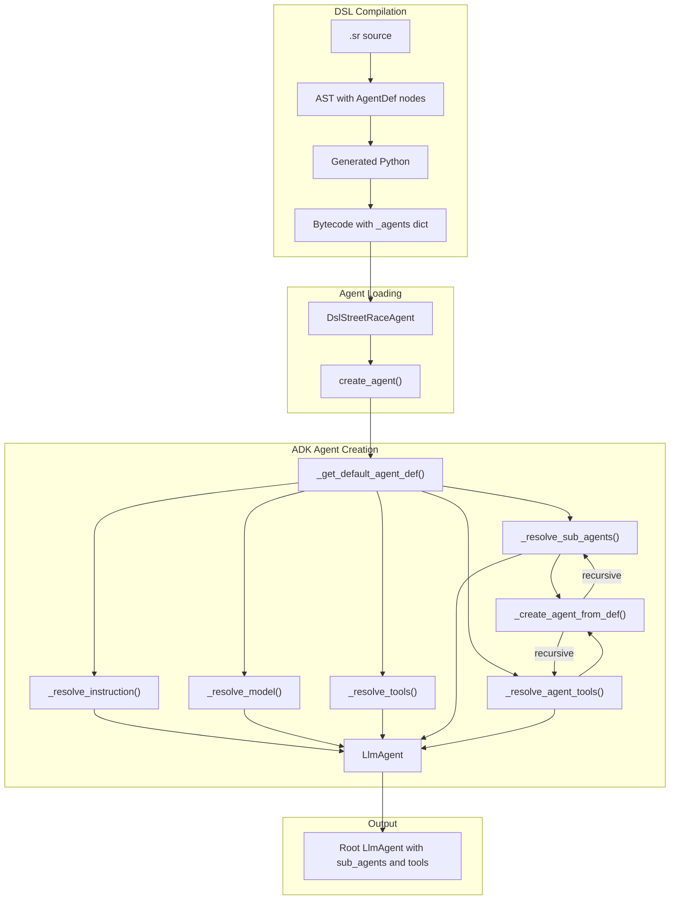

# DSL Agentic Patterns

The Streetrace DSL supports multi-agent patterns that map to Google ADK's agent composition
mechanisms. This document describes how the `delegate`, `use`, and `loop` constructs work
at the compiler and runtime levels.

## Overview

The DSL implements three key multi-agent patterns from the
[ADK Multi-Agent documentation](https://google.github.io/adk-docs/agents/multi-agents/):

| Pattern | DSL Construct | ADK Mechanism | Description |
|---------|---------------|---------------|-------------|
| Coordinator/Dispatcher | `delegate` | `sub_agents` | LLM decides which sub-agent handles the request |
| Hierarchical Task Decomposition | `use` | `AgentTool` | Agent calls other agents as tools |
| Iterative Refinement | `loop` block | `LoopAgent` | Repeat until condition or max iterations |

## Grammar Rules

The grammar rules for agentic patterns are defined in `src/streetrace/dsl/grammar/streetrace.lark`.

### Agent Properties

```lark
agent_property: "tools" name_list _NL                 -> agent_tools
              | "instruction" NAME _NL                -> agent_instruction
              | "retry" NAME _NL                      -> agent_retry
              | "timeout" timeout_value _NL           -> agent_timeout
              | "description" STRING _NL              -> agent_description
              | "delegate" name_list _NL              -> agent_delegate
              | "use" name_list _NL                   -> agent_use

name_list: tool_name ("," tool_name)*
```

**Source**: `src/streetrace/dsl/grammar/streetrace.lark:270-282`

### Loop Block

```lark
loop_block: "loop" "max" INT "do" _NL _INDENT flow_body _DEDENT "end" _NL?
          | "loop" "do" _NL _INDENT flow_body _DEDENT "end" _NL?
```

**Source**: `src/streetrace/dsl/grammar/streetrace.lark:316-317`

The loop block appears in both `handler_statement` and `flow_statement` rules, allowing it
to be used in event handlers and flow definitions.

## AST Nodes

### AgentDef

The `AgentDef` node includes two optional lists for multi-agent patterns:

```python
@dataclass
class AgentDef:
    name: str | None  # None for unnamed/default agent
    tools: list[str]
    instruction: str
    retry: str | None = None
    timeout_ref: str | None = None
    timeout_value: int | None = None
    timeout_unit: str | None = None
    description: str | None = None
    delegate: list[str] | None = None  # Sub-agents for coordinator pattern
    use: list[str] | None = None  # AgentTool for hierarchical pattern
    meta: SourcePosition | None = None
```

**Source**: `src/streetrace/dsl/ast/nodes.py:420-433`

### LoopBlock

The `LoopBlock` node represents bounded or unbounded iteration:

```python
@dataclass
class LoopBlock:
    """Loop block for iterative refinement pattern."""

    max_iterations: int | None  # None means unbounded loop
    body: list[AstNode]
    meta: SourcePosition | None = None
```

**Source**: `src/streetrace/dsl/ast/nodes.py:248-257`

## AST Transformation

The transformer converts parse tree nodes to AST nodes. Relevant methods in
`src/streetrace/dsl/ast/transformer.py`:

### delegate and use Properties

```python
def agent_delegate(self, items: list[object]) -> tuple[str, list[str]]:
    """Transform delegate property."""
    agents = self._extract_name_list(items)
    return ("delegate", agents)

def agent_use(self, items: list[object]) -> tuple[str, list[str]]:
    """Transform use property."""
    agents = self._extract_name_list(items)
    return ("use", agents)
```

### Loop Block

```python
def loop_block(self, items: list[object]) -> LoopBlock:
    """Transform loop block."""
    max_iterations: int | None = None
    body: list[AstNode] = []
    meta = self._get_meta(items)

    for item in items:
        if isinstance(item, Token) and item.type == "INT":
            max_iterations = int(item.value)
        elif isinstance(item, list):
            body = item

    return LoopBlock(
        max_iterations=max_iterations,
        body=body,
        meta=meta,
    )
```

## Semantic Analysis

The semantic analyzer validates agentic pattern constructs and detects errors.

### Validation Rules

**Source**: `src/streetrace/dsl/semantic/analyzer.py:454-493`

1. **Reference validation**: All agent names in `delegate` and `use` must reference
   defined agents.

2. **Warning W0002**: If an agent has both `delegate` and `use`, a warning is issued
   because this is an unusual pattern that may indicate a design issue.

3. **Error E0011**: Circular agent references are detected and reported.

### Circular Reference Detection

The analyzer builds a directed graph of agent relationships and uses DFS to detect cycles:

```python
def _detect_circular_agent_refs(self) -> None:
    """Detect circular references in agent delegate/use relationships."""
    graph = self._build_agent_graph()
    cycle = self._find_cycle_in_graph(graph)
    if cycle is not None:
        self._add_error(
            SemanticError.circular_agent_reference(
                agents=cycle,
                position=first_agent.meta,
            ),
        )
```

**Source**: `src/streetrace/dsl/semantic/analyzer.py:699-715`

### Error Codes

| Code | Type | Description |
|------|------|-------------|
| E0001 | Error | Undefined reference to agent in `delegate` or `use` |
| E0011 | Error | Circular agent reference detected |
| W0002 | Warning | Agent has both `delegate` and `use` |

**Source**: `src/streetrace/dsl/semantic/errors.py:15-29`

## Code Generation

The code generator emits Python code that maps DSL constructs to the runtime.

### Agent Generation

When emitting agents, the workflow visitor includes `sub_agents` and `agent_tools`:

```python
def _emit_agents(self) -> None:
    for agent in self._agents:
        # ...
        # Optional: sub_agents for delegate pattern
        if agent.delegate:
            sub_agents_str = ", ".join(f"'{a}'" for a in agent.delegate)
            self._emitter.emit(f"'sub_agents': [{sub_agents_str}],")

        # Optional: agent_tools for use pattern
        if agent.use:
            agent_tools_str = ", ".join(f"'{a}'" for a in agent.use)
            self._emitter.emit(f"'agent_tools': [{agent_tools_str}],")
```

**Source**: `src/streetrace/dsl/codegen/visitors/workflow.py:319-357`

### Generated Output

For the coordinator pattern:

```python
_agents = {
    'coordinator': {
        'tools': ['fs'],
        'instruction': 'coordinator_prompt',
        'sub_agents': ['billing_agent', 'support_agent'],
    },
}
```

For the hierarchical pattern:

```python
_agents = {
    'researcher': {
        'tools': ['fs'],
        'instruction': 'researcher_prompt',
        'agent_tools': ['searcher', 'summarizer'],
    },
}
```

## Runtime Integration

The runtime interprets the generated code to create ADK agent instances. The key integration
point is the `DslStreetRaceAgent.create_agent()` method which transforms DSL agent definitions
into fully-configured ADK `LlmAgent` instances.

### ADK Agent Creation Pipeline



**Source**: `src/streetrace/agents/dsl_agent_loader.py:341-403`

### Sub-agents (delegate)

When `sub_agents` is present in the agent definition, the runtime creates sub-agent instances
and passes them to the `LlmAgent` constructor. The `_resolve_sub_agents()` method handles this:

```python
async def _resolve_sub_agents(
    self,
    agent_def: dict[str, object],
    model_factory: ModelFactory,
    tool_provider: ToolProvider,
    system_context: SystemContext,
) -> list[BaseAgent]:
    """Resolve sub_agents for the coordinator/dispatcher pattern."""
    sub_agent_names = agent_def.get("sub_agents", [])
    if not sub_agent_names:
        return []

    agents = self._workflow_class._agents
    sub_agents: list[BaseAgent] = []

    for agent_name in sub_agent_names:
        sub_agent_def = agents[agent_name]
        sub_agent = await self._create_agent_from_def(
            name=agent_name,
            agent_def=sub_agent_def,
            model_factory=model_factory,
            tool_provider=tool_provider,
            system_context=system_context,
        )
        sub_agents.append(sub_agent)

    return sub_agents
```

**Source**: `src/streetrace/agents/dsl_agent_loader.py:699-749`

The LLM decides when to delegate to sub-agents based on the instruction context.

### AgentTool (use)

When `agent_tools` is present, the runtime wraps referenced agents as ADK `AgentTool`
instances. The `_resolve_agent_tools()` method creates these wrappers:

```python
async def _resolve_agent_tools(
    self,
    agent_def: dict[str, object],
    model_factory: ModelFactory,
    tool_provider: ToolProvider,
    system_context: SystemContext,
) -> list[AdkTool]:
    """Resolve agent_tools for the hierarchical pattern."""
    from google.adk.tools.agent_tool import AgentTool

    agent_tool_names = agent_def.get("agent_tools", [])
    if not agent_tool_names:
        return []

    agents = self._workflow_class._agents
    agent_tools: list[AdkTool] = []

    for agent_name in agent_tool_names:
        sub_agent_def = agents[agent_name]
        sub_agent = await self._create_agent_from_def(
            name=agent_name,
            agent_def=sub_agent_def,
            model_factory=model_factory,
            tool_provider=tool_provider,
            system_context=system_context,
        )
        agent_tools.append(AgentTool(sub_agent))

    return agent_tools
```

**Source**: `src/streetrace/agents/dsl_agent_loader.py:751-803`

The parent agent explicitly calls these as tools within its workflow.

### Recursive Pattern Support

Both `_resolve_sub_agents()` and `_resolve_agent_tools()` call `_create_agent_from_def()`,
which itself recursively resolves nested patterns. This enables hierarchies like:

```
coordinator
├── specialist_a (sub_agent)
│   ├── helper_1 (agent_tool)
│   └── helper_2 (agent_tool)
└── specialist_b (sub_agent)
    └── helper_3 (agent_tool)
```

### Agent Creation from Definition

The `_create_agent_from_def()` method creates a fully-configured `LlmAgent` from an agent
definition dictionary:

```python
async def _create_agent_from_def(
    self,
    name: str,
    agent_def: dict[str, object],
    model_factory: ModelFactory,
    tool_provider: ToolProvider,
    system_context: SystemContext,
) -> BaseAgent:
    """Create an LlmAgent from an agent definition dict."""
    from google.adk.agents import LlmAgent

    instruction = self._resolve_instruction(agent_def)
    model = self._resolve_model(model_factory, agent_def)
    tools = self._resolve_tools(tool_provider, agent_def)

    # Recursively resolve nested patterns
    sub_agents = await self._resolve_sub_agents(
        agent_def, model_factory, tool_provider, system_context,
    )
    agent_tools = await self._resolve_agent_tools(
        agent_def, model_factory, tool_provider, system_context,
    )
    tools.extend(agent_tools)

    description = agent_def.get("description", f"Agent: {name}")

    agent_kwargs = {
        "name": name,
        "model": model,
        "instruction": instruction,
        "tools": tools,
        "description": description,
    }
    if sub_agents:
        agent_kwargs["sub_agents"] = sub_agents

    return LlmAgent(**agent_kwargs)
```

**Source**: `src/streetrace/agents/dsl_agent_loader.py:644-697`

### Resource Cleanup

The `_close_agent_recursive()` method ensures proper cleanup of all nested agents and tools
in depth-first order:

```python
async def _close_agent_recursive(self, agent: BaseAgent) -> None:
    """Recursively close agent, its sub-agents, and tools."""
    from google.adk.tools.agent_tool import AgentTool

    # Close sub-agents first (depth-first)
    for sub_agent in getattr(agent, "sub_agents", []) or []:
        await self._close_agent_recursive(sub_agent)

    # Close tools, handling AgentTool specially
    for tool in getattr(agent, "tools", []) or []:
        if isinstance(tool, AgentTool):
            await self._close_agent_recursive(tool.agent)

        close_fn = getattr(tool, "close", None)
        if callable(close_fn):
            ret = close_fn()
            if inspect.isawaitable(ret):
                await ret
```

**Source**: `src/streetrace/agents/dsl_agent_loader.py:815-843`

### Loop Execution

Loop blocks are executed by the runtime with iteration tracking:

```python
for iteration in range(max_iterations or float('inf')):
    result = await execute_body(body, ctx)
    if should_exit(result):
        break
```

## Pattern Semantics

### delegate vs use

| Aspect | `delegate` | `use` |
|--------|-----------|-------|
| Control transfer | LLM decides when to transfer | Explicit tool call |
| Return behavior | May not return to caller | Always returns |
| Conversation context | Shared | Isolated |
| ADK mechanism | `sub_agents=[...]` | `tools=[AgentTool(...)]` |
| Use case | Routing, handoff | Task delegation |

### When to Use delegate

- User requests need routing to specialized handlers
- Full conversation handoff to sub-agent
- Central coordinator with multiple specialists

### When to Use use

- Agent needs capabilities from other agents
- Higher-level agent orchestrates lower-level ones
- Results must be aggregated by caller

## API Reference

This section documents the key methods in `DslStreetRaceAgent` that implement the agentic
patterns ADK integration.

### DslStreetRaceAgent.create_agent

```python
async def create_agent(
    self,
    model_factory: ModelFactory,
    tool_provider: ToolProvider,
    system_context: SystemContext,
) -> BaseAgent
```

Create the ADK agent from the DSL workflow.

The main entry point for agent creation. Creates the root `LlmAgent` with support for
agentic patterns via `sub_agents` (delegate keyword) and `AgentTool` wrappers (use keyword).

**Parameters**:
- `model_factory`: Factory for creating LLM models.
- `tool_provider`: Provider for resolving tools.
- `system_context`: System context for the agent.

**Returns**:
The root ADK `LlmAgent` instance.

**Location**: `src/streetrace/agents/dsl_agent_loader.py:341`

### DslStreetRaceAgent._create_agent_from_def

```python
async def _create_agent_from_def(
    self,
    name: str,
    agent_def: dict[str, object],
    model_factory: ModelFactory,
    tool_provider: ToolProvider,
    system_context: SystemContext,
) -> BaseAgent
```

Create an `LlmAgent` from an agent definition dictionary.

Used for creating both the root agent and sub-agents. Handles instruction, model, and
tool resolution, and recursively resolves nested agentic patterns.

**Parameters**:
- `name`: Name for the agent.
- `agent_def`: Agent definition dict containing `tools`, `instruction`, `sub_agents`,
  `agent_tools`, and `description` keys.
- `model_factory`: Factory for creating LLM models.
- `tool_provider`: Provider for resolving tools.
- `system_context`: System context.

**Returns**:
The created ADK `LlmAgent` instance.

**Location**: `src/streetrace/agents/dsl_agent_loader.py:644`

### DslStreetRaceAgent._resolve_sub_agents

```python
async def _resolve_sub_agents(
    self,
    agent_def: dict[str, object],
    model_factory: ModelFactory,
    tool_provider: ToolProvider,
    system_context: SystemContext,
) -> list[BaseAgent]
```

Resolve `sub_agents` for the coordinator/dispatcher pattern.

Create `LlmAgent` instances for each agent listed in the `sub_agents` field. This enables
the `delegate` keyword functionality where a coordinator can dispatch work to specialized
sub-agents.

**Parameters**:
- `agent_def`: Agent definition dict with optional `sub_agents` list.
- `model_factory`: Factory for creating LLM models.
- `tool_provider`: Provider for resolving tools.
- `system_context`: System context.

**Returns**:
List of created sub-agent `LlmAgent` instances.

**Location**: `src/streetrace/agents/dsl_agent_loader.py:699`

### DslStreetRaceAgent._resolve_agent_tools

```python
async def _resolve_agent_tools(
    self,
    agent_def: dict[str, object],
    model_factory: ModelFactory,
    tool_provider: ToolProvider,
    system_context: SystemContext,
) -> list[AdkTool]
```

Resolve `agent_tools` for the hierarchical pattern.

Create `AgentTool` wrappers for each agent listed in the `agent_tools` field. This enables
the `use` keyword functionality where an agent can invoke other agents as tools.

**Parameters**:
- `agent_def`: Agent definition dict with optional `agent_tools` list.
- `model_factory`: Factory for creating LLM models.
- `tool_provider`: Provider for resolving tools.
- `system_context`: System context.

**Returns**:
List of `AgentTool` instances wrapping the child agents.

**Location**: `src/streetrace/agents/dsl_agent_loader.py:751`

### DslStreetRaceAgent._close_agent_recursive

```python
async def _close_agent_recursive(self, agent: BaseAgent) -> None
```

Recursively close agent, its sub-agents, and tools.

Traverse the agent hierarchy depth-first, closing sub-agents before parent agents to
ensure proper cleanup order. For tools, if the tool is an `AgentTool`, close the wrapped
agent first, then close the tool itself.

**Parameters**:
- `agent`: The agent to close.

**Location**: `src/streetrace/agents/dsl_agent_loader.py:815`

## Extension Guide

### Adding a New Agentic Pattern

To add a new agentic pattern (similar to `delegate` or `use`):

1. **Update the Grammar** (`src/streetrace/dsl/grammar/streetrace.lark`)

   Add a new agent property rule:

   ```lark
   agent_property: ...
                 | "new_pattern" name_list _NL -> agent_new_pattern
   ```

2. **Update the AST Node** (`src/streetrace/dsl/ast/nodes.py`)

   Add the new field to `AgentDef`:

   ```python
   @dataclass
   class AgentDef:
       # ... existing fields
       new_pattern: list[str] | None = None
   ```

3. **Update the Transformer** (`src/streetrace/dsl/ast/transformer.py`)

   Add a transformer method for the new rule:

   ```python
   def agent_new_pattern(self, items: list[object]) -> tuple[str, list[str]]:
       agents = self._extract_name_list(items)
       return ("new_pattern", agents)
   ```

4. **Update Semantic Analysis** (`src/streetrace/dsl/semantic/analyzer.py`)

   Add validation for the new pattern (reference checking, cycle detection):

   ```python
   def _validate_new_pattern_refs(self, agent: AgentDef) -> None:
       if not agent.new_pattern:
           return
       for name in agent.new_pattern:
           if name not in self._symbols.agents:
               self._add_error(SemanticError.undefined_agent_ref(name, ...))
   ```

5. **Update Code Generation** (`src/streetrace/dsl/codegen/visitors/workflow.py`)

   Emit the new pattern to the `_agents` dictionary:

   ```python
   if agent.new_pattern:
       pattern_str = ", ".join(f"'{a}'" for a in agent.new_pattern)
       self._emitter.emit(f"'new_pattern': [{pattern_str}],")
   ```

6. **Update the Agent Loader** (`src/streetrace/agents/dsl_agent_loader.py`)

   Add a resolution method for the new pattern:

   ```python
   async def _resolve_new_pattern(
       self,
       agent_def: dict[str, object],
       model_factory: ModelFactory,
       tool_provider: ToolProvider,
       system_context: SystemContext,
   ) -> list[SomeType]:
       pattern_names = agent_def.get("new_pattern", [])
       # ... implementation
   ```

   Then call it from `create_agent()` and `_create_agent_from_def()`.

7. **Add Tests**

   - Parser tests in `tests/dsl/test_agentic_patterns.py`
   - AST transformation tests
   - Semantic validation tests
   - Code generation tests
   - Agent loader integration tests

### Modifying the Agent Creation Pipeline

To customize how agents are created:

1. **Override resolution methods**: Subclass `DslStreetRaceAgent` and override methods
   like `_resolve_instruction()`, `_resolve_model()`, or `_resolve_tools()`.

2. **Add new agent properties**: Follow the extension guide above to add new properties
   that affect agent creation.

3. **Customize cleanup**: Override `_close_agent_recursive()` to add custom cleanup logic.

### Testing Agentic Patterns

Key test files:
- `tests/dsl/test_agentic_patterns.py` - Parser and AST tests
- `tests/dsl/test_semantic_patterns.py` - Semantic validation tests
- `tests/dsl/test_codegen_patterns.py` - Code generation tests
- `tests/dsl/test_dsl_agent_loader.py` - Agent loader integration tests

## Example Files

The repository includes example files demonstrating each pattern:

| File | Pattern |
|------|---------|
| `agents/examples/dsl/coordinator.sr` | Coordinator/Dispatcher |
| `agents/examples/dsl/hierarchical.sr` | Hierarchical Task Decomposition |
| `agents/examples/dsl/iterative.sr` | Iterative Refinement |
| `agents/examples/dsl/combined.sr` | Combined patterns |

## See Also

- [Grammar Development Guide](grammar.md) - How to modify the DSL grammar
- [API Reference](api-reference.md) - Complete API documentation
- [Architecture](architecture.md) - Compiler pipeline design
- [User Guide: Multi-Agent Patterns](../../user/dsl/multi-agent-patterns.md) - Usage guide
