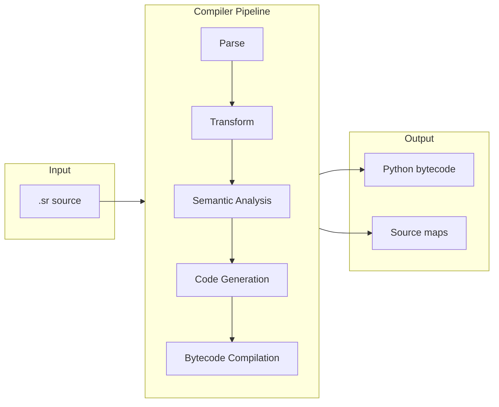
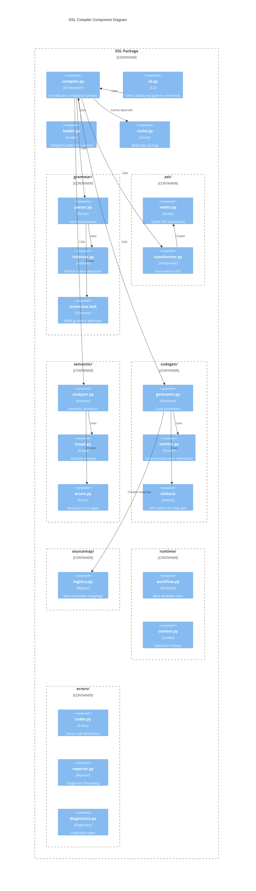

# DSL Compiler Architecture

The Streetrace DSL compiler transforms `.sr` files into executable Python code through a
multi-phase pipeline. This document describes the compiler architecture for developers who
need to understand, debug, or extend the system.

## Overview

The compiler follows a traditional multi-pass design with six distinct phases:



## Compiler Phases

### Phase 1: Lexical Analysis and Parsing

**Entry point**: `streetrace.dsl.grammar.parser:parse()`

The parser uses [Lark](https://lark-parser.readthedocs.io/) with a custom indenter for
Python-style significant whitespace. The grammar is defined in EBNF format.

**Key files**:
- Grammar definition: `src/streetrace/dsl/grammar/streetrace.lark`
- Custom indenter: `src/streetrace/dsl/grammar/indenter.py`
- Parser module: `src/streetrace/dsl/grammar/parser.py`

The parser produces a Lark parse tree that preserves source positions for error reporting.

### Phase 2: AST Transformation

**Entry point**: `streetrace.dsl.ast.transformer:transform()`

The transformer converts the Lark parse tree into a typed AST using dataclass nodes. This
phase normalizes the tree structure and extracts semantic information from tokens.

**Key files**:
- AST node definitions: `src/streetrace/dsl/ast/nodes.py`
- Transformer: `src/streetrace/dsl/ast/transformer.py`

The AST provides a stable interface for subsequent phases, isolating them from grammar
changes.

### Phase 3: Semantic Analysis

**Entry point**: `streetrace.dsl.semantic.analyzer:SemanticAnalyzer.analyze()`

The analyzer validates the AST for semantic correctness through two passes:

1. **Symbol collection**: Gather all top-level definitions (models, schemas, tools,
   prompts, agents, flows, policies) into a symbol table
2. **Reference validation**: Verify all references resolve to defined symbols, validate
   variable scoping, and check type compatibility

**Key files**:
- Analyzer: `src/streetrace/dsl/semantic/analyzer.py`
- Scope management: `src/streetrace/dsl/semantic/scope.py`
- Error definitions: `src/streetrace/dsl/semantic/errors.py`

### Phase 4: Code Generation

**Entry point**: `streetrace.dsl.codegen.generator:CodeGenerator.generate()`

The code generator produces Python source code from the validated AST. It uses a visitor
pattern to traverse the AST and emit code through a managed emitter that handles
indentation and source mapping.

**Key files**:
- Generator: `src/streetrace/dsl/codegen/generator.py`
- Code emitter: `src/streetrace/dsl/codegen/emitter.py`
- Workflow visitor: `src/streetrace/dsl/codegen/visitors/workflow.py`

Generated code extends `DslAgentWorkflow` and overrides event handler methods.

### Phase 5: Bytecode Compilation

**Entry point**: `streetrace.dsl.compiler:compile_dsl()`

The generated Python source is compiled to bytecode using Python's built-in `compile()`
function. The bytecode is cached to avoid recompilation on subsequent loads.

**Key files**:
- Compiler orchestration: `src/streetrace/dsl/compiler.py`
- Bytecode cache: `src/streetrace/dsl/cache.py`

### Phase 6: Source Map Generation

**Entry point**: Generated alongside code in phase 4

Source maps maintain bidirectional mappings between generated Python line numbers and
original DSL positions. These enable translating Python runtime errors back to DSL source
locations.

**Key files**:
- Source map registry: `src/streetrace/dsl/sourcemap/registry.py`

## Module Structure



## Key Classes

### DslFile

The root AST node representing a complete `.sr` file.

```python
@dataclass
class DslFile:
    version: VersionDecl | None
    statements: list[object]
```

**Location**: `src/streetrace/dsl/ast/nodes.py:24`

### SemanticAnalyzer

Validates AST nodes for semantic correctness.

```python
class SemanticAnalyzer:
    def analyze(self, ast: DslFile) -> AnalysisResult: ...
```

**Location**: `src/streetrace/dsl/semantic/analyzer.py:82`

Key responsibilities:
- Reference validation (models, tools, prompts, agents)
- Variable scoping (global, flow-local, handler-local)
- Type checking for expressions
- Duplicate detection

### CodeGenerator

Transforms validated AST into Python source code.

```python
class CodeGenerator:
    def generate(
        self,
        ast: DslFile,
        source_file: str,
    ) -> tuple[str, list[SourceMapping]]: ...
```

**Location**: `src/streetrace/dsl/codegen/generator.py:15`

### DslAgentWorkflow

Base class for all generated workflows.

```python
class DslAgentWorkflow:
    _models: ClassVar[dict[str, str]] = {}
    _prompts: ClassVar[dict[str, object]] = {}
    _tools: ClassVar[dict[str, dict[str, object]]] = {}
    _agents: ClassVar[dict[str, dict[str, object]]] = {}

    async def on_start(self, ctx: WorkflowContext) -> None: ...
    async def on_input(self, ctx: WorkflowContext) -> None: ...
    async def on_output(self, ctx: WorkflowContext) -> None: ...
```

**Location**: `src/streetrace/dsl/runtime/workflow.py:14`

### DslAgentLoader

Runtime loader for `.sr` files.

```python
class DslAgentLoader:
    def can_load(self, path: Path) -> bool: ...
    def load(self, path: Path) -> type[DslAgentWorkflow]: ...
    def discover(self, directory: Path) -> list[Path]: ...
```

**Location**: `src/streetrace/dsl/loader.py:37`

## Error Handling

The compiler uses standardized error codes for consistent diagnostics:

| Code | Category | Description |
|------|----------|-------------|
| E0001 | Reference | Undefined reference to model, tool, agent, or prompt |
| E0002 | Reference | Variable used before definition |
| E0003 | Reference | Duplicate definition |
| E0004 | Type | Type mismatch in expression |
| E0005 | Import | Import file not found |
| E0006 | Import | Circular import detected |
| E0007 | Syntax | Invalid token or unexpected end of input |
| E0008 | Syntax | Mismatched indentation |
| E0009 | Semantic | Invalid guardrail action for context |
| E0010 | Semantic | Missing required property |

Errors are formatted in rustc-style with source context:

```
error[E0001]: undefined reference to model 'fast'
  --> my_agent.sr:15:18
     |
  15 |     using model "fast"
     |                  ^^^^
     |
     = help: defined models are: main, compact
```

## Design Decisions

### Why Lark?

Lark provides several advantages for the DSL:
- EBNF grammar syntax is readable and maintainable
- Built-in support for custom indenters (Python-style significant whitespace)
- Automatic source position tracking
- Tree transformers simplify AST construction

### Why generate Python code?

Generating Python rather than interpreting the AST directly provides:
- Full Python ecosystem access at runtime
- Debugger compatibility with source maps
- Performance through bytecode caching
- Familiar error messages from Python runtime

### Why separate analysis from code generation?

Separating semantic analysis from code generation:
- Enables better error messages before code generation
- Allows validation-only mode (`check` command)
- Simplifies code generator logic
- Supports future optimizations or alternative backends

## Known Issues and Technical Debt

The following issues are known and tracked for future resolution:

### Issue: Comma-Separated Name Lists

**Symptom**: Commas in `tools fs, cli, github` are parsed as tool names, causing
semantic errors like `undefined reference to tool ','`.

**Root cause**: The `name_list` transformer in `ast/transformer.py` returns all items
without filtering commas:

```python
def name_list(self, items: TransformerItems) -> list[str]:
    return list(items)  # Should filter commas
```

**Fix required**: Update `name_list` to filter comma tokens:

```python
def name_list(self, items: TransformerItems) -> list[str]:
    filtered = _filter_children(items)
    return [str(item) for item in filtered]
```

**Location**: `src/streetrace/dsl/ast/transformer.py`

### Issue: Flow Parameter Variable Scoping

**Symptom**: Flow parameters like `$input` in `flow process $input:` cause
`variable used before definition` errors when referenced in the flow body.

**Root cause**: The `flow_params` transformer stores parameters with `$` prefix
(e.g., `$input`), but `VarRef.name` stores names without the prefix. The semantic
analyzer defines `$input` in scope but looks up `input`, causing a mismatch.

**Fix required**: Either:
1. Store flow parameters without the `$` prefix in `flow_params`
2. Or add `$` prefix when looking up VarRef names
3. Or normalize both to use the same convention

**Locations**:
- `src/streetrace/dsl/ast/transformer.py:flow_params()`
- `src/streetrace/dsl/semantic/analyzer.py:_validate_flow()`

### Issue: Policy Property Transformation

**Symptom**: Some policy properties like `strategy: summarize_with_goal` cause
`unhashable type` errors during AST transformation.

**Root cause**: The `policy_property` transformer handles some property types
(like `trigger`) that return dicts, but other properties (like `strategy`) pass
through raw tokens or strings. When `policy_body` tries to `update()` with
non-dict items, it fails.

**Fix required**: Update `policy_property` to return dicts for all property types:

```python
def policy_property(self, items: TransformerItems) -> dict:
    # Handle each property type explicitly
    if items[0] == "strategy":
        return {"strategy": str(items[2])}
    elif items[0] == "use" and items[1] == "model":
        return {"model": items[3]}
    # ... etc
    return items[0]  # For items already returning dicts
```

**Location**: `src/streetrace/dsl/ast/transformer.py`

### Issue: VarRef Name Including Dollar Sign

**Symptom**: Error messages show `$$variable` (double dollar sign) instead of
`$variable`.

**Root cause**: The `undefined_variable` error formatter adds a `$` prefix:

```python
msg = f"variable '${name}' used before definition"
```

But in some code paths, `VarRef.name` already includes the `$` prefix.

**Fix required**: Ensure consistent handling - either always include `$` in
VarRef.name, or never include it, and adjust error formatting accordingly.

**Locations**:
- `src/streetrace/dsl/ast/transformer.py:var_ref()`
- `src/streetrace/dsl/semantic/errors.py:undefined_variable()`

### Issue: Runtime Integration Incomplete

**Symptom**: DSL agents compile successfully but cannot be run with
`streetrace --agent my_agent.sr`.

**Root cause**: The main agent loading system in `agents/agent_manager.py` does
not use `DslAgentLoader`. The DSL workflow classes (`DslAgentWorkflow`) also
don't integrate with the ADK-based runtime.

**Fix required**:
1. Register `DslAgentLoader` with the agent manager
2. Bridge `DslAgentWorkflow` with the ADK agent system
3. Map DSL tools/models to runtime configurations

**Locations**:
- `src/streetrace/agents/agent_manager.py`
- `src/streetrace/dsl/loader.py`
- `src/streetrace/dsl/runtime/workflow.py`

## See Also

- [Grammar Development Guide](grammar.md) - How to modify the DSL grammar
- [Extension Guide](extending.md) - Adding new syntax and features
- [CLI Reference](../user/dsl/cli-reference.md) - Using compiler commands
