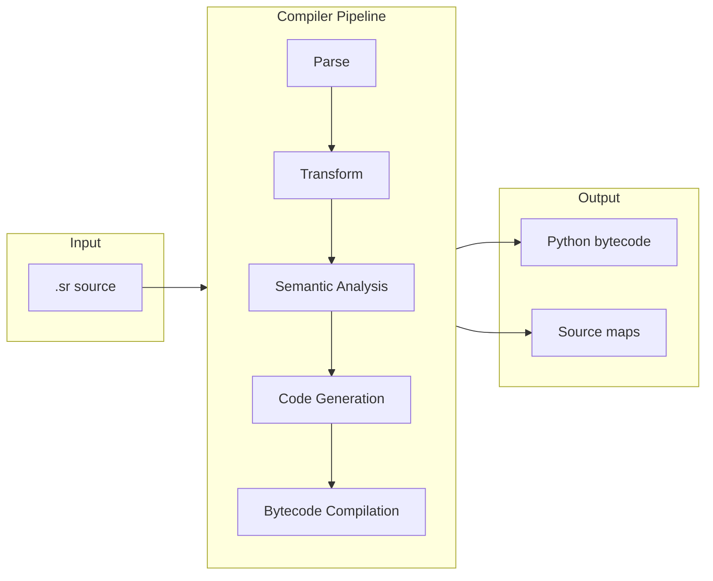
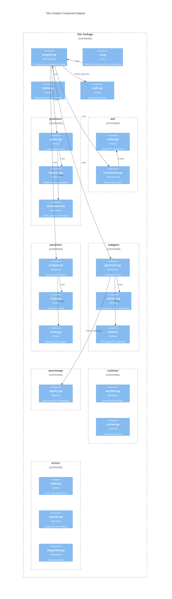
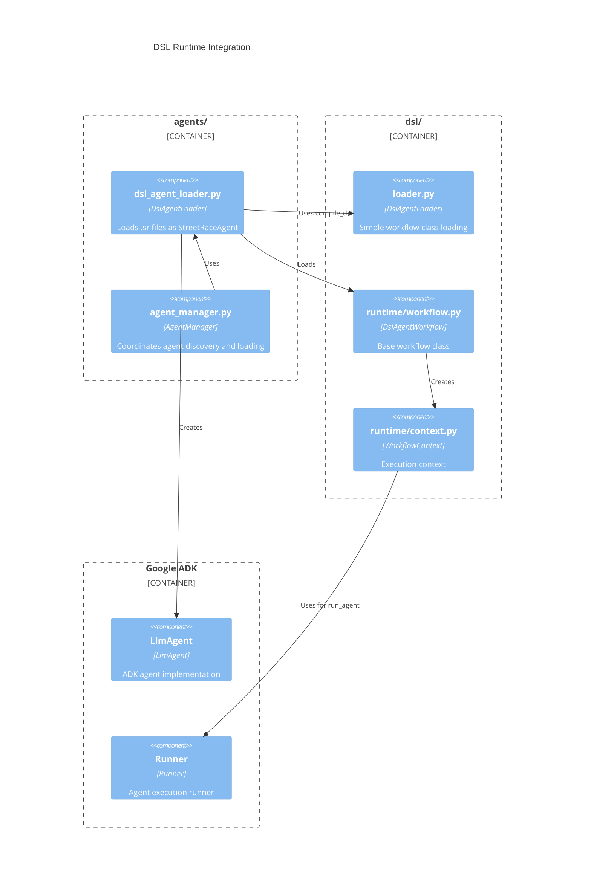

# DSL Compiler Architecture

The Streetrace DSL compiler transforms `.sr` files into executable Python code through a
multi-phase pipeline. This document describes the compiler architecture for developers who
need to understand, debug, or extend the system.

## Overview

The compiler follows a traditional multi-pass design with six distinct phases:



## Compiler Phases

### Phase 1: Lexical Analysis and Parsing

**Entry point**: `streetrace.dsl.grammar.parser:ParserFactory.create()`

The parser uses [Lark](https://lark-parser.readthedocs.io/) with a custom indenter for
Python-style significant whitespace. The grammar is defined in EBNF format.

**Key files**:
- Grammar definition: `src/streetrace/dsl/grammar/streetrace.lark`
- Custom indenter: `src/streetrace/dsl/grammar/indenter.py`
- Parser module: `src/streetrace/dsl/grammar/parser.py`

The parser produces a Lark parse tree that preserves source positions for error reporting.

### Phase 2: AST Transformation

**Entry point**: `streetrace.dsl.ast.transformer:transform()`

The transformer converts the Lark parse tree into a typed AST using dataclass nodes. This
phase normalizes the tree structure and extracts semantic information from tokens.

**Key files**:
- AST node definitions: `src/streetrace/dsl/ast/nodes.py`
- Transformer: `src/streetrace/dsl/ast/transformer.py`

The AST provides a stable interface for subsequent phases, isolating them from grammar
changes.

### Phase 3: Semantic Analysis

**Entry point**: `streetrace.dsl.semantic.analyzer:SemanticAnalyzer.analyze()`

The analyzer validates the AST for semantic correctness through two passes:

1. **Symbol collection**: Gather all top-level definitions (models, schemas, tools,
   prompts, agents, flows, policies) into a symbol table
2. **Reference validation**: Verify all references resolve to defined symbols, validate
   variable scoping, and check type compatibility

**Key files**:
- Analyzer: `src/streetrace/dsl/semantic/analyzer.py`
- Scope management: `src/streetrace/dsl/semantic/scope.py`
- Error definitions: `src/streetrace/dsl/semantic/errors.py`

### Phase 4: Code Generation

**Entry point**: `streetrace.dsl.codegen.generator:CodeGenerator.generate()`

The code generator produces Python source code from the validated AST. It uses a visitor
pattern to traverse the AST and emit code through a managed emitter that handles
indentation and source mapping.

**Key files**:
- Generator: `src/streetrace/dsl/codegen/generator.py`
- Code emitter: `src/streetrace/dsl/codegen/emitter.py`
- Workflow visitor: `src/streetrace/dsl/codegen/visitors/workflow.py`
- Flow visitor: `src/streetrace/dsl/codegen/visitors/flows.py`
- Handler visitor: `src/streetrace/dsl/codegen/visitors/handlers.py`
- Expression visitor: `src/streetrace/dsl/codegen/visitors/expressions.py`

Generated code extends `DslAgentWorkflow` and overrides event handler methods.

### Phase 5: Bytecode Compilation

**Entry point**: `streetrace.dsl.compiler:compile_dsl()`

The generated Python source is compiled to bytecode using Python's built-in `compile()`
function. The bytecode is cached to avoid recompilation on subsequent loads.

**Key files**:
- Compiler orchestration: `src/streetrace/dsl/compiler.py`
- Bytecode cache: `src/streetrace/dsl/cache.py`

### Phase 6: Source Map Generation

**Entry point**: Generated alongside code in phase 4

Source maps maintain bidirectional mappings between generated Python line numbers and
original DSL positions. These enable translating Python runtime errors back to DSL source
locations.

**Key files**:
- Source map registry: `src/streetrace/dsl/sourcemap/registry.py`
- Exception hook: `src/streetrace/dsl/sourcemap/excepthook.py`

## Module Structure



## Runtime Integration

The DSL compiler integrates with the Streetrace runtime through two loader classes and a
runtime context system.

### Runtime Architecture



### DslStreetRaceAgent

The `DslStreetRaceAgent` class wraps a compiled DSL workflow to implement the
`StreetRaceAgent` interface required by the AgentManager.

**Location**: `src/streetrace/agents/dsl_agent_loader.py:290`

Key responsibilities:
- Load and compile `.sr` files to workflow classes
- Create ADK `LlmAgent` instances with DSL-defined configuration
- Resolve models following the priority: prompt's `using model` clause, then `main` model
- Map DSL tool definitions to ADK tool objects

### WorkflowContext

The `WorkflowContext` provides runtime state and services to generated workflow code.

**Location**: `src/streetrace/dsl/runtime/context.py:127`

Key capabilities:
- Variable storage (`ctx.vars`)
- Agent execution via `run_agent()`
- LLM calls via `call_llm()`
- Guardrail operations (PII masking, jailbreak detection)
- Drift detection
- Human escalation

### Model Resolution

Model resolution follows a specific priority order:

1. Model from prompt's `using model` clause (e.g., `prompt foo using model "fast":`)
2. Fall back to model named `main`
3. CLI `--model` argument overrides all (handled by ModelFactory)

**Implementation**: `WorkflowContext._resolve_agent_model()` at `context.py:310`

### Tool Resolution

Tools are resolved from the agent's tools list and mapped to ADK tool objects:

1. Builtin tools (e.g., `streetrace.fs`) map to `StreetraceToolRef`
2. MCP tools map to `McpToolRef` with appropriate transport

**Implementation**: `DslStreetRaceAgent._resolve_tools()` at `dsl_agent_loader.py:496`

## Key Classes

### DslFile

The root AST node representing a complete `.sr` file.

```python
@dataclass
class DslFile:
    version: VersionDecl | None
    statements: list[object]
```

**Location**: `src/streetrace/dsl/ast/nodes.py:24`

### SemanticAnalyzer

Validates AST nodes for semantic correctness.

```python
class SemanticAnalyzer:
    def analyze(self, ast: DslFile) -> AnalysisResult: ...
```

**Location**: `src/streetrace/dsl/semantic/analyzer.py:82`

Key responsibilities:
- Reference validation (models, tools, prompts, agents)
- Variable scoping (global, flow-local, handler-local)
- Type checking for expressions
- Duplicate detection

### CodeGenerator

Transforms validated AST into Python source code.

```python
class CodeGenerator:
    def generate(
        self,
        ast: DslFile,
        source_file: str,
    ) -> tuple[str, list[SourceMapping]]: ...
```

**Location**: `src/streetrace/dsl/codegen/generator.py:15`

### DslAgentWorkflow

Base class for all generated workflows.

```python
class DslAgentWorkflow:
    _models: ClassVar[dict[str, str]] = {}
    _prompts: ClassVar[dict[str, object]] = {}
    _tools: ClassVar[dict[str, dict[str, object]]] = {}
    _agents: ClassVar[dict[str, dict[str, object]]] = {}

    async def on_start(self, ctx: WorkflowContext) -> None: ...
    async def on_input(self, ctx: WorkflowContext) -> None: ...
    async def on_output(self, ctx: WorkflowContext) -> None: ...
```

**Location**: `src/streetrace/dsl/runtime/workflow.py:14`

### WorkflowContext

Execution context for DSL workflows providing runtime services.

```python
class WorkflowContext:
    vars: dict[str, object]
    message: str
    guardrails: GuardrailProvider

    async def run_agent(self, agent_name: str, *args: object) -> object: ...
    async def call_llm(self, prompt_name: str, *args: object) -> object: ...
```

**Location**: `src/streetrace/dsl/runtime/context.py:127`

### DslAgentLoader (agents/)

Runtime loader that creates `StreetRaceAgent` instances from `.sr` files.

```python
class DslAgentLoader(AgentLoader):
    def discover_in_paths(self, paths: list[Path]) -> list[AgentInfo]: ...
    def load_from_path(self, path: Path) -> StreetRaceAgent: ...
    def load_agent(self, agent_info: AgentInfo) -> StreetRaceAgent: ...
```

**Location**: `src/streetrace/agents/dsl_agent_loader.py:58`

### DslAgentLoader (dsl/)

Simple loader for workflow classes (used internally).

```python
class DslAgentLoader:
    def can_load(self, path: Path) -> bool: ...
    def load(self, path: Path) -> type[DslAgentWorkflow]: ...
    def discover(self, directory: Path) -> list[Path]: ...
```

**Location**: `src/streetrace/dsl/loader.py:37`

## Error Handling

The compiler uses standardized error codes for consistent diagnostics:

| Code | Category | Description |
|------|----------|-------------|
| E0001 | Reference | Undefined reference to model, tool, agent, or prompt |
| E0002 | Reference | Variable used before definition |
| E0003 | Reference | Duplicate definition |
| E0004 | Type | Type mismatch in expression |
| E0005 | Import | Import file not found |
| E0006 | Import | Circular import detected |
| E0007 | Syntax | Invalid token or unexpected end of input |
| E0008 | Syntax | Mismatched indentation |
| E0009 | Semantic | Invalid guardrail action for context |
| E0010 | Semantic | Missing required property |

Errors are formatted in rustc-style with source context:

```
error[E0001]: undefined reference to model 'fast'
  --> my_agent.sr:15:18
     |
  14 |
  15 |     using model "fast"
  16 |
     |                  ^^^^
     |
     = help: defined models are: main, compact
```

## Design Decisions

### Why Lark?

Lark provides several advantages for the DSL:
- EBNF grammar syntax is readable and maintainable
- Built-in support for custom indenters (Python-style significant whitespace)
- Automatic source position tracking
- Tree transformers simplify AST construction

### Why generate Python code?

Generating Python rather than interpreting the AST directly provides:
- Full Python ecosystem access at runtime
- Debugger compatibility with source maps
- Performance through bytecode caching
- Familiar error messages from Python runtime

### Why separate analysis from code generation?

Separating semantic analysis from code generation:
- Enables better error messages before code generation
- Allows validation-only mode (`check` command)
- Simplifies code generator logic
- Supports future optimizations or alternative backends

### Why two loader classes?

The DSL has two loader classes serving different purposes:

1. **`dsl/loader.py:DslAgentLoader`**: Simple loader that returns workflow classes directly.
   Used for programmatic access and testing.

2. **`agents/dsl_agent_loader.py:DslAgentLoader`**: Full loader implementing `AgentLoader`
   interface for integration with AgentManager. Wraps workflows in `DslStreetRaceAgent`.

## Known Limitations

The following limitations are tracked for future resolution:

### Comma-Separated Name Lists

**Status**: Known issue

Commas in `tools fs, cli, github` are parsed as tool names, causing semantic errors.

**Root cause**: The `name_list` transformer returns all items without filtering commas.

**Workaround**: Use single tool per agent definition.

### Flow Parameter Variable Scoping

**Status**: Known issue

Flow parameters like `$input` in `flow process $input:` cause variable scope errors.

**Root cause**: `flow_params` stores names with `$` prefix but `VarRef.name` doesn't
include the prefix.

**Workaround**: Avoid flow parameters; use simpler agent-based patterns.

### Earley Parser

**Status**: Performance consideration

The parser uses Earley algorithm instead of LALR due to grammar ambiguities.

**Impact**: Slower parsing than LALR but correct handling of all valid inputs.

**Future**: Grammar refactoring to enable LALR parsing.

## See Also

- [Grammar Development Guide](grammar.md) - How to modify the DSL grammar
- [Extension Guide](extending.md) - Adding new syntax and features
- [API Reference](api-reference.md) - Complete API documentation
- [CLI Reference](../../user/dsl/cli-reference.md) - Using compiler commands
