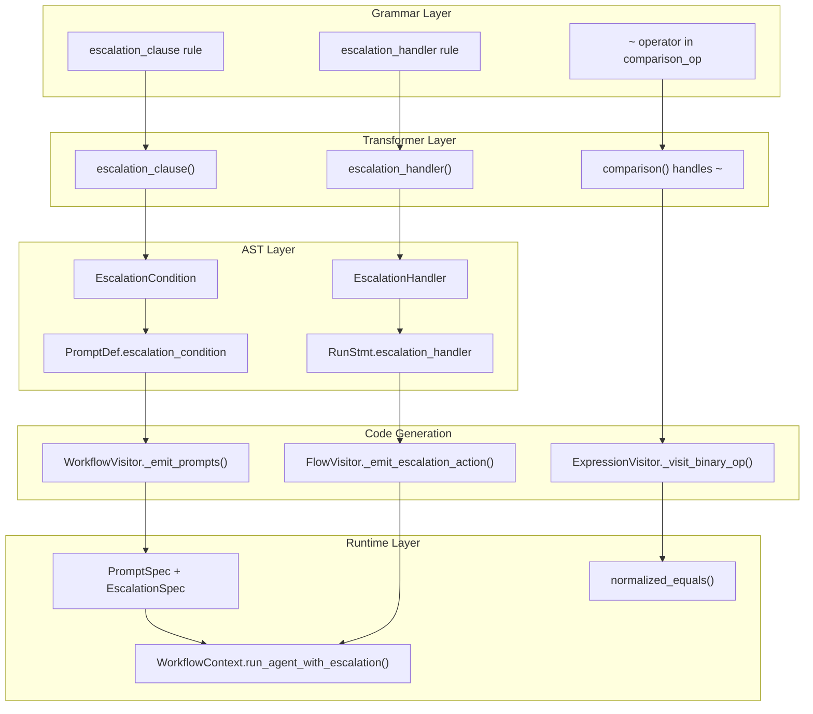

# Escalation Feature Architecture

The Escalation feature enables cleaner agent communication patterns in the DSL through normalized
comparison and prompt-level escalation conditions. This document describes the architecture for
developers who need to understand, debug, or extend the system.

## Overview

The feature introduces two related capabilities:

1. **Normalized comparison operator (`~`)** - Case-insensitive, whitespace/punctuation-stripped
   equality comparison for handling LLM output formatting noise
2. **Prompt escalation conditions** - Define when a prompt's output should trigger escalation
3. **Run statement escalation handlers** - Handle escalation at the call site with actions like
   `return`, `continue`, or `abort`

These capabilities work together to enable patterns like iterative refinement loops where agents
can signal when they have reached a stable state.

## Data Flow

The escalation feature flows through the DSL pipeline as follows:



## Key Components

### AST Nodes

#### EscalationCondition

Define when a prompt's output should trigger escalation.

**Location**: `src/streetrace/dsl/ast/nodes.py:439`

```python
@dataclass
class EscalationCondition:
    """Escalation condition for prompt outputs."""

    op: str  # "~", "==", "!=", "contains"
    value: str | AstNode  # String literal or expression
    meta: SourcePosition | None = None
```

The `op` field determines how the comparison is performed:

| Operator | Description | Example |
|----------|-------------|---------|
| `~` | Normalized equality (case-insensitive, strips formatting) | `~ "DRIFTING"` |
| `==` | Exact string match | `== "ERROR"` |
| `!=` | Not equal | `!= "OK"` |
| `contains` | Substring check | `contains "ERROR"` |

#### EscalationHandler

Define what action to take when escalation occurs.

**Location**: `src/streetrace/dsl/ast/nodes.py:452`

```python
@dataclass
class EscalationHandler:
    """Handler for agent escalation."""

    action: str  # "return", "continue", "abort"
    value: AstNode | None = None  # For return action
    meta: SourcePosition | None = None
```

Actions:

| Action | Effect | Use Case |
|--------|--------|----------|
| `return` | Return from flow with value | Return previous value on drift |
| `continue` | Skip to next loop iteration | Skip failed items |
| `abort` | Raise AbortError | Critical failure |

#### Modified PromptDef

Prompts can now include an escalation condition.

**Location**: `src/streetrace/dsl/ast/nodes.py:465`

```python
@dataclass
class PromptDef:
    """Prompt definition node."""

    name: str
    body: str
    model: str | None = None
    expecting: str | None = None
    inherit: str | None = None
    escalation_condition: EscalationCondition | None = None  # NEW
    meta: SourcePosition | None = None
```

#### Modified RunStmt

Run statements can now include an escalation handler.

**Location**: `src/streetrace/dsl/ast/nodes.py:133`

```python
@dataclass
class RunStmt:
    """Run statement node for agents and flows."""

    target: str | None
    agent: str
    args: list[AstNode]
    meta: SourcePosition | None = None
    is_flow: bool = False
    escalation_handler: EscalationHandler | None = None  # NEW
```

### Runtime Dataclasses

#### EscalationSpec

Runtime representation of an escalation condition.

**Location**: `src/streetrace/dsl/runtime/workflow.py:35`

```python
@dataclass
class EscalationSpec:
    """Escalation specification for prompt outputs."""

    op: str
    """Comparison operator: '~', '==', '!=', 'contains'."""

    value: str
    """Value to compare against."""
```

#### PromptSpec

Runtime representation of a prompt with optional escalation.

**Location**: `src/streetrace/dsl/runtime/workflow.py:50`

```python
@dataclass
class PromptSpec:
    """Prompt specification with optional escalation."""

    body: Callable[[object], str]
    """Lambda that takes context and returns the prompt text."""

    model: str | None = None
    """Optional model name for this prompt."""

    escalation: EscalationSpec | None = None
    """Optional escalation condition."""
```

#### EscalationEvent

FlowEvent emitted when escalation is triggered, providing full context about the escalation.

**Location**: `src/streetrace/dsl/runtime/events.py:61`

```python
@dataclass
class EscalationEvent(FlowEvent):
    """Event emitted when escalation is triggered."""

    agent_name: str
    """Name of the agent that triggered escalation."""

    result: str
    """The result that triggered escalation."""

    condition_op: str
    """The escalation operator that matched ('~', '==', '!=', 'contains')."""

    condition_value: str
    """The escalation condition value that was matched against."""

    type: str = field(default="escalation", init=False)
```

This event provides detailed information about what triggered escalation, useful for
debugging and logging in complex multi-agent workflows.

### Runtime Methods

#### WorkflowContext.run_agent_with_escalation()

Run an agent and track escalation state.

**Location**: `src/streetrace/dsl/runtime/context.py:264`

```python
async def run_agent_with_escalation(
    self,
    agent_name: str,
    *args: object,
) -> AsyncGenerator[Event | EscalationEvent, None]:
    """Run agent and check for escalation."""
```

This method:
1. Resets the escalation flag
2. Delegates to `run_agent()` yielding all events
3. After completion, checks if the result triggers the agent's prompt escalation condition
4. If escalation is triggered:
   - Yields an `EscalationEvent` with full context (agent name, result, condition)
   - Yields an ADK `Event` with `actions.escalate = True` for ADK ecosystem integration
5. Stores the escalation flag for retrieval via `get_last_result_with_escalation()`

#### ADK Integration

When escalation is triggered, the system yields an ADK `Event` with `actions.escalate = True`.
This integrates with Google's ADK escalation pattern, allowing parent agents in a hierarchy
(like LoopAgent) to react to escalation signals:

```python
from google.adk.events import Event
from google.adk.events.event_actions import EventActions

# When escalation triggers, this event is yielded:
Event(
    author=agent_name,
    actions=EventActions(escalate=True),
)
```

This enables proper integration with ADK's multi-agent patterns where parent agents can
monitor for `event.actions.escalate` to handle escalation from sub-agents.

#### WorkflowContext._check_escalation()

Check if a result triggers an escalation condition.

**Location**: `src/streetrace/dsl/runtime/context.py:295`

```python
def _check_escalation(self, agent_name: str, result: object) -> bool:
    """Check if result triggers escalation condition."""
```

Resolution chain:
1. Look up agent definition by name
2. Get the agent's instruction (prompt name)
3. Look up the prompt's PromptSpec
4. Check if it has an EscalationSpec
5. Evaluate the condition against the result

#### normalized_equals()

Perform normalized equality comparison.

**Location**: `src/streetrace/dsl/runtime/utils.py:50`

```python
def normalized_equals(left: object, right: object) -> bool:
    """Perform normalized equality comparison."""
```

The normalization process (`normalize_for_comparison()`):
1. Remove markdown modifiers (`**`, `*`, `_`, `` ` ``, `#`)
2. Remove punctuation (`.`, `!`, `?`, `,`, `;`, `:`)
3. Convert to lowercase
4. Collapse whitespace to single space
5. Strip leading/trailing whitespace

## Code Generation

### Expression Generation

The `~` operator is handled in `ExpressionVisitor._visit_binary_op()`.

**Location**: `src/streetrace/dsl/codegen/visitors/expressions.py:137`

```python
def _visit_binary_op(self, node: BinaryOp) -> str:
    left = self.visit(node.left)
    right = self.visit(node.right)
    op = node.op

    # Handle normalized equals operator
    if op == "~":
        return f"normalized_equals({left}, {right})"

    # ... other operators
```

Generated code example:

```python
# DSL: if $response ~ "YES":
if normalized_equals(ctx.vars['response'], "YES"):
```

### Prompt Generation

Prompts with escalation conditions emit `PromptSpec` with `EscalationSpec`.

**Location**: `src/streetrace/dsl/codegen/visitors/workflow.py:245`

```python
if prompt.escalation_condition:
    cond = prompt.escalation_condition
    self._emitter.emit(
        f"'{prompt.name}': PromptSpec(",
    )
    self._emitter.indent()
    self._emitter.emit(f"body=lambda ctx: {body},")
    self._emitter.emit(
        f"escalation=EscalationSpec(op='{cond.op}', value='{cond.value}'),",
    )
    self._emitter.dedent()
    self._emitter.emit("),")
```

Generated code example:

```python
_prompts = {
    'pi_enhancer': PromptSpec(
        body=lambda ctx: f"""Enhance the prompt...""",
        escalation=EscalationSpec(op='~', value='DRIFTING'),
    ),
}
```

### Run Statement Generation

Run statements with escalation handlers use `run_agent_with_escalation()`.

**Location**: `src/streetrace/dsl/codegen/visitors/flows.py:226`

```python
def _visit_run_stmt(self, node: RunStmt) -> None:
    if node.escalation_handler:
        # Use run_agent_with_escalation which tracks escalation state
        call = f"ctx.run_agent_with_escalation('{node.agent}', {args_str})"

        # Generate async for loop to yield events
        self._emitter.emit(f"async for _event in {call}:")
        self._emitter.indent()
        self._emitter.emit("yield _event")
        self._emitter.dedent()

        # Get result and escalation flag
        self._emitter.emit(
            "_result, _escalated = ctx.get_last_result_with_escalation()",
        )

        # Handle escalation
        self._emitter.emit("if _escalated:")
        self._emitter.indent()
        self._emit_escalation_action(node.escalation_handler)
        self._emitter.dedent()
```

Generated code example:

```python
# DSL: $current = run agent peer1 $current, on escalate return $current
async for _event in ctx.run_agent_with_escalation('peer1', ctx.vars['current']):
    yield _event
_result, _escalated = ctx.get_last_result_with_escalation()
ctx.vars['current'] = _result
if _escalated:
    ctx.vars['_return_value'] = ctx.vars['current']
    return
```

## Grammar Rules

### Escalation Clause

**Location**: `src/streetrace/dsl/grammar/streetrace.lark:302`

```lark
// Prompt escalation clause - defines when output triggers escalation
escalation_clause: _NL _INDENT "escalate" "if" escalation_condition _NL _DEDENT

escalation_condition: "~" STRING                     -> normalized_escalation
                    | "==" STRING                    -> exact_escalation
                    | "!=" STRING                    -> not_equal_escalation
                    | "contains" STRING              -> contains_escalation
```

### Escalation Handler

**Location**: `src/streetrace/dsl/grammar/streetrace.lark:362`

```lark
// Escalation handler for run statements
escalation_handler: "," "on" "escalate" escalation_action

escalation_action: "return" expression               -> escalation_return
                 | "continue"                        -> escalation_continue
                 | "abort"                           -> escalation_abort
```

### Normalized Comparison Operator

**Location**: `src/streetrace/dsl/grammar/streetrace.lark:417`

```lark
comparison_op: ">" | "<" | ">=" | "<=" | "==" | "!=" | "contains" | "~"
```

## Integration Points

### With Flow Event Yielding

The escalation feature integrates with the Flow Event Yielding system:

1. `run_agent_with_escalation()` yields all ADK events like `run_agent()`
2. After event iteration completes, it checks the escalation condition
3. Generated code uses the async generator pattern for event streaming

### With Agentic Patterns

Escalation works with both `delegate` and `use` patterns:

- Sub-agents created via `delegate` can have prompts with escalation conditions
- AgentTools created via `use` can escalate when their output matches conditions
- Nested agent hierarchies propagate escalation through the call chain

## Error Handling

### AbortError

When `on escalate abort` is triggered, an `AbortError` is raised.

**Location**: `src/streetrace/dsl/runtime/errors.py`

```python
class AbortError(Exception):
    """Exception raised when a flow is aborted."""
    pass
```

This error propagates up and stops workflow execution.

### Invalid Escalation Conditions

If an escalation condition cannot be evaluated (e.g., missing prompt), the check returns `False`
(no escalation). This is a fail-safe design to prevent unexpected flow interruption.

## See Also

- [API Reference](api-reference.md) - Complete API documentation
- [Flow Event Yielding](flow-events/overview.md) - Event streaming architecture
- [Agentic Patterns](agentic-patterns.md) - Multi-agent pattern implementation
- [Grammar Development Guide](grammar.md) - How to modify the DSL grammar
