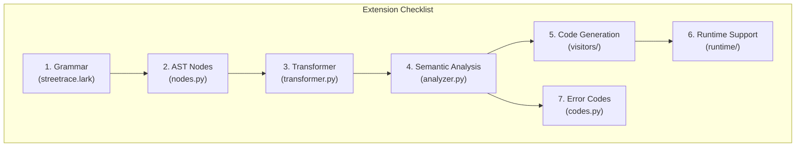

# DSL Extension Guide

This guide explains how to extend the Streetrace DSL with new node types, code generation
patterns, and runtime integrations. Follow this guide when adding significant new features
to the language.

## Overview

Extending the DSL involves changes across multiple compiler phases:



## Example: Adding a New Construct

This walkthrough adds a hypothetical `guard` construct for defining reusable guardrail
conditions:

```
guard pii_check:
    pattern: "\\b\\d{3}-\\d{2}-\\d{4}\\b"
    action: mask
    message: "SSN detected and masked"
```

### Step 1: Define the Grammar

Edit `src/streetrace/dsl/grammar/streetrace.lark`:

```lark
// Add to statement alternatives
statement: version_decl
         | import_stmt
         | model_def
         | schema_def
         | tool_def
         | guard_def      // NEW
         | ...

// Define the guard construct
guard_def: "guard" NAME ":" _NL guard_body

guard_body: _INDENT guard_property+ _DEDENT

guard_property: guard_pattern
              | guard_action
              | guard_message

guard_pattern: "pattern" ":" STRING
guard_action: "action" ":" guard_action_type
guard_action_type: "mask" | "block" | "warn"
guard_message: "message" ":" STRING
```

### Step 2: Create AST Node

Edit `src/streetrace/dsl/ast/nodes.py`:

```python
@dataclass
class GuardDef:
    """Guard definition for reusable guardrail conditions.

    Define a named pattern-based guardrail that can be referenced
    in event handlers.
    """

    name: str
    """Unique identifier for this guard."""

    pattern: str | None = None
    """Regex pattern to match."""

    action: str = "warn"
    """Action to take: mask, block, or warn."""

    message: str | None = None
    """Message to display when triggered."""

    meta: SourcePosition | None = None
    """Source position for error reporting."""
```

Add to the `__all__` list:

```python
__all__ = [
    # ... existing exports ...
    "GuardDef",
]
```

### Step 3: Implement Transformer

Edit `src/streetrace/dsl/ast/transformer.py`:

```python
def guard_def(self, items: TransformerItems) -> GuardDef:
    """Transform guard_def rule."""
    filtered = _filter_children(items)
    name = None
    properties: dict[str, str | None] = {}

    for item in filtered:
        if isinstance(item, dict):
            properties.update(item)
        elif isinstance(item, (str, Token)):
            val = _get_token_value(item) if isinstance(item, Token) else item
            if name is None and val:
                name = val

    return GuardDef(
        name=name or "",
        pattern=properties.get("pattern"),
        action=properties.get("action", "warn"),
        message=properties.get("message"),
    )


def guard_body(self, items: TransformerItems) -> dict:
    """Transform guard_body rule."""
    result: dict[str, str | None] = {}
    filtered = _filter_children(items)
    for item in filtered:
        if isinstance(item, dict):
            result.update(item)
    return result


def guard_pattern(self, items: TransformerItems) -> dict:
    """Transform guard_pattern rule."""
    filtered = _filter_children(items)
    for item in filtered:
        if isinstance(item, str):
            return {"pattern": item}
    return {}


def guard_action(self, items: TransformerItems) -> dict:
    """Transform guard_action rule."""
    filtered = _filter_children(items)
    for item in filtered:
        if isinstance(item, str):
            return {"action": item}
    return {}


def guard_action_type(self, items: TransformerItems) -> str:
    """Transform guard_action_type rule."""
    return str(items[0])


def guard_message(self, items: TransformerItems) -> dict:
    """Transform guard_message rule."""
    filtered = _filter_children(items)
    for item in filtered:
        if isinstance(item, str):
            return {"message": item}
    return {}
```

### Step 4: Add Semantic Validation

Edit `src/streetrace/dsl/semantic/analyzer.py`:

First, add to the `SymbolTable` dataclass:

```python
@dataclass
class SymbolTable:
    """Collected symbol information from analysis."""

    models: dict[str, ModelDef] = field(default_factory=dict)
    schemas: dict[str, SchemaDef] = field(default_factory=dict)
    tools: dict[str, ToolDef] = field(default_factory=dict)
    prompts: dict[str, PromptDef] = field(default_factory=dict)
    agents: dict[str, AgentDef] = field(default_factory=dict)
    flows: dict[str, FlowDef] = field(default_factory=dict)
    guards: dict[str, GuardDef] = field(default_factory=dict)  # NEW
    # ... other fields ...
```

Add to `SymbolKind` enum if needed:

```python
class SymbolKind(Enum):
    # ... existing kinds ...
    GUARD = "guard"
```

Add collection method:

```python
def _collect_definition(self, stmt: object) -> None:
    """Collect a single top-level definition."""
    if isinstance(stmt, ModelDef):
        self._collect_model(stmt)
    # ... existing cases ...
    elif isinstance(stmt, GuardDef):
        self._collect_guard(stmt)


def _collect_guard(self, guard: GuardDef) -> None:
    """Collect a guard definition."""
    if guard.name in self._symbols.guards:
        self._add_error(
            SemanticError.duplicate_definition(
                kind="guard",
                name=guard.name,
                position=guard.meta,
            ),
        )
        return

    # Validate pattern is valid regex
    if guard.pattern is not None:
        try:
            import re
            re.compile(guard.pattern)
        except re.error as e:
            self._add_error(
                SemanticError(
                    code=ErrorCode.E0010,
                    message=f"invalid regex pattern in guard '{guard.name}': {e}",
                    position=guard.meta,
                ),
            )
            return

    self._symbols.guards[guard.name] = guard
    if self._global_scope is not None:
        self._global_scope.define(
            name=guard.name,
            kind=SymbolKind.GUARD,
            node=guard,
        )
```

### Step 5: Implement Code Generation

Create or edit a visitor in `src/streetrace/dsl/codegen/visitors/`:

```python
def visit_guard_def(self, node: GuardDef, source_line: int | None) -> None:
    """Generate code for guard definition.

    Guards are compiled to a dictionary entry in _guards class variable.

    Args:
        node: The GuardDef AST node.
        source_line: Original source line number.

    """
    self._emitter.emit(
        f"_guards['{node.name}'] = GuardConfig(",
        source_line=source_line,
    )
    self._emitter.indent()

    if node.pattern is not None:
        # Escape backslashes for Python string
        escaped = node.pattern.replace("\\", "\\\\")
        self._emitter.emit(f'pattern=r"{escaped}",')

    self._emitter.emit(f'action="{node.action}",')

    if node.message is not None:
        self._emitter.emit(f'message="{node.message}",')

    self._emitter.dedent()
    self._emitter.emit(")")
    self._emitter.emit_blank()
```

Update the main visitor to call this method:

```python
def visit(self, ast: DslFile, source_file: str) -> None:
    """Visit all nodes in the AST."""
    for stmt in ast.statements:
        source_line = stmt.meta.line if hasattr(stmt, "meta") and stmt.meta else None

        if isinstance(stmt, ModelDef):
            self.visit_model_def(stmt, source_line)
        # ... existing cases ...
        elif isinstance(stmt, GuardDef):
            self.visit_guard_def(stmt, source_line)
```

### Step 6: Add Runtime Support

Create runtime classes in `src/streetrace/dsl/runtime/`:

```python
# src/streetrace/dsl/runtime/guards.py
"""Guard runtime support for Streetrace DSL."""

import re
from dataclasses import dataclass
from typing import Callable


@dataclass
class GuardConfig:
    """Configuration for a guard."""

    pattern: str | None = None
    action: str = "warn"
    message: str | None = None

    _compiled: re.Pattern | None = None

    def __post_init__(self) -> None:
        """Compile the regex pattern."""
        if self.pattern is not None:
            self._compiled = re.compile(self.pattern)

    def check(self, text: str) -> tuple[bool, str | None]:
        """Check if text matches the guard pattern.

        Args:
            text: Text to check.

        Returns:
            Tuple of (matched, masked_text or None).

        """
        if self._compiled is None:
            return False, None

        match = self._compiled.search(text)
        if not match:
            return False, None

        if self.action == "mask":
            masked = self._compiled.sub("[MASKED]", text)
            return True, masked

        return True, None
```

Update `DslAgentWorkflow` base class:

```python
class DslAgentWorkflow:
    """Base class for generated DSL workflows."""

    _models: ClassVar[dict[str, str]] = {}
    _prompts: ClassVar[dict[str, object]] = {}
    _tools: ClassVar[dict[str, dict[str, object]]] = {}
    _agents: ClassVar[dict[str, dict[str, object]]] = {}
    _guards: ClassVar[dict[str, GuardConfig]] = {}  # NEW

    def check_guards(self, text: str) -> tuple[str, list[str]]:
        """Check all guards against text.

        Args:
            text: Text to check.

        Returns:
            Tuple of (possibly modified text, list of triggered guard names).

        """
        triggered = []
        result = text

        for name, guard in self._guards.items():
            matched, masked = guard.check(result)
            if matched:
                triggered.append(name)
                if masked is not None:
                    result = masked

        return result, triggered
```

### Step 7: Add Error Codes

If new error conditions are possible, add codes to `src/streetrace/dsl/errors/codes.py`:

```python
class ErrorCode(str, Enum):
    # ... existing codes ...

    E0011 = "E0011"
    """Invalid regex pattern in guard."""


ERROR_MESSAGES: dict[ErrorCode, str] = {
    # ... existing messages ...
    ErrorCode.E0011: "invalid regex pattern in guard '{name}': {error}",
}
```

### Step 8: Write Tests

Create comprehensive tests:

```python
# tests/dsl/test_guards.py
"""Tests for guard definitions."""

import pytest
from streetrace.dsl.grammar.parser import parse
from streetrace.dsl.ast.transformer import transform
from streetrace.dsl.ast.nodes import GuardDef
from streetrace.dsl.semantic.analyzer import SemanticAnalyzer
from streetrace.dsl.compiler import compile_dsl


class TestGuardParsing:
    """Test guard definition parsing."""

    def test_parse_simple_guard(self):
        """Test parsing a simple guard definition."""
        source = '''
guard pii_check:
    pattern: "\\\\d{3}-\\\\d{2}-\\\\d{4}"
    action: mask
'''
        tree = parse(source)
        ast = transform(tree)

        assert len(ast.statements) == 1
        guard = ast.statements[0]
        assert isinstance(guard, GuardDef)
        assert guard.name == "pii_check"
        assert guard.action == "mask"

    def test_guard_with_message(self):
        """Test guard with custom message."""
        source = '''
guard ssn_guard:
    pattern: "\\\\d{9}"
    action: block
    message: "SSN detected"
'''
        tree = parse(source)
        ast = transform(tree)

        guard = ast.statements[0]
        assert guard.message == "SSN detected"


class TestGuardSemantics:
    """Test guard semantic analysis."""

    def test_duplicate_guard_error(self):
        """Test error on duplicate guard names."""
        source = '''
guard check1:
    action: warn

guard check1:
    action: block
'''
        tree = parse(source)
        ast = transform(tree)
        analyzer = SemanticAnalyzer()
        result = analyzer.analyze(ast)

        assert not result.is_valid
        assert any("duplicate" in e.message for e in result.errors)

    def test_invalid_regex_error(self):
        """Test error on invalid regex pattern."""
        source = '''
guard bad_pattern:
    pattern: "[invalid"
    action: warn
'''
        tree = parse(source)
        ast = transform(tree)
        analyzer = SemanticAnalyzer()
        result = analyzer.analyze(ast)

        assert not result.is_valid


class TestGuardCodeGen:
    """Test guard code generation."""

    def test_generate_guard_code(self):
        """Test that guards generate valid Python."""
        source = '''
guard pii_check:
    pattern: "\\\\d{3}-\\\\d{2}-\\\\d{4}"
    action: mask
    message: "PII detected"
'''
        bytecode, _ = compile_dsl(source, "test.sr")
        assert bytecode is not None
```

## Adding New Code Generation Patterns

### Pattern: Class Variables

For constructs that define static configuration:

```python
def visit_config_def(self, node: ConfigDef, source_line: int | None) -> None:
    """Generate class variable for config."""
    self._emitter.emit(f"_config_{node.name} = {{", source_line=source_line)
    self._emitter.indent()
    for key, value in node.properties.items():
        self._emitter.emit(f'"{key}": {repr(value)},')
    self._emitter.dedent()
    self._emitter.emit("}")
```

### Pattern: Method Overrides

For constructs that define behavior:

```python
def visit_handler_def(self, node: HandlerDef, source_line: int | None) -> None:
    """Generate async method override."""
    self._emitter.emit(
        f"async def {node.method_name}(self, ctx: WorkflowContext) -> None:",
        source_line=source_line,
    )
    self._emitter.indent()
    for stmt in node.body:
        self.visit_statement(stmt)
    self._emitter.dedent()
    self._emitter.emit_blank()
```

### Pattern: Runtime Calls

For constructs that invoke runtime functions:

```python
def visit_action_stmt(self, node: ActionStmt, source_line: int | None) -> None:
    """Generate runtime function call."""
    args = ", ".join(self.format_expr(arg) for arg in node.args)
    self._emitter.emit(
        f"await self._runtime.{node.action}({args})",
        source_line=source_line,
    )
```

## Integrating with the Runtime

### Workflow Context

The `WorkflowContext` provides runtime state. Add new capabilities by extending it:

```python
# src/streetrace/dsl/runtime/context.py
class WorkflowContext:
    def __init__(self) -> None:
        self._models: dict[str, str] = {}
        self._prompts: dict[str, object] = {}
        self._guards: dict[str, GuardConfig] = {}  # NEW

    def set_guards(self, guards: dict[str, GuardConfig]) -> None:
        """Set guard configurations."""
        self._guards = guards

    def apply_guards(self, text: str) -> tuple[str, list[str]]:
        """Apply all guards to text."""
        # Implementation
```

### Base Workflow Class

Update `DslAgentWorkflow` for new constructs:

```python
class DslAgentWorkflow:
    def create_context(self) -> WorkflowContext:
        """Create a new workflow context."""
        ctx = WorkflowContext()
        ctx.set_models(self._models)
        ctx.set_prompts(self._prompts)
        ctx.set_guards(self._guards)  # NEW
        self._context = ctx
        return ctx
```

## Documentation Updates

When adding new features, update:

1. **User syntax reference**: `docs/user/dsl/syntax-reference.md`
2. **User getting started** (if applicable): `docs/user/dsl/getting-started.md`
3. **Troubleshooting** (for new errors): `docs/user/dsl/troubleshooting.md`

## See Also

- [Architecture Overview](architecture.md) - Compiler phase descriptions
- [Grammar Development](grammar.md) - Grammar syntax and patterns
- [Syntax Reference](../user/dsl/syntax-reference.md) - User-facing syntax docs
