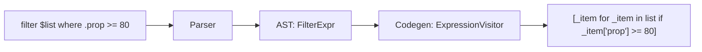

# Filter Expression

This document covers the architecture and implementation of the filter expression
in the Streetrace DSL, enabling declarative list filtering with implicit property access.

## Overview

The `filter` expression provides a concise way to filter lists based on conditions
that reference properties of each item using implicit property access syntax:

```streetrace
$filtered = filter $findings where .confidence >= 80
$fixable = filter $items where .suggested_fix != null
```

The leading dot (`.property`) indicates property access on the implicit iteration item,
eliminating the need for explicit lambda variable declarations.

## Architecture

### Compilation Pipeline



### AST Representation

Two nodes work together for filter expressions:

```python
@dataclass
class ImplicitProperty:
    """Implicit property access on filter iteration item.

    Represents `.property` or `.nested.property` in filter conditions.
    The leading dot indicates access on the implicit loop variable.
    """

    properties: list[str]
    meta: SourcePosition | None = None


@dataclass
class FilterExpr:
    """Filter expression for list filtering.

    Example: filter $findings where .confidence >= 80
    """

    list_expr: AstNode  # The list to filter
    condition: AstNode  # The condition expression (uses ImplicitProperty)
    meta: SourcePosition | None = None
```

**Location**: `src/streetrace/dsl/ast/nodes.py:118-139`

### Grammar Definition

```lark
# Filter expression at the comparison level
?comparison: filter_expr
           | additive (comparison_op additive)?

# Filter expression for list filtering
filter_expr: "filter" atom "where" or_expr

# Implicit property access for filter conditions
implicit_property: "." contextual_name ("." contextual_name)*
                 | "." DOTTED_NAME
```

**Location**: `src/streetrace/dsl/grammar/streetrace.lark:415-443`

The filter expression is placed at the `comparison` level in the expression hierarchy,
allowing it to be used in assignments while the condition can contain full boolean
expressions.

## Code Generation

### Implicit Property Visitor

The `ImplicitProperty` node generates code that accesses properties on `_item`:

```python
def _visit_implicit_property(self, node: ImplicitProperty) -> str:
    """Generate code for implicit property access.

    Example:
        .confidence -> _item['confidence']
        .nested.prop -> _item['nested']['prop']
    """
    base = "_item"
    for prop in node.properties:
        base = f"{base}['{prop}']"
    return base
```

**Location**: `src/streetrace/dsl/codegen/visitors/expressions.py:248-265`

### Filter Expression Visitor

The `FilterExpr` node generates a Python list comprehension:

```python
def _visit_filter_expr(self, node: FilterExpr) -> str:
    """Generate code for filter expression.

    Example:
        filter $findings where .confidence >= 80
        -> [_item for _item in ctx.vars['findings'] if _item['confidence'] >= 80]
    """
    list_code = self.visit(node.list_expr)
    condition_code = self.visit(node.condition)
    return f"[_item for _item in {list_code} if {condition_code}]"
```

**Location**: `src/streetrace/dsl/codegen/visitors/expressions.py:267-283`

### Generated Code Examples

| DSL Expression | Generated Python |
|----------------|------------------|
| `filter $findings where .confidence >= 80` | `[_item for _item in ctx.vars['findings'] if _item['confidence'] >= 80]` |
| `filter $items where .suggested_fix != null` | `[_item for _item in ctx.vars['items'] if _item['suggested_fix'] != None]` |
| `filter $findings where .nested.severity == "critical"` | `[_item for _item in ctx.vars['findings'] if _item['nested']['severity'] == "critical"]` |

## Design Decisions

### Implicit Property Syntax

The leading dot syntax (`.property`) was chosen for several reasons:

1. **Unambiguous Grammar**: The dot prefix clearly distinguishes implicit property access
   from variable references or other expressions
2. **No Semantic Analysis Required**: The parser can identify implicit properties purely
   syntactically without needing symbol table lookups
3. **Familiar Pattern**: Similar to jq's `.field` syntax and other data query languages
4. **Supports Nesting**: Natural extension to nested properties (`.finding.severity`)

### List Comprehension Target

Generating Python list comprehensions provides:

- Native Python performance
- Lazy evaluation benefits in iterator chains
- Familiar debugging experience for Python developers
- Direct compatibility with Python's type system

### Condition Flexibility

The condition accepts full `or_expr` expressions, allowing complex filters:

```streetrace
$critical = filter $findings where .severity == "critical" or .confidence >= 95
```

## Usage in Code Review Agents

### V1 Monolithic - Confidence Filter

```streetrace
$filtered = filter $review.findings where .confidence >= 80
$review.findings = $filtered
```

**Location**: `agents/code-review/v1-monolithic.sr:159-160`

### V2 Parallel - Multiple Filters

```streetrace
# Filter for validation
$high_confidence = filter $findings where .confidence >= 80

# Filter for patch generation
$fixable = filter $findings where .suggested_fix != null
```

**Location**: `agents/code-review/v2-parallel.sr:562,587`

## Error Handling

### Invalid Property Access

If a property does not exist on a list item at runtime, Python raises a `KeyError`.
The error includes the property name and is propagated to the workflow error handler.

### Empty List Input

Filtering an empty list returns an empty list without error:

```python
[_item for _item in [] if _item['prop'] >= 80]  # Returns []
```

## Comparison with Alternatives

| Approach | Syntax | Trade-offs |
|----------|--------|------------|
| Implicit Property | `filter $list where .prop >= 80` | Concise, no variable declaration |
| Lambda Expression | `filter($list, $x -> $x.prop >= 80)` | More explicit, longer syntax |
| Method Chaining | `$list.filter(x => x.prop >= 80)` | OOP-style, requires method support |

The implicit property approach was chosen for its balance of conciseness and clarity,
avoiding the verbosity of lambda declarations while maintaining readability.

## See Also

- [Property Assignment](property-assignment.md) - Assigning to object properties
- [Expressions](../user/dsl/expressions.md) - User guide for DSL expressions
- [DSL Architecture](architecture.md) - Overall compiler architecture
