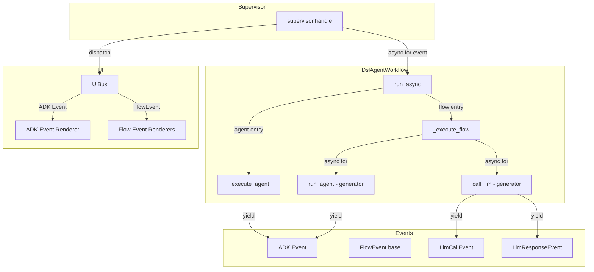
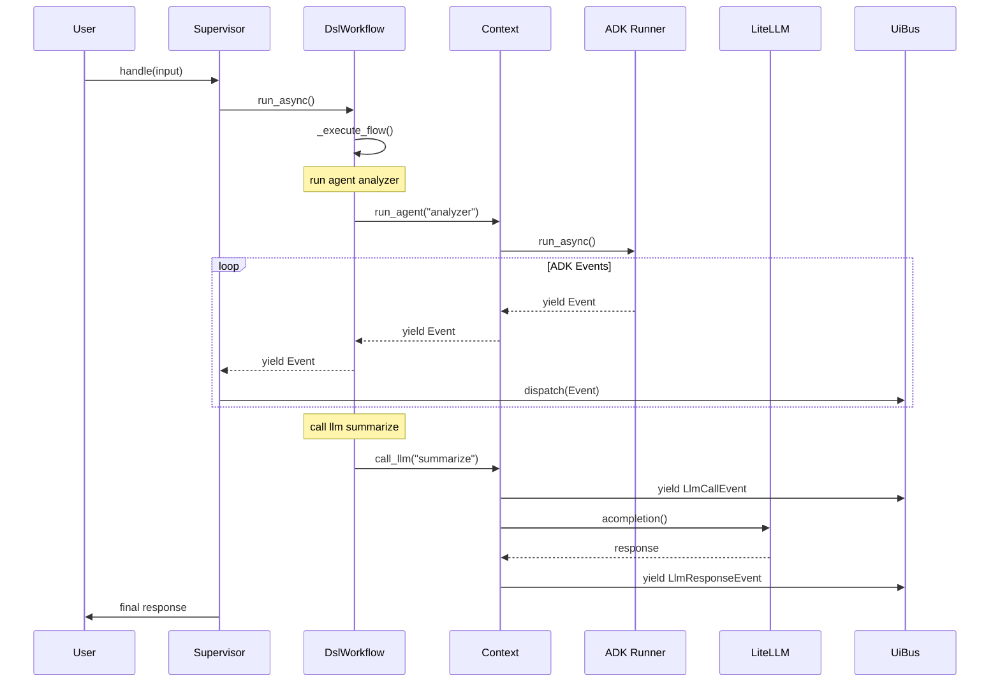

# Flow Event Yielding Architecture

DSL flows yield events during execution, enabling real-time progress monitoring and consistent
user experience. This document describes the architecture for developers who need to understand,
extend, or debug the event streaming system.

## Overview

Before this feature, DSL flows executed operations without producing events. Agent runs and LLM
calls completed silently, with only final results being captured. This created a poor user
experience during long-running workflows.

Flow Event Yielding solves this by making all flow methods async generators that yield events
as operations progress. The Supervisor receives these events and dispatches them to the UI for
real-time rendering.

## Architecture



## Event Types

The system produces two categories of events:

### ADK Events

ADK Events come from Google ADK's Runner and represent agent execution progress. These include:

- Function calls (tool invocations)
- Function responses (tool results)
- Model thinking/reasoning
- Final responses

ADK Events pass through unchanged from `run_agent()` operations. The existing
`adk_event_renderer.py` handles their display.

### FlowEvents

FlowEvents are custom events for operations that don't use ADK, specifically direct LLM calls
via `call llm` statements.

**Location**: `src/streetrace/dsl/runtime/events.py`

```python
@dataclass
class FlowEvent:
    """Base class for all non-ADK flow events."""
    type: str  # Discriminator for serialization/dispatch

@dataclass
class LlmCallEvent(FlowEvent):
    """Event emitted when a direct LLM call is initiated."""
    prompt_name: str
    model: str
    prompt_text: str
    type: str = field(default="llm_call", init=False)

@dataclass
class LlmResponseEvent(FlowEvent):
    """Event emitted when a direct LLM call completes."""
    prompt_name: str
    content: str
    is_final: bool = True
    type: str = field(default="llm_response", init=False)
```

The `type` field serves as a discriminator for dispatch and potential serialization.

## Async Generator Pattern

Python's async generators cannot use `return value` directly. The implementation solves this
with a side-channel result capture pattern.

### Generator Flow

1. Flow method is an async generator yielding `Event | FlowEvent`
2. Operations like `run_agent()` and `call_llm()` are also generators
3. Results are stored in `WorkflowContext._last_call_result`
4. Generated code calls `ctx.get_last_result()` after iteration

### Generated Code Example

DSL source:

```streetrace
flow main:
    $analysis = run agent analyzer $input_prompt
    $result = call llm summarize $analysis
    return $result
```

Generated Python:

```python
async def flow_main(
    self, ctx: WorkflowContext
) -> AsyncGenerator[Event | FlowEvent, None]:
    async for _event in ctx.run_agent('analyzer', ctx.vars['input_prompt']):
        yield _event
    ctx.vars['analysis'] = ctx.get_last_result()

    async for _event in ctx.call_llm('summarize', ctx.vars['analysis']):
        yield _event
    ctx.vars['result'] = ctx.get_last_result()

    ctx.vars['_return_value'] = ctx.vars['result']
    return
```

## Component Integration

### Supervisor Event Handling

**Location**: `src/streetrace/workflow/supervisor.py:172-187`

The Supervisor handles both event types in its main loop:

```python
async for event in workload.run_async(session, content):
    if isinstance(event, FlowEvent):
        # Custom flow event - dispatch directly
        self.ui_bus.dispatch_ui_update(event)
        final_response_text = self._capture_flow_event_response(
            event, final_response_text
        )
    else:
        # ADK Event - wrap and dispatch
        self.ui_bus.dispatch_ui_update(Event(event=event))
        final_response_text = self._capture_adk_event_response(
            event, final_response_text
        )
```

Final responses are captured from:

- `LlmResponseEvent.content` when `is_final=True`
- ADK Event's final response content

### DslAgentWorkflow Methods

**Location**: `src/streetrace/dsl/runtime/workflow.py`

Key async generator methods:

| Method | Return Type | Description |
|--------|-------------|-------------|
| `run_async()` | `AsyncGenerator[Event \| FlowEvent, None]` | Entry point for workload execution |
| `_execute_flow()` | `AsyncGenerator[Event \| FlowEvent, None]` | Execute a named flow |
| `_execute_agent()` | `AsyncGenerator[Event, None]` | Execute a named agent |
| `run_agent()` | `AsyncGenerator[Event, None]` | Run agent from within flow |
| `run_flow()` | `AsyncGenerator[Event \| FlowEvent, None]` | Run nested flow |

### WorkflowContext Methods

**Location**: `src/streetrace/dsl/runtime/context.py`

| Method | Return Type | Description |
|--------|-------------|-------------|
| `run_agent()` | `AsyncGenerator[Event, None]` | Delegate to workflow, yield events |
| `run_flow()` | `AsyncGenerator[Event \| FlowEvent, None]` | Delegate to workflow, yield events |
| `call_llm()` | `AsyncGenerator[FlowEvent, None]` | Yield LlmCallEvent and LlmResponseEvent |
| `get_last_result()` | `object` | Retrieve result from last operation |

### Code Generation

**Location**: `src/streetrace/dsl/codegen/visitors/flows.py`

The FlowVisitor generates async generator methods with:

- Return type `AsyncGenerator[Event | FlowEvent, None]`
- `async for _event in ... yield _event` for run/call statements
- `ctx.get_last_result()` for result capture
- `ctx.vars['_return_value']` for flow return values

### Event Renderers

**Location**: `src/streetrace/ui/flow_event_renderer.py`

Renderers are registered via `@register_renderer` decorator:

```python
@register_renderer
def render_llm_call(obj: LlmCallEvent, console: "Console") -> None:
    console.print(
        f"[LLM Call] {obj.prompt_name} (model: {obj.model})",
        style=Styles.RICH_INFO,
    )

@register_renderer
def render_llm_response(obj: LlmResponseEvent, console: "Console") -> None:
    from rich.markdown import Markdown
    console.print(
        Markdown(obj.content, inline_code_theme=Styles.RICH_MD_CODE),
        style=Styles.RICH_MODEL,
    )
```

## Event Flow Sequence



## Design Decisions

### ADK Events Pass Through Unchanged

We don't wrap ADK events in a custom type. This preserves compatibility with existing renderers
and avoids unnecessary abstraction. The Supervisor uses `isinstance()` to distinguish event
types.

### Minimal FlowEvent Hierarchy

Only events needed for `call llm` are defined. Additional event types can be added as needed
without breaking existing code. The `type` discriminator field enables easy extension.

### Generator Pattern vs Callbacks

Async generators were chosen over callbacks for several reasons:

1. Natural async/await integration
2. Backpressure support (consumer controls pace)
3. Composable (generators can yield from other generators)
4. Familiar pattern from ADK

### Sequential Parallel Execution

Parallel blocks (`parallel:`) execute sequentially to preserve event yielding. True parallel
execution with event streaming requires custom implementation (out of scope).

## Limitations

### Parallel Blocks

Currently, `parallel:` blocks execute sequentially:

```python
# Sequential execution (parallel event yielding not yet supported)
async for _event in ctx.run_agent('task1'):
    yield _event
async for _event in ctx.run_agent('task2'):
    yield _event
```

True parallel execution would require:

1. Running agents concurrently with `asyncio.gather()`
2. Merging event streams from multiple sources
3. Maintaining event ordering for UI coherence

### Streaming LLM Responses

`call_llm()` currently yields a single `LlmResponseEvent` after completion. Streaming token-by-
token would require:

1. Using LiteLLM's streaming API
2. Yielding partial `LlmResponseEvent` with `is_final=False`
3. Updating renderers to handle partial responses

## Testing

Unit tests are located in:

- `tests/unit/dsl/runtime/test_context_call_llm_generator.py` - call_llm event yielding
- `tests/unit/dsl/runtime/test_workflow_run_agent_generator.py` - run_agent event yielding
- `tests/unit/dsl/runtime/test_flow_event_propagation.py` - flow event propagation
- `tests/unit/workflow/test_supervisor_flow_events.py` - supervisor event handling
- `tests/unit/dsl/codegen/test_flow_generator_codegen.py` - code generation
- `tests/integration/dsl/test_flow_event_yielding.py` - end-to-end integration

## See Also

- [API Reference](api-reference.md) - Complete API documentation
- [Extending](extending.md) - Adding new event types
- [Architecture](../architecture.md) - DSL compiler architecture
- [Workload Architecture](../../workloads/architecture.md) - Unified workload execution
