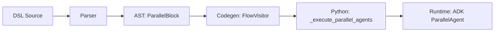

# Parallel Execution

This document covers the architecture and implementation of parallel execution blocks
in the Streetrace DSL, enabling concurrent agent execution using Google ADK's ParallelAgent
pattern.

## Overview

The `parallel do` block enables concurrent execution of multiple agents, collecting their
results into separate variables. This pattern is essential for code review workflows where
independent analysis tasks (security, bug detection, style review) can run simultaneously.

```streetrace
parallel do
    $a = run agent agent1 $input
    $b = run agent agent2 $input
end
# Both $a and $b are available here
```

## Architecture

### Compilation Pipeline



### AST Representation

The `ParallelBlock` node holds a list of statements that must be `RunStmt` nodes:

```python
@dataclass
class ParallelBlock:
    """Parallel execution block node."""

    body: list[AstNode]  # Must be RunStmt only
    meta: SourcePosition | None = None
```

**Location**: `src/streetrace/dsl/ast/nodes.py:279-284`

### Grammar Definition

The grammar defines the parallel block with `do`/`end` delimiters:

```lark
parallel_block: "parallel" "do" _NL _INDENT flow_body _DEDENT "end" _NL?
```

**Location**: `src/streetrace/dsl/grammar/streetrace.lark:325`

## Code Generation

### Validation

The flow visitor validates that parallel blocks contain only `run agent` statements:

```python
def _visit_parallel_block(self, node: ParallelBlock) -> None:
    # Validate: parallel do only supports run agent statements
    for stmt in node.body:
        if not isinstance(stmt, RunStmt):
            stmt_type = type(stmt).__name__
            msg = (
                f"parallel do only supports 'run agent' statements. "
                f"Found: {stmt_type}"
            )
            raise TypeError(msg)
```

**Location**: `src/streetrace/dsl/codegen/visitors/flows.py:448-455`

### Generated Code

For a parallel block:

```streetrace
parallel do
    $pr_info = run agent pr_fetcher $input
    $diff = run agent diff_fetcher $input
end
```

The code generator produces:

```python
# Parallel block - execute agents concurrently
_parallel_specs = [
    ('pr_fetcher', [ctx.vars['input']], 'pr_info'),
    ('diff_fetcher', [ctx.vars['input']], 'diff'),
]
_parallel_results = await self._execute_parallel_agents(
    ctx, _parallel_specs)
ctx.vars['pr_info'] = _parallel_results['pr_info']
ctx.vars['diff'] = _parallel_results['diff']
```

**Location**: `src/streetrace/dsl/codegen/visitors/flows.py:461-495`

### Runtime Execution

The `_execute_parallel_agents` method uses ADK's `ParallelAgent` for concurrent execution:

1. Creates sub-agents with `output_key` for storing results in session state
2. Wraps sub-agents in a `ParallelAgent` for orchestrated concurrent execution
3. Executes via ADK `Runner` which manages the parallel workflow
4. Retrieves results from session state after execution
5. Returns the results for assignment back to context variables

This approach leverages ADK's native parallel execution pattern where:
- Each sub-agent stores its result in session state via `output_key`
- `ParallelAgent` manages concurrent execution and memory isolation
- Results are non-deterministic in order but all complete before proceeding

## Design Decisions

### Only `run agent` Statements Allowed

The parallel block is deliberately restricted to `run agent` statements. This simplifies
implementation and ensures predictable behavior:

- **No `call llm`**: LLM calls can be wrapped in simple agents if parallel execution is needed
- **No assignments**: Side-effect statements would have unpredictable ordering
- **No control flow**: Nested loops or conditionals would complicate result collection

This constraint provides clear error messages at compile time rather than runtime surprises.

### Sequential Result Collection

Results are collected in declaration order, making the behavior deterministic and
predictable for users who rely on specific variable assignments.

### Error Propagation

If any agent in a parallel block fails, the entire block fails. This follows the
fail-fast principle appropriate for workflow execution.

## Usage in Code Review Agents

The code review agents use parallel blocks extensively:

### V1 Monolithic - Initial Fetch

```streetrace
parallel do
    $pr_info = run agent pr_fetcher $input
    $diff = run agent diff_fetcher $input
end
```

**Location**: `agents/code-review/v1-monolithic.sr:139-142`

### V2 Parallel - Specialist Review

```streetrace
parallel do
    $security_findings = run agent security_reviewer_agent $full_context $chunk
    $bug_findings = run agent bug_reviewer_agent $full_context $chunk
    $style_findings = run agent style_reviewer_agent $full_context $chunk
end
```

**Location**: `agents/code-review/v2-parallel.sr:525-529`

## Error Messages

### Invalid Statement Type

```
TypeError: parallel do only supports 'run agent' statements. Found: Assignment
```

Triggered when attempting to include non-agent statements in a parallel block.

### Missing Agent

```
AgentNotFoundError: Agent 'unknown_agent' not found
```

Triggered at runtime if a referenced agent is not defined.

## Performance Considerations

- Parallel blocks spawn concurrent tasks but share the same thread
- I/O-bound operations (LLM calls, API requests) benefit most from parallelization
- CPU-bound operations see limited benefit due to Python's GIL
- Memory usage scales with the number of concurrent agents

## See Also

- [DSL Architecture](architecture.md) - Overall compiler architecture
- [Flow Control](../user/dsl/flow-control.md) - User guide for flow control
- [Multi-Agent Patterns](../user/dsl/multi-agent-patterns.md) - Agent composition patterns
