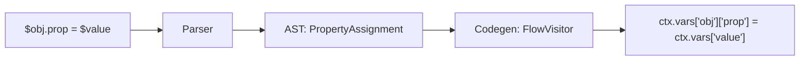

# Property Assignment

This document covers the architecture and implementation of property assignment
in the Streetrace DSL, enabling direct modification of object properties.

## Overview

Property assignment allows modifying properties of objects stored in variables:

```streetrace
$review.findings = $filtered
$obj.nested.property = "value"
```

This is essential for workflows that need to transform structured data in place,
such as filtering findings in a code review result.

## Architecture

### Compilation Pipeline



### AST Representation

The `PropertyAssignment` node holds the target property path and the value to assign:

```python
@dataclass
class PropertyAssignment:
    """Property assignment statement node (e.g., $obj.prop = value).

    Assign a value to an object property using dictionary-style access.
    Supports nested properties like $obj.a.b = value.
    """

    target: "PropertyAccess"  # The property to assign to
    value: AstNode  # The value to assign
    meta: SourcePosition | None = None
```

**Location**: `src/streetrace/dsl/ast/nodes.py:156-166`

The target uses the existing `PropertyAccess` node:

```python
@dataclass
class PropertyAccess:
    """Property access node (e.g., $item.value.first)."""

    base: "VarRef | PropertyAccess | NameRef"
    properties: list[str]
    meta: SourcePosition | None = None
```

**Location**: `src/streetrace/dsl/ast/nodes.py:49-55`

### Grammar Definition

Property assignment is parsed as a variant of assignment when the left-hand side
contains a dot:

```lark
assignment: variable "=" expression

# Variable with property access is parsed and transformed
variable: "$" var_name                                -> var_ref
        | "$" DOTTED_NAME                             -> var_dotted
```

The transformer distinguishes between simple variable assignment and property
assignment based on the presence of dots in the target.

**Location**: `src/streetrace/dsl/grammar/streetrace.lark:350,466-467`

## Code Generation

### Property Assignment Visitor

The flow visitor generates nested dictionary access for property assignment:

```python
def _visit_property_assignment(self, node: PropertyAssignment) -> None:
    """Generate code for property assignment.

    Transform $obj.prop = value to ctx.vars['obj']['prop'] = value.
    Supports nested properties like $obj.a.b = value.
    """
    source_line = node.meta.line if node.meta else None

    # Get base variable name from PropertyAccess
    base = node.target.base
    base_name = base.name if isinstance(base, VarRef) else str(base)

    # Build nested dict access: ctx.vars['obj']['prop1']['prop2']...
    target = f"ctx.vars['{base_name}']"
    for prop in node.target.properties:
        target = f"{target}['{prop}']"

    # Generate value expression
    value = self._expr_visitor.visit(node.value)

    self._emitter.emit(f"{target} = {value}", source_line=source_line)
```

**Location**: `src/streetrace/dsl/codegen/visitors/flows.py:229-253`

### Generated Code Examples

| DSL Statement | Generated Python |
|---------------|------------------|
| `$review.findings = $filtered` | `ctx.vars['review']['findings'] = ctx.vars['filtered']` |
| `$obj.a.b = "value"` | `ctx.vars['obj']['a']['b'] = "value"` |
| `$result.status = true` | `ctx.vars['result']['status'] = True` |

## Design Decisions

### Dictionary-Style Access

Python dictionaries are used for object representation because:

1. **JSON Compatibility**: Schema results from LLMs are parsed as dictionaries
2. **Dynamic Properties**: Properties can be added or modified at runtime
3. **Consistent Semantics**: Same access pattern for reading and writing

### Nested Property Support

Supporting nested properties like `$obj.a.b.c` enables working with deeply structured
data without intermediate variables:

```streetrace
# Instead of
$nested = $result.data
$inner = $nested.items
$inner.count = 42

# Simply write
$result.data.items.count = 42
```

### No Property Creation

Property assignment requires the parent path to exist. Assigning to `$obj.a.b`
fails if `$obj.a` is not already a dictionary. This prevents accidental creation
of deeply nested structures.

## Usage in Code Review Agents

### V1 Monolithic - Filtering Findings

```streetrace
# Filter findings
$filtered = filter $review.findings where .confidence >= 80

# Update the review object in place
$review.findings = $filtered
```

**Location**: `agents/code-review/v1-monolithic.sr:159-160`

This pattern is common when post-processing structured results from LLM calls:

1. Extract a list property
2. Filter or transform it
3. Assign the result back to the original object

## Error Handling

### Key Error on Missing Parent

If a parent property does not exist, Python raises a `KeyError`:

```python
ctx.vars['obj']['missing']['prop'] = value  # KeyError: 'missing'
```

The error propagates to the workflow error handler with context about the
missing key.

### Type Error on Non-Dict Parent

If a parent property exists but is not a dictionary, Python raises a `TypeError`:

```python
ctx.vars['obj']['string_prop']['nested'] = value  # TypeError
```

## Comparison with Alternatives

| Approach | Syntax | Notes |
|----------|--------|-------|
| Property Assignment | `$obj.prop = $value` | Direct, intuitive |
| Dictionary Update | `$obj = merge($obj, {prop: $value})` | Verbose, creates new object |
| Setter Function | `set($obj, "prop", $value)` | Explicit but verbose |

Property assignment was chosen for its natural syntax that mirrors property access,
making the DSL intuitive for developers familiar with object-oriented languages.

## Relationship to Property Access

Property assignment is the write counterpart to property access (reading):

| Operation | DSL Syntax | Python Generated |
|-----------|------------|------------------|
| Read | `$x = $obj.prop` | `x = ctx.vars['obj']['prop']` |
| Write | `$obj.prop = $x` | `ctx.vars['obj']['prop'] = ctx.vars['x']` |

Both use the same underlying dictionary access pattern, ensuring consistent
behavior for structured data manipulation.

## See Also

- [Filter Expression](filter-expression.md) - Filtering lists for property assignment
- [Expressions](../user/dsl/expressions.md) - User guide for DSL expressions
- [DSL Architecture](architecture.md) - Overall compiler architecture
