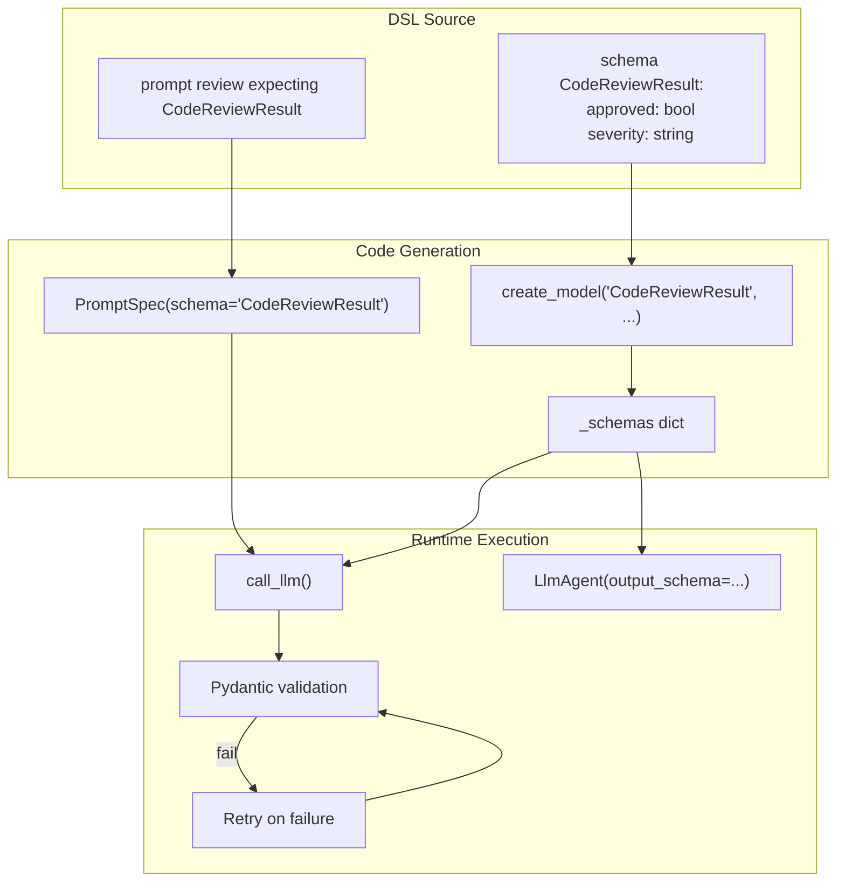
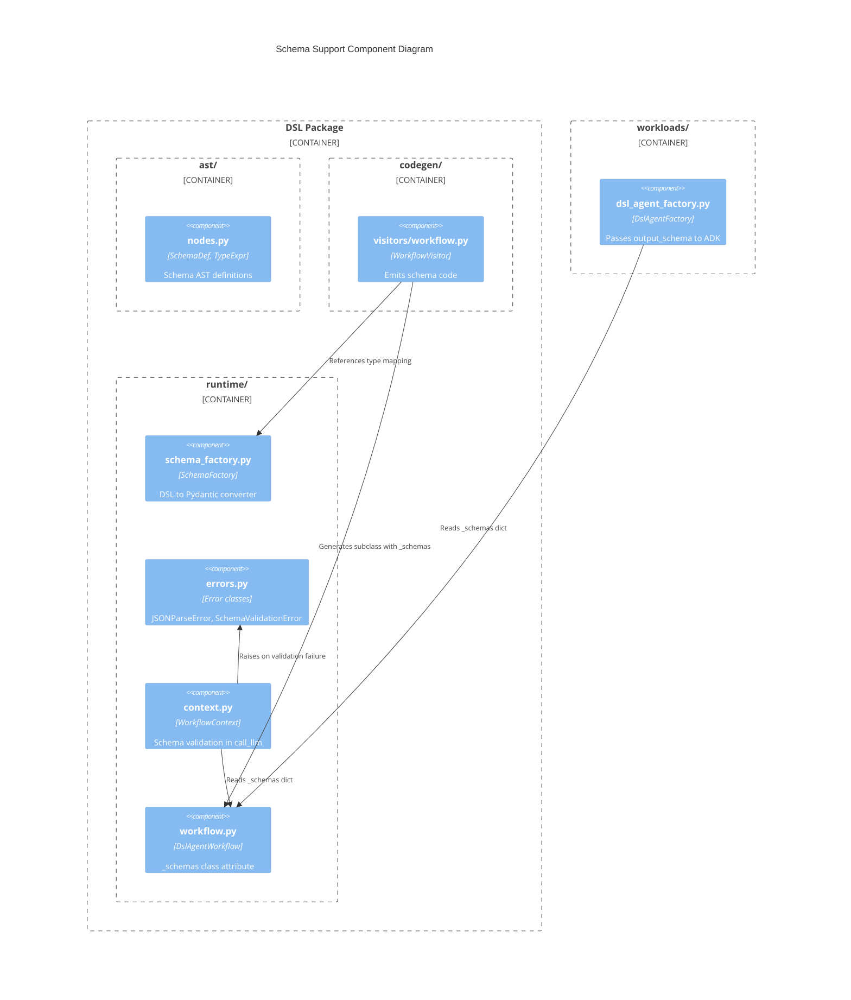
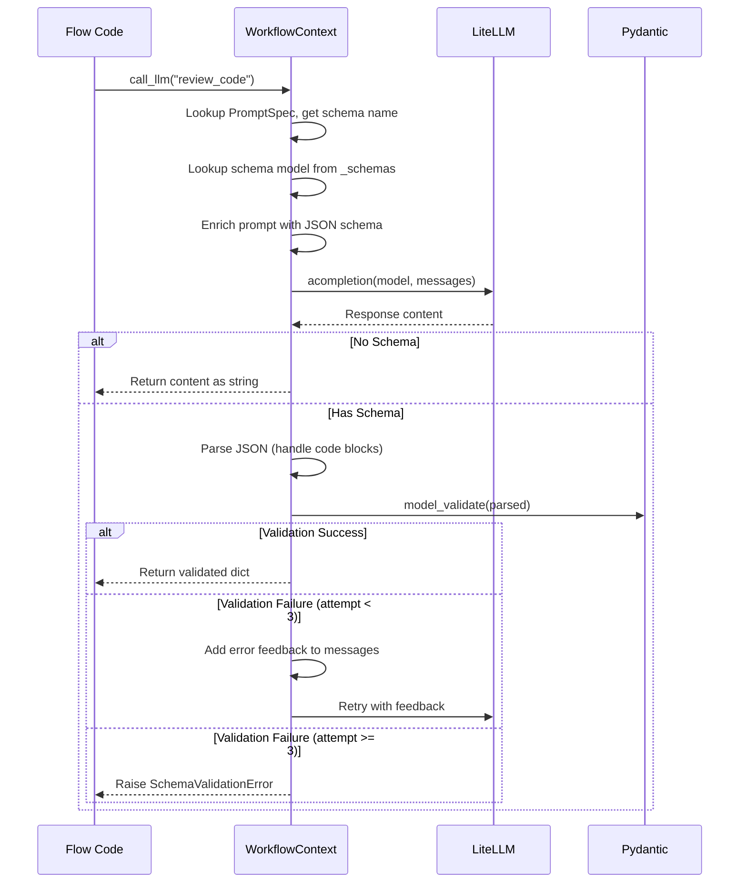

# Schema Support for Structured Outputs

Schema Support enables StreetRace DSL prompts to declare expected response schemas that are
validated at runtime using Pydantic. When a prompt has `expecting SchemaName`, the system
ensures LLM responses conform to the schema structure with automatic retry on validation
failures.

## Overview

The schema system bridges DSL type definitions to Python runtime validation through three
main components:

1. **Schema Factory** - Converts DSL `SchemaDef` AST nodes to Pydantic models
2. **Code Generation** - Emits `create_model()` calls and links prompts to schemas
3. **Runtime Validation** - Validates LLM responses with retry logic



## Architecture

### Component Relationships



## Schema Factory

The schema factory converts DSL `SchemaDef` AST nodes to Pydantic model classes using
`create_model()`.

**Location**: `src/streetrace/dsl/runtime/schema_factory.py`

### Type Mapping

| DSL Type | Python Type | Pydantic Field |
|----------|-------------|----------------|
| `string` | `str` | `(str, ...)` |
| `int` | `int` | `(int, ...)` |
| `float` | `float` | `(float, ...)` |
| `bool` | `bool` | `(bool, ...)` |
| `list[T]` | `list[T]` | `(list[T], ...)` |
| `T?` | `T \| None` | `(T \| None, None)` |

### Key Functions

```python
def type_expr_to_python_type(type_expr: TypeExpr) -> Any:
    """Convert DSL TypeExpr to Python type annotation."""

def schema_to_pydantic(schema_def: SchemaDef) -> type[BaseModel]:
    """Convert DSL SchemaDef to a Pydantic model class."""
```

**Source reference**: `schema_factory.py:22-72`

### Example Conversion

DSL input:
```
schema CodeReviewResult:
    approved: bool
    severity: string
    issues: list[string]
    confidence: float?
```

Generated Pydantic model (conceptual):
```python
CodeReviewResult = create_model(
    "CodeReviewResult",
    approved=(bool, ...),
    severity=(str, ...),
    issues=(list[str], ...),
    confidence=(float | None, None),
)
```

## Code Generation

The workflow visitor emits schema definitions as `create_model()` calls inside the
generated workflow class.

**Location**: `src/streetrace/dsl/codegen/visitors/workflow.py:234-271`

### Generated Code Structure

```python
from pydantic import BaseModel, create_model

class SchemaWorkflow(DslAgentWorkflow):
    """Generated workflow from schema.sr."""

    # Schema definitions (Pydantic models)
    CodeReviewResult = create_model(
        "CodeReviewResult",
        approved=(bool, ...),
        severity=(str, ...),
        issues=(list[str], ...),
        suggestions=(list[str], ...),
        confidence=(float, ...),
    )

    _schemas: dict[str, type[BaseModel]] = {
        "CodeReviewResult": CodeReviewResult,
    }

    _prompts = {
        "review_code": PromptSpec(
            body=lambda ctx: "...",
            schema="CodeReviewResult",  # Links to schema
        ),
    }
```

### PromptSpec Extension

The `PromptSpec` dataclass includes an optional `schema` field that references a schema
name.

**Location**: `src/streetrace/dsl/runtime/workflow.py:50-69`

```python
@dataclass
class PromptSpec:
    body: Callable[[object], str]
    model: str | None = None
    schema: str | None = None  # Schema name reference
    escalation: EscalationSpec | None = None
```

## Runtime Validation

### call_llm Flow

When `call_llm()` is invoked with a schema-expecting prompt, validation follows this flow:



**Source reference**: `context.py:644-804`

### Prompt Enrichment

When a schema is expected, the prompt is enriched with JSON format instructions:

```python
def _enrich_prompt_with_schema(
    self,
    prompt_text: str,
    json_schema: dict[str, object],
) -> str:
    schema_str = json.dumps(json_schema, indent=2)
    return (
        f"{prompt_text}\n\n"
        f"IMPORTANT: You MUST respond with valid JSON that matches this schema:\n"
        f"```json\n{schema_str}\n```\n\n"
        f"Do NOT include any text outside the JSON object."
    )
```

**Source reference**: `context.py:567-591`

### JSON Response Parsing

The parser handles markdown code blocks that LLMs often emit:

```python
def _parse_json_response(self, content: str) -> dict[str, object]:
    """Parse JSON from LLM response, handling markdown code blocks."""
    code_blocks = _JSON_CODE_BLOCK_PATTERN.findall(content)

    if len(code_blocks) == 0:
        # No code blocks - treat entire content as JSON
        return json.loads(content.strip())
    elif len(code_blocks) == 1:
        # Single code block - extract contents
        return json.loads(code_blocks[0].strip())
    else:
        # Multiple code blocks - ambiguous
        raise JSONParseError(...)
```

**Source reference**: `context.py:496-540`

### Retry Logic

On validation failure, the system adds error feedback and retries up to 3 times:

```python
MAX_SCHEMA_RETRIES = 3

# After validation failure:
messages.append({"role": "assistant", "content": last_content})
messages.append({
    "role": "user",
    "content": f"Error: {last_error}\n\nPlease fix the JSON and try again."
})
```

**Source reference**: `context.py:36-37, 806-829`

## Agent Integration

When creating ADK agents, `DslAgentFactory` passes the `output_schema` parameter to
`LlmAgent` if the agent's instruction prompt has a schema expectation.

**Location**: `src/streetrace/workloads/dsl_agent_factory.py:302-343`

```python
def _resolve_output_schema(
    self,
    agent_def: dict[str, object],
) -> type[BaseModel] | None:
    """Resolve output_schema from agent's instruction prompt."""
    instruction_name = agent_def.get("instruction")
    prompt_spec = prompts.get(instruction_name)

    if not isinstance(prompt_spec, PromptSpec):
        return None

    schema_name = prompt_spec.schema
    schemas = getattr(self._workflow_class, "_schemas", {})
    return schemas.get(schema_name)
```

When `output_schema` is passed to ADK's `LlmAgent`:
- ADK automatically adds JSON format instructions to the prompt
- ADK handles JSON parsing and validation
- Response is returned as structured data

## Error Handling

### JSONParseError

Raised when LLM response cannot be parsed as JSON.

**Location**: `src/streetrace/dsl/runtime/errors.py:43-60`

```python
class JSONParseError(DslRuntimeError):
    def __init__(self, raw_response: str, parse_error: str) -> None:
        self.raw_response = raw_response
        self.parse_error = parse_error
```

**Triggers**:
- Invalid JSON syntax in response
- Multiple ambiguous code blocks in response

### SchemaValidationError

Raised after retry exhaustion when LLM response fails Pydantic validation.

**Location**: `src/streetrace/dsl/runtime/errors.py:63-84`

```python
class SchemaValidationError(DslRuntimeError):
    def __init__(
        self,
        schema_name: str,
        errors: list[str],
        raw_response: str,
    ) -> None:
        self.schema_name = schema_name
        self.errors = errors
        self.raw_response = raw_response
```

**Triggers**:
- Missing required fields
- Type mismatches
- Validation failures after 3 retry attempts

**Escalation**: This error triggers the escalation system, allowing flows to handle
validation failures gracefully.

## Extension Points

### Adding New Base Types

To support additional DSL types:

1. Add the type to `DSL_TYPE_MAP` in `schema_factory.py`:
   ```python
   DSL_TYPE_MAP: dict[str, type] = {
       "string": str,
       "int": int,
       "float": float,
       "bool": bool,
       "bytes": bytes,  # New type
   }
   ```

2. Update the grammar in `streetrace.lark` if needed

3. Update `_type_expr_to_string()` in `workflow.py` for code generation

### Custom Validation

Future work could add field-level constraints:

```
schema StrictResult:
    score: float @min(0.0) @max(1.0)
    name: string @pattern("[a-z]+")
```

This would require:
- Grammar changes for constraint annotations
- AST node updates
- Code generation for Pydantic field validators

### Nested Schemas

Currently not supported. Implementing nested schemas would require:
- Dependency ordering in code generation (inner schemas first)
- Type resolution for schema references in field types
- Handling circular dependencies

## Limitations

1. **No nested schemas** - Schemas cannot reference other schemas as field types
2. **No union types** - Fields cannot be `string | int`
3. **No enum types** - No constrained string values
4. **Fixed retry count** - Hard-coded to 3 attempts
5. **No field descriptions** - Cannot add descriptions for better LLM understanding
6. **No schema inheritance** - Cannot extend existing schemas

## See Also

- [Syntax Reference](../../user/dsl/syntax-reference.md) - DSL syntax for schemas
- [Schema Support User Guide](../../user/dsl/schema-support.md) - Using schemas
- [Escalation](escalation.md) - How SchemaValidationError triggers escalation
- [Architecture](architecture.md) - Overall DSL compiler architecture
