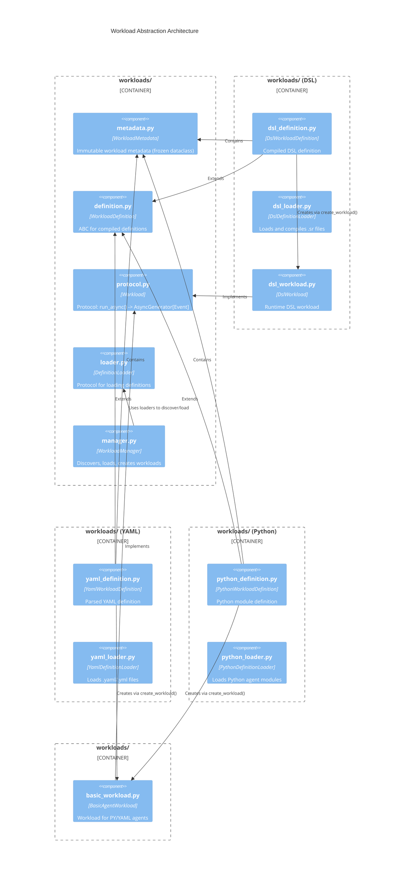
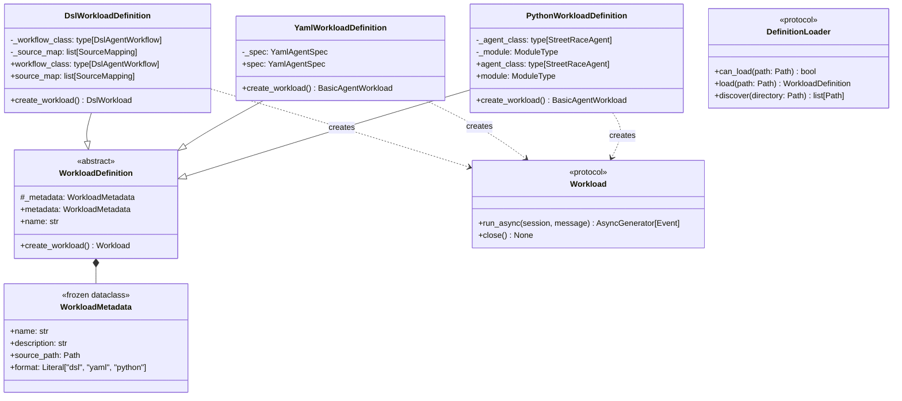
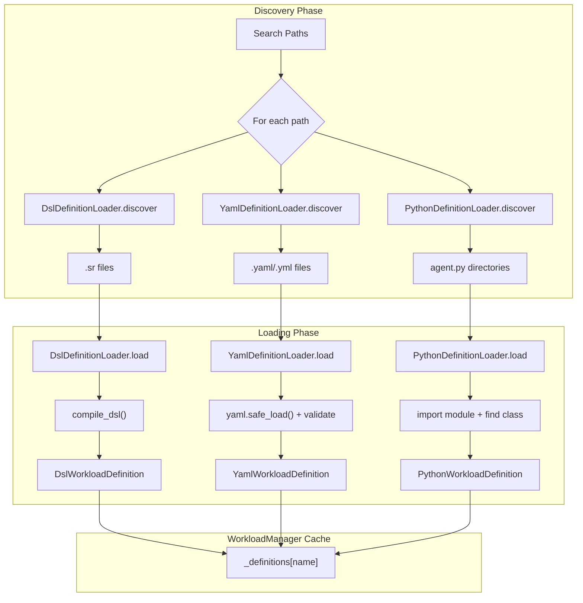
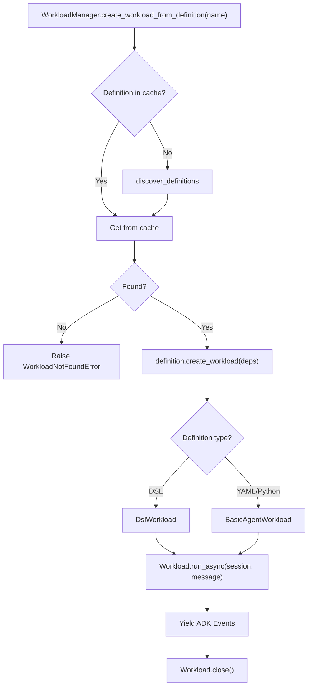
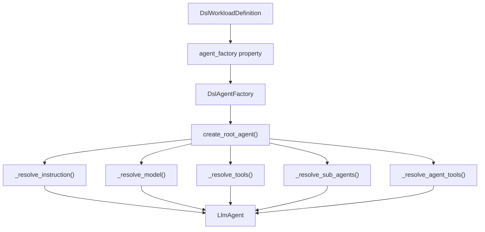

# Workload Abstraction Architecture

The Workload Abstraction introduces a unified pipeline for loading and creating workloads from DSL,
YAML, and Python agent files. This document describes the architecture for developers who need to
understand, extend, or debug the workload system.

## Overview

The Workload Abstraction refactoring addresses several architectural inconsistencies in the original
agent loading system. The key improvements are:

1. **Consistent naming**: All types use "Workload" terminology instead of mixing "Agent" and "Workload"
2. **Compile-on-load**: DSL files are compiled during `load()`, not deferred to execution time
3. **Required parameters**: No Optional types for semantically required fields
4. **Clear lifecycle separation**: Definition (compiled artifact) vs Workload (running instance)



## Design Principles

### 1. No Optional Fields for Semantically Required Data

If a field is needed for the object to function, it is required at construction time. The type
system enforces correctness, not runtime checks.

**Before** (anti-pattern):
```python
class DslAgentInfo:
    workflow_class: type[DslAgentWorkflow] | None = None  # Optional but required!
```

**After** (correct):
```python
class DslWorkloadDefinition:
    def __init__(
        self,
        metadata: WorkloadMetadata,
        workflow_class: type[DslAgentWorkflow],  # Required - no None
        source_map: list[SourceMapping],          # Required - no None
    ) -> None:
```

**Location**: `src/streetrace/workloads/dsl_definition.py:42`

### 2. Compile During Load, Not Later

Invalid files are rejected immediately during discovery. The cache contains only valid, compiled
definitions. Errors surface early with clear context.

**Before** (anti-pattern):
```
Discovery Phase:
  .sr file -> _extract_agent_info() -> DslAgentInfo(workflow_class=None)

Loading Phase (later):
  DslAgentInfo -> _load_dsl_file() -> compile_dsl() -> DslStreetRaceAgent
```

**After** (correct):
```
Discovery Phase:
  .sr file -> DslDefinitionLoader.load() -> compile_dsl() -> DslWorkloadDefinition
  (compilation happens immediately, invalid files rejected early)

Execution Phase:
  DslWorkloadDefinition.create_workload() -> DslWorkload (running instance)
```

**Location**: `src/streetrace/workloads/dsl_loader.py:47`

### 3. Single Source of Truth

One loader per format, no duplicates. Clear ownership of compilation logic. The previous codebase
had two `DslAgentLoader` classes in different modules with nearly identical bytecode execution
logic.

**Location**: `src/streetrace/workloads/dsl_loader.py:23` (consolidated)

### 4. Immutable Definitions

`WorkloadMetadata` is a frozen dataclass. Once created, the metadata cannot be modified,
ensuring consistency throughout the workload lifecycle.

```python
@dataclass(frozen=True)
class WorkloadMetadata:
    name: str
    description: str
    source_path: Path
    format: Literal["dsl", "yaml", "python"]
```

**Location**: `src/streetrace/workloads/metadata.py:12`

### 5. Clear Lifecycle Separation

The system separates three distinct concepts:

| Concept | Class | Description |
|---------|-------|-------------|
| Metadata | `WorkloadMetadata` | Immutable identity information |
| Definition | `WorkloadDefinition` | Compiled artifact that can create workloads |
| Workload | `Workload` protocol | Running instance that processes messages |

## Type Hierarchy



## Data Flow

### Discovery and Loading Phase



### Execution Phase



## Core Components

### WorkloadMetadata

Immutable metadata about a workload definition. Frozen dataclass ensures consistency.

**Location**: `src/streetrace/workloads/metadata.py:12`

```python
@dataclass(frozen=True)
class WorkloadMetadata:
    name: str
    description: str
    source_path: Path
    format: Literal["dsl", "yaml", "python"]
```

Key characteristics:
- Frozen (immutable) after creation
- Hashable - can be used as dictionary keys
- All fields required at construction

### WorkloadDefinition

Abstract base class for compiled workload definitions. Subclasses must implement `create_workload()`.

**Location**: `src/streetrace/workloads/definition.py:22`

```python
class WorkloadDefinition(ABC):
    def __init__(self, metadata: WorkloadMetadata) -> None:
        self._metadata = metadata

    @property
    def metadata(self) -> WorkloadMetadata:
        return self._metadata

    @abstractmethod
    def create_workload(
        self,
        model_factory: ModelFactory,
        tool_provider: ToolProvider,
        system_context: SystemContext,
        session_service: BaseSessionService,
    ) -> Workload:
        ...
```

### DefinitionLoader Protocol

Protocol for loading workload definitions from various source formats.

**Location**: `src/streetrace/workloads/loader.py:14`

```python
@runtime_checkable
class DefinitionLoader(Protocol):
    def can_load(self, path: Path) -> bool:
        """Check if this loader can handle the given file type."""
        ...

    def load(self, path: Path) -> WorkloadDefinition:
        """Load and compile/parse a workload definition."""
        ...

    def discover(self, directory: Path) -> list[Path]:
        """Find all loadable files in a directory."""
        ...
```

The key contract is that `load()` must compile/parse the source file immediately - no deferred
compilation.

### DslWorkloadDefinition

Compiled DSL workload definition. Created only after successful DSL compilation.

**Location**: `src/streetrace/workloads/dsl_definition.py:24`

Key fields:
- `workflow_class`: The compiled DslAgentWorkflow subclass (REQUIRED, never None)
- `source_map`: Source mappings for error translation

### DslDefinitionLoader

Loader for `.sr` DSL files. Compiles DSL source during `load()`.

**Location**: `src/streetrace/workloads/dsl_loader.py:23`

Key behavior:
- Compilation happens immediately in `load()`
- Invalid files raise `DslSyntaxError` or `DslSemanticError`
- Extracts metadata from compiled class and source comments

### DslWorkload

Runtime DSL workload implementing the Workload protocol.

**Location**: `src/streetrace/workloads/dsl_workload.py:27`

All dependencies are REQUIRED at construction time:
```python
def __init__(
    self,
    definition: DslWorkloadDefinition,
    model_factory: ModelFactory,
    tool_provider: ToolProvider,
    system_context: SystemContext,
    session_service: BaseSessionService,
) -> None:
```

### YamlWorkloadDefinition and YamlDefinitionLoader

YAML workload definition wraps a `YamlAgentSpec` and creates `BasicAgentWorkload` instances.

**Locations**:
- `src/streetrace/workloads/yaml_definition.py:23`
- `src/streetrace/workloads/yaml_loader.py:24`

### PythonWorkloadDefinition and PythonDefinitionLoader

Python workload definition wraps a `StreetRaceAgent` class and module.

**Locations**:
- `src/streetrace/workloads/python_definition.py:24`
- `src/streetrace/workloads/python_loader.py:23`

### WorkloadNotFoundError

Exception raised when a workload definition cannot be found by name.

**Location**: `src/streetrace/workloads/manager.py:93`

```python
class WorkloadNotFoundError(Exception):
    def __init__(self, name: str) -> None:
        self.name = name
        super().__init__(f"Workload '{name}' not found")
```

## DslAgentFactory

The DslAgentFactory is responsible for creating ADK agents from compiled DSL workflow definitions.
It contains the agent creation logic that was previously in the deprecated DslStreetRaceAgent class.

**Location**: `src/streetrace/workloads/dsl_agent_factory.py:29`

### Purpose

DslAgentFactory handles:
- Resolving instructions from prompts
- Resolving models (prompt-specific or main model)
- Resolving tools from tool definitions
- Creating sub-agents for the delegate pattern
- Creating agent tools for the use pattern
- Recursive cleanup of agent hierarchies

### Key Methods

```python
class DslAgentFactory:
    """Factory for creating ADK agents from DSL workflow definitions."""

    async def create_root_agent(
        self,
        model_factory: ModelFactory,
        tool_provider: ToolProvider,
        system_context: SystemContext,
    ) -> BaseAgent:
        """Create the root ADK agent from the DSL workflow."""

    async def create_agent(
        self,
        agent_name: str,
        model_factory: ModelFactory,
        tool_provider: ToolProvider,
        system_context: SystemContext,
    ) -> BaseAgent:
        """Create a named agent for sub-agent or agent-tool patterns."""

    async def close(self, agent_instance: BaseAgent) -> None:
        """Clean up resources including sub-agents and agent tools."""
```

### Relationship to DslWorkloadDefinition

`DslWorkloadDefinition` creates and caches a `DslAgentFactory` instance lazily:

```python
@property
def agent_factory(self) -> DslAgentFactory:
    """Get the agent factory for creating ADK agents."""
    if self._agent_factory is None:
        self._agent_factory = DslAgentFactory(
            workflow_class=self._workflow_class,
            source_file=self._metadata.source_path,
            source_map=self._source_map,
        )
    return self._agent_factory
```

### Agent Creation Flow



## WorkloadManager Integration

WorkloadManager uses only `DefinitionLoader` instances for loading all formats. The old AgentLoader
infrastructure has been removed.

### Key Methods

#### `discover_definitions()`

Discover and compile all workload definitions using the DefinitionLoader system.

**Location**: `src/streetrace/workloads/manager.py:511`

```python
def discover_definitions(self) -> list[WorkloadDefinition]:
    """Discover and compile all workload definitions."""
    definitions: list[WorkloadDefinition] = []
    # Process locations in priority order
    for location_name, paths in self.search_locations:
        location_defs = self._discover_in_location(paths, seen_names)
        for definition in location_defs:
            name_lower = definition.name.lower()
            if name_lower not in seen_names:
                seen_names.add(name_lower)
                definitions.append(definition)
                self._definitions[name_lower] = definition
    return definitions
```

#### `create_workload()`

Create a runnable workload from identifier (context manager).

**Location**: `src/streetrace/workloads/manager.py:277`

```python
@asynccontextmanager
async def create_workload(
    self,
    identifier: str,
) -> AsyncGenerator[Workload, None]:
    """Create a runnable workload from identifier."""
    definition = self._load_definition_from_identifier(identifier)
    workload = definition.create_workload(...)
    try:
        yield workload
    finally:
        await workload.close()
```

#### `create_workload_from_definition()`

Create a runnable workload by name using the definition system.

**Location**: `src/streetrace/workloads/manager.py:598`

```python
def create_workload_from_definition(self, name: str) -> Workload:
    """Create a runnable workload by name."""
    definition = self._definitions.get(name.lower())
    if definition is None:
        self.discover_definitions()
        definition = self._definitions.get(name.lower())
    if definition is None:
        raise WorkloadNotFoundError(name)
    return definition.create_workload(...)
```

### Definition Loaders

WorkloadManager maintains `_definition_loaders` mapping file extensions to loaders:

```python
self._definition_loaders: dict[str, DefinitionLoader] = {
    ".sr": DslDefinitionLoader(),
    ".yaml": YamlDefinitionLoader(http_auth=http_auth),
    ".yml": YamlDefinitionLoader(http_auth=http_auth),
    "python": PythonDefinitionLoader(),
}
```

## Module Structure

```
src/streetrace/workloads/
├── __init__.py              # Package exports
├── protocol.py              # Workload protocol definition
├── metadata.py              # WorkloadMetadata frozen dataclass
├── definition.py            # WorkloadDefinition ABC
├── loader.py                # DefinitionLoader protocol
├── dsl_definition.py        # DslWorkloadDefinition
├── dsl_loader.py            # DslDefinitionLoader (consolidated)
├── dsl_workload.py          # DslWorkload runtime
├── yaml_definition.py       # YamlWorkloadDefinition
├── yaml_loader.py           # YamlDefinitionLoader
├── python_definition.py     # PythonWorkloadDefinition
├── python_loader.py         # PythonDefinitionLoader
├── basic_workload.py        # BasicAgentWorkload for PY/YAML
└── manager.py               # WorkloadManager (extended)
```

## Problems Solved

| Problem | Solution |
|---------|----------|
| Inconsistent naming (Agent vs Workload) | Consistent "Workload" terminology throughout |
| Deferred DSL compilation | Compile-on-load in `DslDefinitionLoader.load()` |
| Optional parameters for required fields | All semantically required fields are required types |
| Duplicate DslAgentLoader classes | Consolidated into single `DslDefinitionLoader` |
| Polymorphic AgentInfo with optional fields | Separate definition classes per format |
| Runtime type checks instead of compile-time | Type system enforces correctness |
| Late error detection for invalid DSL | Early rejection during discovery |

## Performance Considerations

- **Compile-on-load**: Slightly slower discovery but catches errors earlier
- **Definition caching**: Definitions cached in `_definitions` dict by name
- **Lazy workload creation**: Workloads only created when needed via `create_workload()`
- **Source map preservation**: Enables accurate error messages pointing to DSL source

## See Also

- [API Reference](api-reference.md) - Complete API documentation for all new types
- [Extension Guide](extension-guide.md) - Creating custom DefinitionLoader implementations
- [DSL Architecture](../dsl/architecture.md) - DSL compiler and runtime details
- [Agentic Patterns](../dsl/agentic-patterns.md) - Multi-agent pattern implementation
