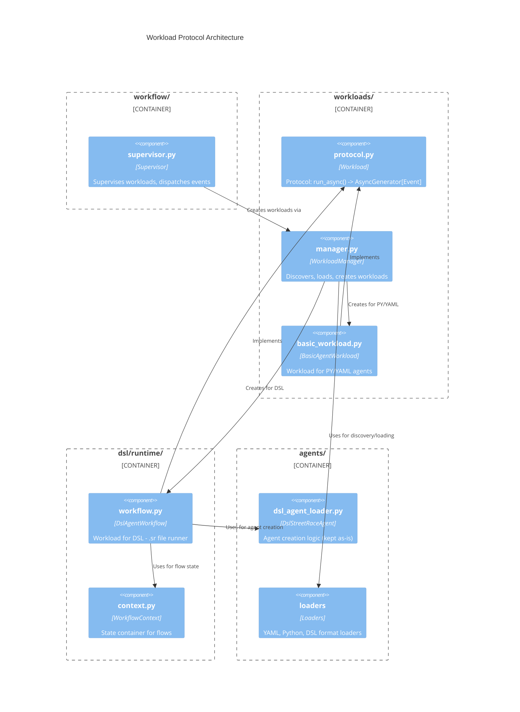
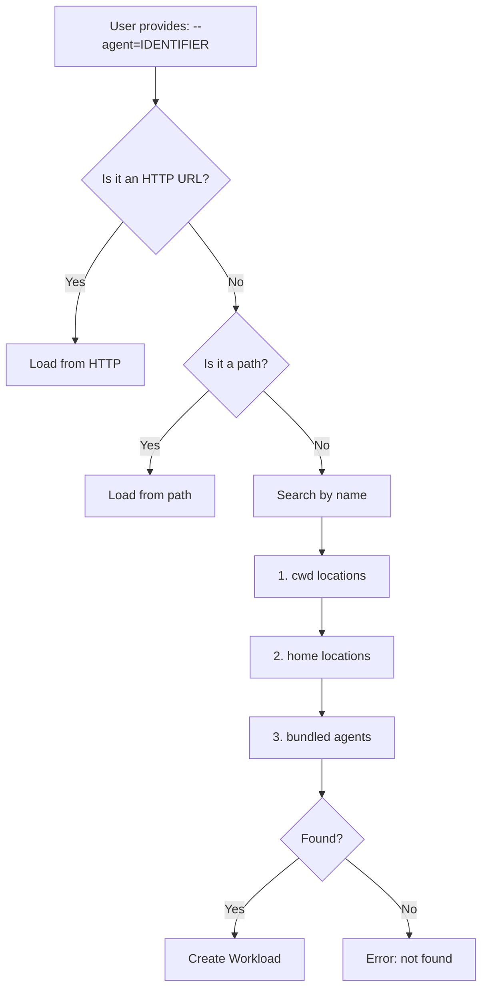
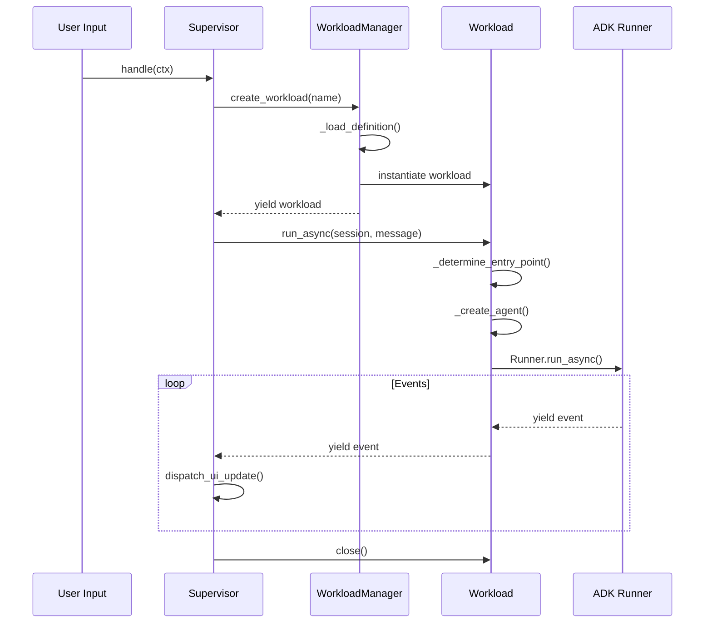

# Workload Protocol Architecture

The Workload Protocol unifies agent execution in StreetRace by providing a single interface for
all executable units. This document describes the architecture for developers who need to
understand, extend, or debug the workload system.

## Overview

The Workload Protocol addresses a fundamental problem in the DSL runtime: agents invoked via
`run agent` in flows lacked access to their DSL-defined tools and agentic patterns. The solution
introduces a unified execution model where all work flows through a common protocol.



## Design Principles

### Supervisor Supervises Workloads

The Supervisor does not know about agents, flows, or implementation details. It operates solely
through the Workload protocol, creating workloads via the WorkloadManager and iterating through
events.

**Location**: `src/streetrace/workflow/supervisor.py:25`

### Composition Over Absorption

DslAgentWorkflow uses DslStreetRaceAgent via composition rather than duplicating its code.
DslStreetRaceAgent contains hundreds of lines of well-tested code for agent creation including
tool resolution, sub-agent creation, and agentic pattern support. Rather than absorbing this
logic, DslAgentWorkflow holds a reference and delegates agent creation.

**Benefits**:
- Zero code duplication
- Existing agent creation logic unchanged
- Single source of truth for tool resolution
- Independent testing of each component

### Event-Driven Execution

All workloads yield ADK events through `run_async()`. The Supervisor iterates these events,
dispatching UI updates and managing session state. This design enables:

- Consistent UI feedback regardless of workload type
- Session management in a single location
- Future support for Human-in-the-Loop (HITL) via event pause/resume

## Core Components

### Workload Protocol

The protocol defines the contract for all executable units.

```python
@runtime_checkable
class Workload(Protocol):
    def run_async(
        self,
        session: Session,
        message: Content | None,
    ) -> AsyncGenerator[Event, None]:
        """Execute the workload and yield events."""
        ...

    async def close(self) -> None:
        """Clean up all resources allocated by this workload."""
        ...
```

**Location**: `src/streetrace/workloads/protocol.py:17`

The protocol is runtime-checkable, allowing `isinstance()` verification for type safety.

### WorkloadManager

WorkloadManager discovers, loads, and creates runnable workloads. It was renamed from
AgentManager to reflect the true abstraction: StreetRace runs a Supervisor which supervises
Workloads.



**Location**: `src/streetrace/workloads/manager.py:148`

Key responsibilities:
- Discovery of workload definitions in configured paths
- Format-agnostic loading (YAML, Python, DSL)
- Routing to appropriate workload type (DSL vs Basic)
- Lifecycle management via async context manager

### BasicAgentWorkload

Wraps Python and YAML agent definitions for execution through the Workload protocol.

**Location**: `src/streetrace/workloads/basic_workload.py:29`

The BasicAgentWorkload:
1. Accepts a StreetRaceAgent definition
2. Creates the ADK agent on first `run_async()` call
3. Reuses the agent for subsequent calls
4. Cleans up on `close()`

### DslAgentWorkflow

The Python representation of a `.sr` file and the main runner of DSL logic. It implements the
Workload protocol for unified execution.

**Location**: `src/streetrace/dsl/runtime/workflow.py:44`

Key capabilities:
- Entry point selection (main flow > default agent > first agent)
- Agent creation via composition with DslStreetRaceAgent
- Flow execution through generated methods
- Event forwarding from nested agent runs (Option 1: results only)

## Control Flow

### Execution Path



### Entry Point Selection

DslAgentWorkflow determines what to execute based on DSL definition:

1. **Main flow**: If the DSL defines a `flow main:`, execute that flow
2. **Default agent**: If the DSL defines `agent default:`, run that agent
3. **First agent**: Otherwise, run the first defined agent

**Location**: `src/streetrace/dsl/runtime/workflow.py:93`

### Agent Creation via Composition

When creating an agent, DslAgentWorkflow delegates to DslStreetRaceAgent:

```python
agent = await self._agent_def._create_agent_from_def(
    agent_name,
    agent_def_dict,
    self._model_factory,
    self._tool_provider,
    self._system_context,
)
```

This reuses all existing logic:
- `_resolve_tools()`: Map DSL tool definitions to ADK tools
- `_resolve_sub_agents()`: Create sub-agents for `delegate` pattern
- `_resolve_agent_tools()`: Create AgentTool wrappers for `use` pattern

**Location**: `src/streetrace/dsl/runtime/workflow.py:125`

## Problems Solved

| Problem | Solution |
|---------|----------|
| Tools not available in flow's `run_agent()` | `_create_agent()` delegates to DslStreetRaceAgent with full resolution |
| Agentic patterns broken in flows | Sub-agents and agent_tools resolved via composition |
| No UI feedback from flow execution | All events yield through Workload protocol |
| Isolated sessions in flows | Session passed into `run_async()` |
| Duplicated Runner loops | Execution logic lives in workloads only |
| Decentralized work execution | All execution through workload protocol |
| Flows cannot be entry points | `run_async()` selects flow or agent based on DSL |

## Event Forwarding Strategy

The current implementation uses **Option 1: Results Only**. When a flow calls `run_agent()`,
inner events are consumed but not yielded. The flow receives only the final response.

This design choice:
- Simplifies initial implementation
- Avoids complex generator composition
- Provides infrastructure for future enhancement

**Location**: `src/streetrace/dsl/runtime/workflow.py:263`

Future options for event forwarding:
- **Option 2**: Queue-based forwarding with events pushed to queue
- **Option 3**: Full generator composition with flows yielding events

## Backward Compatibility

### AgentManager Deprecation

AgentManager still exists at its original location for backward compatibility. New code should
use WorkloadManager.

```python
# Deprecated
from streetrace.agents.agent_manager import AgentManager

# Preferred
from streetrace.workloads import WorkloadManager
```

### StreetRaceAgent Interface

The StreetRaceAgent interface remains unchanged. BasicAgentWorkload wraps any StreetRaceAgent
implementation, ensuring all existing Python and YAML agents continue to work.

### DSL Syntax

No changes to DSL syntax. The same `.sr` files work exactly as before, with the bonus that
flow-invoked agents now have full access to their tools.

## Performance Considerations

- Same underlying ADK Runner - no execution overhead
- Agent creation is lazy (on first use)
- Bytecode caching for compiled DSL workflows
- Single allocation of workload per interaction

## Module Structure

```
src/streetrace/workloads/
├── __init__.py          # Package exports (Workload, BasicAgentWorkload, WorkloadManager)
├── protocol.py          # Workload protocol definition
├── manager.py           # WorkloadManager (renamed from AgentManager)
└── basic_workload.py    # BasicAgentWorkload for PY/YAML agents
```

The DslAgentWorkflow resides in `src/streetrace/dsl/runtime/workflow.py` as it's part of
the DSL runtime, not the generic workloads package.

## See Also

- [API Reference](api-reference.md) - Complete API documentation
- [Extension Guide](extension-guide.md) - Creating custom Workload implementations
- [DSL Architecture](../dsl/architecture.md) - DSL compiler and runtime details
- [Agentic Patterns](../dsl/agentic-patterns.md) - Multi-agent pattern implementation
