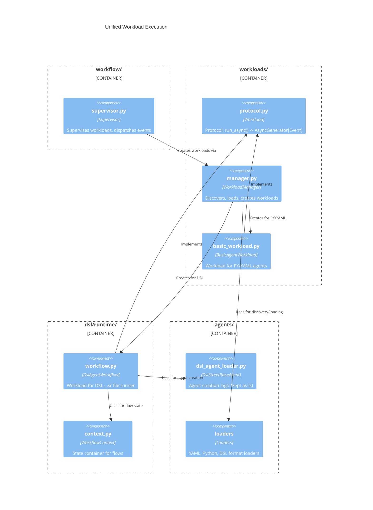

# Unified Agent Execution

## Problem Statement

There are two distinct code paths for executing agents in the DSL runtime:

1. **Root agent execution** (`Supervisor.handle()` at `src/streetrace/workflow/supervisor.py:48`)
   - Uses `AgentManager.create_agent()` which delegates to `DslStreetRaceAgent.create_agent()`
   - Properly resolves tools, sub-agents, agent_tools (agentic patterns)
   - Uses the shared `SessionManager` for conversation persistence
   - Dispatches events to `UiBus` for UI rendering
   - Full ADK Runner integration with session service

2. **Flow-invoked agent execution** (`WorkflowContext.run_agent()` at `src/streetrace/dsl/runtime/context.py:222`)
   - Creates a bare `LlmAgent` with only name, model, and instruction
   - **Missing**: tools, sub-agents, agent_tools
   - Uses ephemeral `InMemorySessionService` (no conversation persistence)
   - Does not dispatch events to UI
   - Isolated execution context

### Impact

- **Tools not available**: Agents invoked via `run agent` in flows cannot use their DSL-defined tools
- **Agentic patterns broken**: `delegate` and `use` patterns don't work for flow-invoked agents
- **No UI feedback**: Flow agent executions are invisible to the user
- **Isolated sessions**: Each flow agent run starts fresh, losing conversation context
- **Code duplication**: Similar ADK Runner loops exist in both Supervisor and WorkflowContext

### Extended Problems (Beyond Tools)

The problem is **not only about creating agents** but also about **execution**:

1. **Execution duplication**: Both `Supervisor.handle()` and `WorkflowContext.run_agent()` have similar event loops with ADK Runner
2. **Decentralized work**: Work (agents, flows, LLM calls) can be executed from random places
3. **State management**: Future HITL and session state maintenance will need implementation in multiple places
4. **Entry point rigidity**: Currently only agents can be entry points, not flows

### Tracking

This issue is documented in `docs/tasks/017-dsl/tech_debt.md` under "Tool Passing Inconsistency Between Loader and Runtime".

---

## Analysis of Options

### Option 1: DslAgentFactory (Initial Proposal)

**Approach**: Extract agent creation into a factory used by both `DslStreetRaceAgent` and `WorkflowContext`.

**Why it's insufficient**:
- Only addresses agent **creation**, not **execution**
- Still leaves duplicated Runner loops in Supervisor and WorkflowContext
- Doesn't solve the centralized worker problem
- Doesn't enable flows as entry points

### Option 2: Workload Protocol (Recommended)

**Approach**: Create a `Workload` protocol that unifies all executable units (agents, flows) with a single execution interface.

```
Supervisor.handle():
    session = create_session()
    workload = workload_factory.create_workload(name)
    async for event in workload.run_async(session, message):
        ui_bus.dispatch_ui_update(event)
        ... handle specific app-level events ...
```

**Key changes**:
1. **`WorkloadFactory`** replaces `AgentManager` for creating runnable workloads
2. **`Workload` protocol**: `async def run_async(session, message) -> AsyncGenerator[Event, None]`
3. **`DslAgentWorkflow` implements `Workload`**: Owns all DSL execution (agents and flows)
4. **`BasicAgentWorkload`** for PY/YAML agents: Simple wrapper around existing `StreetRaceAgent`

**Why this is better**:
- Single execution protocol for all workload types
- Execution logic lives in workloads, not Supervisor
- Centralized worker pattern - no random execution
- Enables flows as entry points
- State management can live in workload implementations
- HITL support via event yield/pause pattern

---

## Recommended Solution: Workload Protocol

### Design Principles

1. **Supervisor** supervises **Workloads** - it doesn't know about agents, flows, or implementation details
2. **WorkloadManager** (renamed from AgentManager) discovers and loads **Workload definitions**
3. **Workloads** are responsible for creating and running their underlying work items
4. **DslAgentWorkflow** is the Python representation of a `.sr` file - the main runner of DSL logic
5. **Composition over absorption**: DslAgentWorkflow **uses** DslStreetRaceAgent for agent creation (no code duplication)

### Architecture Overview



### Workload Protocol

```python
# src/streetrace/workloads/protocol.py
from typing import Protocol, AsyncGenerator
from google.adk.events import Event
from google.adk.sessions import Session
from google.genai.types import Content

class Workload(Protocol):
    """Protocol for all executable workloads."""

    async def run_async(
        self,
        session: Session,
        message: Content | None,
    ) -> AsyncGenerator[Event, None]:
        """Execute the workload and yield events.

        Args:
            session: ADK session for conversation persistence
            message: User message to process

        Yields:
            ADK events from execution
        """
        ...
```

### Control Flow Comparison

**Current**:
```
User Input
    → Supervisor.handle()
        → agent_manager.create_agent()
            → DslStreetRaceAgent.create_agent() → LlmAgent
        → Runner.run_async(agent)
        → iterate events, dispatch to UI
```

**Proposed**:
```
User Input
    → Supervisor.handle()
        → workload_factory.create_workload()
            → DslAgentWorkflow (with deps)
        → workload.run_async(session, message)
            → internally: _create_agent() + Runner.run_async()
            → yields events
        → iterate events, dispatch to UI
```

The key difference: **workloads own execution**, not Supervisor. Supervisor becomes a thin orchestrator.

### DslAgentWorkflow as Workload

The key insight: **DslAgentWorkflow uses DslStreetRaceAgent via composition** rather than absorbing its code. DslStreetRaceAgent already has all the complex agent creation logic - we reuse it.

```python
# src/streetrace/dsl/runtime/workflow.py
class DslAgentWorkflow(Workload):
    """Base class for generated DSL workflows.

    This is the Python representation of a .sr file and the main runner
    of DSL logic. It implements the Workload protocol for unified execution.
    """

    # Class vars populated by code generation
    _models: ClassVar[dict[str, str]] = {}
    _prompts: ClassVar[dict[str, object]] = {}
    _tools: ClassVar[dict[str, dict[str, object]]] = {}
    _agents: ClassVar[dict[str, dict[str, object]]] = {}

    def __init__(
        self,
        agent_definition: DslStreetRaceAgent,  # Reuse existing class!
        model_factory: ModelFactory,
        tool_provider: ToolProvider,
        system_context: SystemContext,
    ) -> None:
        # Store DslStreetRaceAgent for agent creation (composition)
        self._agent_def = agent_definition
        self._model_factory = model_factory
        self._tool_provider = tool_provider
        self._system_context = system_context
        self._context = self._create_context()
        self._created_agents: list[BaseAgent] = []  # Track for cleanup

    async def run_async(
        self,
        session: Session,
        message: Content | None,
    ) -> AsyncGenerator[Event, None]:
        """Execute the workload based on DSL definition.

        Entry point selection:
        1. If DSL defines a 'main' flow → run_flow('main')
        2. Else if DSL defines a 'default' agent → run_agent('default')
        3. Else run first defined agent
        """
        entry_point = self._determine_entry_point()

        if entry_point.type == "flow":
            async for event in self._execute_flow(entry_point.name, session, message):
                yield event
        else:
            async for event in self._execute_agent(entry_point.name, session, message):
                yield event

    def _create_agent(self, agent_name: str) -> BaseAgent:
        """Create fully-configured ADK agent from DSL definition.

        DELEGATES to DslStreetRaceAgent which has all the resolution logic:
        - _resolve_tools()
        - _resolve_sub_agents()
        - _resolve_agent_tools()
        - _create_agent_from_def()

        No code duplication - we reuse the existing implementation.
        """
        # Use DslStreetRaceAgent's internal method for agent creation
        agent = self._agent_def._create_agent_from_def(
            agent_name,
            self._agents[agent_name],
            self._model_factory,
            self._tool_provider,
            self._system_context,
        )
        self._created_agents.append(agent)
        return agent

    async def run_agent(self, agent_name: str, *args: object) -> object:
        """Run an agent from within a flow.

        Called by generated flow code via ctx.run_agent().
        Uses _create_agent() which delegates to DslStreetRaceAgent.
        """
        agent = self._create_agent(agent_name)
        # Execute via Runner, return final result
        ...

    async def run_flow(self, flow_name: str, *args: object) -> object:
        """Run a flow from within another flow."""
        flow_method = getattr(self, f"flow_{flow_name}")
        return await flow_method(self._context)

    async def close(self) -> None:
        """Clean up all created agents."""
        for agent in self._created_agents:
            await self._agent_def.close(agent)
        self._created_agents.clear()
```

### BasicAgentWorkload for PY/YAML

```python
# src/streetrace/workloads/basic_workload.py
class BasicAgentWorkload(Workload):
    """Workload wrapper for Python and YAML agents."""

    def __init__(
        self,
        agent_definition: StreetRaceAgent,
        model_factory: ModelFactory,
        tool_provider: ToolProvider,
        system_context: SystemContext,
    ) -> None:
        self._agent_def = agent_definition
        self._model_factory = model_factory
        self._tool_provider = tool_provider
        self._system_context = system_context
        self._agent: BaseAgent | None = None

    async def run_async(
        self,
        session: Session,
        message: Content | None,
    ) -> AsyncGenerator[Event, None]:
        """Execute the agent and yield events."""
        # Create agent using existing StreetRaceAgent interface
        self._agent = await self._agent_def.create_agent(
            self._model_factory,
            self._tool_provider,
            self._system_context,
        )

        # Run via ADK Runner
        runner = Runner(
            app_name=session.app_name,
            session_service=...,  # Use provided session
            agent=self._agent,
        )

        async for event in runner.run_async(
            user_id=session.user_id,
            session_id=session.id,
            new_message=message,
        ):
            yield event

    async def close(self) -> None:
        """Clean up resources."""
        if self._agent:
            await self._agent_def.close(self._agent)
```

### WorkloadManager (Renamed from AgentManager)

The abstraction should reflect what we're managing: **Workloads**, not just agents. A workflow is a superior entity that may contain agents, flows, LLM calls, etc.

```python
# src/streetrace/workloads/manager.py
class WorkloadManager:
    """Discover, load, and create runnable workloads.

    Renamed from AgentManager to reflect the true abstraction:
    Streetrace runs Supervisor which supervises Workloads.
    WorkloadManager creates the Workloads that Supervisor runs.

    Responsibilities:
    1. Discovery: Find workload definitions (DSL, YAML, Python)
    2. Loading: Parse and validate definitions
    3. Creation: Instantiate runnable Workload objects
    """

    def __init__(
        self,
        model_factory: ModelFactory,
        tool_provider: ToolProvider,
        system_context: SystemContext,
        work_dir: Path,
    ) -> None:
        self._model_factory = model_factory
        self._tool_provider = tool_provider
        self._system_context = system_context
        self._work_dir = work_dir

        # Format loaders (kept from AgentManager)
        self._loaders: dict[str, AgentLoader] = {
            "yaml": YamlAgentLoader(...),
            "python": PythonAgentLoader(),
            "dsl": DslAgentLoader(),
        }

    def discover(self) -> list[WorkloadInfo]:
        """Discover available workloads in configured paths."""
        # Same logic as AgentManager.discover()
        ...

    def _load_definition(self, identifier: str) -> StreetRaceAgent:
        """Load workload definition from identifier.

        Returns the definition (StreetRaceAgent), NOT an instantiated workload.
        The specific Workload type knows how to use the definition.
        """
        # Same logic as AgentManager._load_agent_definition()
        ...

    @asynccontextmanager
    async def create_workload(
        self,
        identifier: str,
    ) -> AsyncGenerator[Workload, None]:
        """Create a runnable workload from identifier.

        This is the main entry point for Supervisor.
        """
        # Load definition
        definition = self._load_definition(identifier)

        # Create appropriate workload based on definition type
        if isinstance(definition, DslStreetRaceAgent):
            workload = self._create_dsl_workload(definition)
        else:
            workload = self._create_basic_workload(definition)

        try:
            yield workload
        finally:
            await workload.close()

    def _create_dsl_workload(
        self,
        definition: DslStreetRaceAgent,
    ) -> DslAgentWorkflow:
        """Create DSL workload.

        DslAgentWorkflow is the Python representation of the .sr file.
        It uses DslStreetRaceAgent (via composition) for agent creation.
        """
        workflow_class = definition._workflow_class
        return workflow_class(
            agent_definition=definition,  # Pass for composition!
            model_factory=self._model_factory,
            tool_provider=self._tool_provider,
            system_context=self._system_context,
        )

    def _create_basic_workload(
        self,
        definition: StreetRaceAgent,
    ) -> BasicAgentWorkload:
        """Create basic workload for PY/YAML agents."""
        return BasicAgentWorkload(
            agent_definition=definition,
            model_factory=self._model_factory,
            tool_provider=self._tool_provider,
            system_context=self._system_context,
        )
```

### Simplified Supervisor

Supervisor **supervises Workloads** - it doesn't know about agents, flows, or DSL vs YAML. It just runs workloads and handles events.

```python
# src/streetrace/workflow/supervisor.py
class Supervisor(InputHandler):
    """Supervises workload execution.

    The Supervisor is now a thin orchestrator:
    - Creates workloads via WorkloadManager
    - Iterates events from workload.run_async()
    - Dispatches UI updates
    - Manages sessions

    It does NOT know about:
    - Agent creation (that's the workload's job)
    - DSL vs YAML vs Python (that's the WorkloadManager's job)
    - Tools, sub-agents, flows (workload implementation details)
    """

    def __init__(
        self,
        workload_manager: WorkloadManager,  # Not factory - manager does it all
        session_manager: SessionManager,
        ui_bus: UiBus,
    ) -> None:
        self.workload_manager = workload_manager
        self.session_manager = session_manager
        self.ui_bus = ui_bus

    async def handle(self, ctx: InputContext) -> HandlerResult:
        content = self._build_content(ctx)
        session = await self.session_manager.get_or_create_session()
        session = await self.session_manager.validate_session(session)

        workload_name = ctx.agent_name or "default"

        async with self.workload_manager.create_workload(workload_name) as workload:
            async for event in workload.run_async(session, content):
                self.ui_bus.dispatch_ui_update(Event(event=event))
                await self.session_manager.manage_current_session()

                if event.is_final_response():
                    ctx.final_response = self._extract_response(event)

        return HANDLED_CONT
```

---

## Design Validation

### Does this address all gaps?

| Gap | Addressed? | How |
|-----|------------|-----|
| Tools not available in flows | ✅ Yes | `_create_agent()` in DslAgentWorkflow uses full resolution |
| Agentic patterns broken | ✅ Yes | Sub-agents and agent_tools resolved in `_create_agent()` |
| No UI feedback from flows | ✅ Yes | All events yield up to Supervisor |
| Isolated sessions | ✅ Yes | Session passed into `run_async()` |
| Execution duplication | ✅ Yes | Runner logic lives in workloads only |
| Decentralized work | ✅ Yes | All execution through workload protocol |
| Flows as entry points | ✅ Yes | `run_async()` can select flow or agent |
| Future HITL support | ✅ Yes | Events can signal pause for human input |
| Future state maintenance | ✅ Yes | Workload owns state, single place to implement |

### What about event forwarding from nested runs?

When a flow calls `run_agent()`, should those inner events be yielded to the UI?

**Options**:
1. **Don't forward** (simpler): Inner runs return result only, no streaming
2. **Queue-based forwarding**: Events pushed to queue, yielded by outer `run_async()`
3. **Generator composition**: Flows become generators yielding events

**Decision**: Option 1 for this task. Everything should ultimately forward events to the Supervisor, but this is blocked by tech debt out of scope for this task. The infrastructure supports enhancement later.

### Code duplication between DslAgentWorkflow and BasicAgentWorkload?

Yes, both will have similar Runner loops. This is **acceptable** because:
1. They share the Workload protocol - the base abstraction
2. They may diverge in the future (DSL may need special handling)
3. Can extract common base methods later if needed
4. Keeps workload implementations independent and testable

The key point: **their shared base is the Workload protocol (representation of a work item)**, not implementation inheritance.

### Why composition instead of absorbing DslStreetRaceAgent?

DslStreetRaceAgent has significant, well-tested code for agent creation:
- `_resolve_tools()`, `_resolve_sub_agents()`, `_resolve_agent_tools()`
- `_create_agent_from_def()` with recursive handling
- Tool lifecycle management

**Absorbing** this into DslAgentWorkflow would:
- Duplicate hundreds of lines of code
- Create maintenance burden
- Risk introducing bugs in working code

**Composition** means:
- DslAgentWorkflow holds reference to DslStreetRaceAgent
- Delegates agent creation via `self._agent_def._create_agent_from_def()`
- Reuses all existing logic without modification
- DslStreetRaceAgent continues to work for any direct usage

---

## Fit Analysis: Current Implementation

### What changes minimally?

| Component | Change Level | Notes |
|-----------|--------------|-------|
| Loaders (YAML, Python, DSL) | None | Still produce `StreetRaceAgent` definitions |
| `StreetRaceAgent` interface | None | Kept for backward compatibility |
| `DslStreetRaceAgent` | None | **Kept as-is**, used via composition |
| Generated DSL code | None | Still calls `ctx.run_agent()`, `ctx.vars`, etc. |
| `WorkflowContext` | Minimal | Delegates `run_agent()` to parent workflow |

### What changes significantly?

| Component | Change Level | Notes |
|-----------|--------------|-------|
| `AgentManager` | Rename | Becomes `WorkloadManager` (same logic, better abstraction) |
| `Supervisor` | Moderate | Uses WorkloadManager, simpler event loop |
| `DslAgentWorkflow` | Significant | Implements Workload, uses DslStreetRaceAgent via composition |

### Abstraction Responsibilities

| Abstraction | Responsibility |
|-------------|----------------|
| **Supervisor** | Supervises workloads, dispatches events to UI |
| **WorkloadManager** | Discovers, loads, creates Workloads |
| **Workload** | Protocol for runnable work items |
| **DslAgentWorkflow** | Python representation of .sr file, main runner of DSL logic |
| **BasicAgentWorkload** | Wrapper for PY/YAML agents |
| **DslStreetRaceAgent** | Agent creation logic (unchanged, used via composition) |

### Risk Assessment

| Risk | Impact | Mitigation |
|------|--------|------------|
| Breaking existing agents | Low | BasicAgentWorkload wraps unchanged |
| Breaking DslStreetRaceAgent | None | Used via composition, not modified |
| Complex refactoring | Medium | Phased approach, each phase testable |
| Performance regression | Low | Same underlying ADK Runner |
| Session handling changes | Medium | Careful testing of session flow |

---

## Code Pointers

| Component | File | Line | Purpose |
|-----------|------|------|---------|
| Current Supervisor | `src/streetrace/workflow/supervisor.py` | 48 | Main loop to simplify |
| AgentManager | `src/streetrace/agents/agent_manager.py` | 143 | Rename to WorkloadManager |
| AgentManager.create_agent | `src/streetrace/agents/agent_manager.py` | 326 | Move to WorkloadManager |
| DslStreetRaceAgent | `src/streetrace/agents/dsl_agent_loader.py` | 291 | **Keep as-is** (composition) |
| DslStreetRaceAgent._create_agent_from_def | `src/streetrace/agents/dsl_agent_loader.py` | 644 | Called by DslAgentWorkflow |
| Tool resolution | `src/streetrace/agents/dsl_agent_loader.py` | 517 | Reused via composition |
| WorkflowContext.run_agent | `src/streetrace/dsl/runtime/context.py` | 222 | Delegate to workflow |
| DslAgentWorkflow | `src/streetrace/dsl/runtime/workflow.py` | 14 | Extend to implement Workload |
| YamlAgent | `src/streetrace/agents/yaml_agent.py` | 20 | Wrapped by BasicAgentWorkload |
| Session management | `src/streetrace/session/session_manager.py` | 64 | Session to pass to workloads |

---

## Acceptance Criteria

- [ ] `Workload` protocol defined with `run_async()` signature
- [ ] `AgentManager` renamed to `WorkloadManager` with `create_workload()` method
- [ ] `DslAgentWorkflow` implements `Workload` protocol
- [ ] `DslAgentWorkflow` uses `DslStreetRaceAgent` via composition (no code duplication)
- [ ] `BasicAgentWorkload` wraps existing PY/YAML agents
- [ ] `Supervisor` uses `WorkloadManager` instead of direct Runner
- [ ] Agents invoked via `ctx.run_agent()` in flows have full tools
- [ ] All existing tests pass
- [ ] No breaking changes to DSL syntax
- [ ] No breaking changes to existing Python/YAML agent definitions
- [ ] `DslStreetRaceAgent` unchanged (reused via composition)
