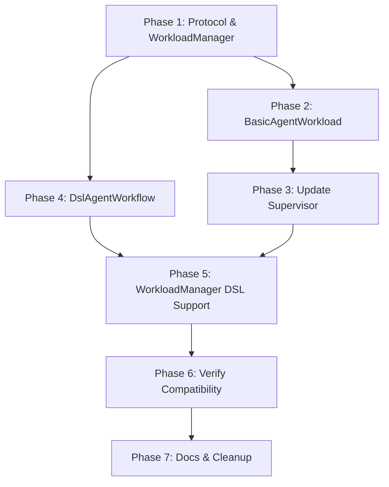

# Implementation Plan: Unified Workload Execution

## Overview

This plan implements the **Workload Protocol** approach for unified agent execution. Key design decisions:

1. **Workloads own execution** - Supervisor becomes a thin orchestrator
2. **AgentManager → WorkloadManager** - Renamed for abstraction clarity
3. **Composition over absorption** - DslAgentWorkflow uses DslStreetRaceAgent (no code duplication)
4. **Event forwarding** - Option 1 (don't forward nested) for now, out of scope for this task

## Phase 1: Define Workload Protocol and Rename AgentManager

### 1.1 Create Workload Protocol

**File**: `src/streetrace/workloads/__init__.py` (new package)
**File**: `src/streetrace/workloads/protocol.py`

**Tasks**:
- [ ] Create `workloads` package
- [ ] Define `Workload` protocol:
  ```python
  class Workload(Protocol):
      async def run_async(
          self,
          session: Session,
          message: Content | None,
      ) -> AsyncGenerator[Event, None]: ...

      async def close(self) -> None: ...
  ```
- [ ] Add type exports to `__init__.py`

### 1.2 Rename AgentManager to WorkloadManager

**File**: `src/streetrace/agents/agent_manager.py` → `src/streetrace/workloads/manager.py`

**Tasks**:
- [ ] Copy `agent_manager.py` to `workloads/manager.py`
- [ ] Rename class `AgentManager` → `WorkloadManager`
- [ ] Rename internal methods for clarity:
  - `_load_agent_definition` → `_load_definition`
  - Keep discovery methods as-is (they discover workload definitions)
- [ ] Add `create_workload(identifier: str)` async context manager
- [ ] Keep loaders internal (they produce StreetRaceAgent definitions)
- [ ] Update all imports throughout codebase

### 1.3 Unit Tests for Protocol and Manager

**File**: `tests/workloads/test_protocol.py`
**File**: `tests/workloads/test_manager.py`

**Tasks**:
- [ ] Test Workload protocol compliance
- [ ] Test WorkloadManager discovery (same as AgentManager)
- [ ] Test `create_workload()` routing to DSL vs Basic

## Phase 2: Implement BasicAgentWorkload

### 2.1 Create BasicAgentWorkload

**File**: `src/streetrace/workloads/basic_workload.py`

**Tasks**:
- [ ] Implement `BasicAgentWorkload` class
- [ ] Constructor accepts `StreetRaceAgent` definition + dependencies
- [ ] Implement `run_async()`:
  - Create agent via `agent_def.create_agent()`
  - Create ADK Runner with session service
  - Iterate and yield events
- [ ] Implement `close()` for resource cleanup
- [ ] Handle telemetry attributes (port from AgentManager)

### 2.2 Unit Tests for BasicAgentWorkload

**File**: `tests/workloads/test_basic_workload.py`

**Tasks**:
- [ ] Test event yielding from Runner
- [ ] Test cleanup on close
- [ ] Test with mock StreetRaceAgent
- [ ] Test session passing

## Phase 3: Update Supervisor to Use Workloads

### 3.1 Refactor Supervisor

**File**: `src/streetrace/workflow/supervisor.py`

**Tasks**:
- [ ] Replace `AgentManager` with `WorkloadManager` in constructor
- [ ] Update `handle()` to use workload protocol:
  ```python
  async with self.workload_manager.create_workload(workload_name) as workload:
      async for event in workload.run_async(session, content):
          # dispatch, handle, etc.
  ```
- [ ] Remove direct Runner usage
- [ ] Keep session management and UI dispatch logic
- [ ] Supervisor now **supervises workloads**, doesn't know about agents/flows

### 3.2 Update App Initialization

**File**: `src/streetrace/app.py`

**Tasks**:
- [ ] Create `WorkloadManager` instead of `AgentManager`
- [ ] Pass manager to Supervisor
- [ ] `--list-agents` uses `workload_manager.discover()` (method renamed if needed)

### 3.3 Integration Tests

**File**: `tests/workflow/test_supervisor_workloads.py`

**Tasks**:
- [ ] Test Supervisor with BasicAgentWorkload
- [ ] Test event dispatch works correctly
- [ ] Test session management unchanged
- [ ] Test error handling

## Phase 4: Transform DslAgentWorkflow into Workload

This is the core phase where DSL execution becomes unified.

**Key decision**: Use **composition** - DslAgentWorkflow holds DslStreetRaceAgent and delegates agent creation to it. No code absorption/duplication.

### 4.1 Update DslAgentWorkflow Constructor

**File**: `src/streetrace/dsl/runtime/workflow.py`

**Tasks**:
- [ ] Add constructor to `DslAgentWorkflow` accepting:
  - `agent_definition: DslStreetRaceAgent` (composition!)
  - `model_factory: ModelFactory`
  - `tool_provider: ToolProvider`
  - `system_context: SystemContext`
- [ ] Store `self._agent_def` for delegation
- [ ] Track created agents for cleanup: `self._created_agents: list[BaseAgent]`

### 4.2 Implement `_create_agent()` via Delegation

**File**: `src/streetrace/dsl/runtime/workflow.py`

**Tasks**:
- [ ] Implement `_create_agent(agent_name: str) -> BaseAgent`:
  ```python
  def _create_agent(self, agent_name: str) -> BaseAgent:
      # Delegate to DslStreetRaceAgent - NO code duplication
      agent = self._agent_def._create_agent_from_def(
          agent_name,
          self._agents[agent_name],
          self._model_factory,
          self._tool_provider,
          self._system_context,
      )
      self._created_agents.append(agent)
      return agent
  ```
- [ ] Ensure `_create_agent_from_def` is accessible (may need to make it package-private)

### 4.3 Implement Workload Protocol

**File**: `src/streetrace/dsl/runtime/workflow.py`

**Tasks**:
- [ ] Add `run_async()` method:
  ```python
  async def run_async(
      self,
      session: Session,
      message: Content | None,
  ) -> AsyncGenerator[Event, None]:
      entry_point = self._determine_entry_point()
      if entry_point.type == "flow":
          async for event in self._execute_flow(...):
              yield event
      else:
          async for event in self._execute_agent(...):
              yield event
  ```
- [ ] Implement `_determine_entry_point()` - check for main flow vs default agent
- [ ] Implement `_execute_agent()` - use `_create_agent()` + Runner
- [ ] Implement `_execute_flow()` - call flow method, handle results
- [ ] Implement `close()` - cleanup via `self._agent_def.close(agent)` for each created agent

### 4.4 Implement run_agent() and run_flow() Methods

**File**: `src/streetrace/dsl/runtime/workflow.py`

**Tasks**:
- [ ] Implement `run_agent(name, *args) -> object`:
  - Create agent via `_create_agent()` (delegates to DslStreetRaceAgent)
  - Execute via Runner
  - Return final result (not generator, for flow compatibility)
- [ ] Implement `run_flow(name, *args) -> object`:
  - Call generated `flow_{name}()` method
  - Return result

### 4.4 Update WorkflowContext

**File**: `src/streetrace/dsl/runtime/context.py`

**Tasks**:
- [ ] Add reference to parent `DslAgentWorkflow`
- [ ] Change `run_agent()` to delegate to workflow:
  ```python
  async def run_agent(self, agent_name: str, *args: object) -> object:
      return await self._workflow.run_agent(agent_name, *args)
  ```
- [ ] Add `run_flow()` that delegates to workflow
- [ ] Keep all other context functionality (vars, guardrails, etc.)

### 4.5 Update DslAgentWorkflow.create_context()

**File**: `src/streetrace/dsl/runtime/workflow.py`

**Tasks**:
- [ ] Pass `self` (workflow) reference to context
- [ ] Ensure context has access to workflow for delegation

### 4.6 Unit Tests for DslAgentWorkflow

**File**: `tests/dsl/test_workflow_workload.py`

**Tasks**:
- [ ] Test `_create_agent()` creates full agent with tools
- [ ] Test `run_async()` entry point selection
- [ ] Test `run_agent()` from within flows
- [ ] Test `run_flow()` composition
- [ ] Test event yielding from agent execution

## Phase 5: Update WorkloadManager for DSL

### 5.1 DSL Workload Creation in WorkloadManager

**File**: `src/streetrace/workloads/manager.py`

**Tasks**:
- [ ] Implement `_create_dsl_workload(definition: DslStreetRaceAgent)`:
  ```python
  def _create_dsl_workload(self, definition: DslStreetRaceAgent) -> DslAgentWorkflow:
      workflow_class = definition._workflow_class
      return workflow_class(
          agent_definition=definition,  # Pass for composition
          model_factory=self._model_factory,
          tool_provider=self._tool_provider,
          system_context=self._system_context,
      )
  ```
- [ ] Route DSL definitions to `_create_dsl_workload()` in `create_workload()`

### 5.2 Integration Tests

**File**: `tests/workloads/test_dsl_workload.py`

**Tasks**:
- [ ] Test full DSL agent execution via workload
- [ ] Test flow as entry point
- [ ] Test tools available in flow's run_agent()
- [ ] Test agentic patterns work (sub_agents, agent_tools)

## Phase 6: Verify DslStreetRaceAgent Compatibility

**No changes needed to DslStreetRaceAgent** - it's used via composition.

### 6.1 Ensure _create_agent_from_def is Accessible

**File**: `src/streetrace/agents/dsl_agent_loader.py`

**Tasks**:
- [ ] Verify `_create_agent_from_def` can be called by DslAgentWorkflow
- [ ] If needed, make it package-private (single underscore) instead of private
- [ ] Add any missing parameters needed for delegation

### 6.2 Update Imports

**Tasks**:
- [ ] Update `app.py` to use `WorkloadManager` instead of `AgentManager`
- [ ] Update any direct `AgentManager` references in tests
- [ ] Add deprecation notice to old `AgentManager` location if keeping for backward compat

## Phase 7: Documentation and Cleanup

### 7.1 Update Architecture Docs

**File**: `docs/dev/dsl/architecture.md`

**Tasks**:
- [ ] Add Workload protocol documentation
- [ ] Update runtime integration diagram
- [ ] Mark "Tool Passing" limitation as resolved
- [ ] Document entry point selection logic

### 7.2 Update Tech Debt Tracker

**File**: `docs/tasks/017-dsl/tech_debt.md`

**Tasks**:
- [ ] Move "Tool Passing Inconsistency" to Resolved
- [ ] Add resolution notes

### 7.3 Run Full Test Suite

**Tasks**:
- [ ] Run `make check`
- [ ] Fix any regressions
- [ ] Ensure test coverage maintained

---

## Summary of Files

### New Files

| File | Purpose |
|------|---------|
| `src/streetrace/workloads/__init__.py` | Package exports |
| `src/streetrace/workloads/protocol.py` | Workload protocol definition |
| `src/streetrace/workloads/manager.py` | WorkloadManager (renamed from AgentManager) |
| `src/streetrace/workloads/basic_workload.py` | Wrapper for PY/YAML agents |
| `tests/workloads/test_protocol.py` | Protocol tests |
| `tests/workloads/test_manager.py` | WorkloadManager tests |
| `tests/workloads/test_basic_workload.py` | BasicAgentWorkload tests |
| `tests/workloads/test_dsl_workload.py` | DSL workload integration tests |
| `tests/dsl/test_workflow_workload.py` | DslAgentWorkflow as Workload tests |

### Modified Files

| File | Changes |
|------|---------|
| `src/streetrace/workflow/supervisor.py` | Use WorkloadManager |
| `src/streetrace/app.py` | Initialize WorkloadManager |
| `src/streetrace/dsl/runtime/workflow.py` | Implement Workload, use DslStreetRaceAgent via composition |
| `src/streetrace/dsl/runtime/context.py` | Delegate run_agent to workflow |
| `docs/dev/dsl/architecture.md` | Document Workload protocol |
| `docs/tasks/017-dsl/tech_debt.md` | Mark resolved |

### Unchanged Files

| File | Notes |
|------|-------|
| `src/streetrace/agents/dsl_agent_loader.py` | **Kept as-is** - used via composition |
| `src/streetrace/agents/yaml_agent_loader.py` | Unchanged - loaders still produce definitions |
| `src/streetrace/agents/py_agent_loader.py` | Unchanged |

---

## Dependencies Between Phases



**Critical Path**: P1 → P2 → P3 → P5 → P7
**Parallel Work**: P4 can proceed alongside P2/P3 (independent of Supervisor changes)

---

## Estimated Effort

| Phase | Complexity | Est. Tasks |
|-------|------------|------------|
| Phase 1: Protocol & Rename AgentManager | Medium | 8 |
| Phase 2: BasicAgentWorkload | Low | 5 |
| Phase 3: Update Supervisor | Medium | 6 |
| Phase 4: DslAgentWorkflow (composition) | Medium | 8 |
| Phase 5: WorkloadManager DSL Support | Low | 4 |
| Phase 6: Verify Compatibility | Low | 3 |
| Phase 7: Docs & Cleanup | Low | 4 |
| **Total** | | **38 tasks** |

Note: Phase 4 reduced from High to Medium because we use composition instead of absorbing code from DslStreetRaceAgent.

---

## Risks & Mitigations

| Risk | Impact | Mitigation |
|------|--------|------------|
| Breaking PY/YAML agents | High | BasicAgentWorkload wraps unchanged |
| Breaking existing flows | High | run_agent() signature unchanged |
| Breaking DslStreetRaceAgent | None | **Used via composition, not modified** |
| Session handling regression | Medium | Extensive session tests in Phase 3 |
| Performance overhead | Low | Same Runner, just different ownership |
| Circular imports | Medium | Careful import structure, TYPE_CHECKING |
