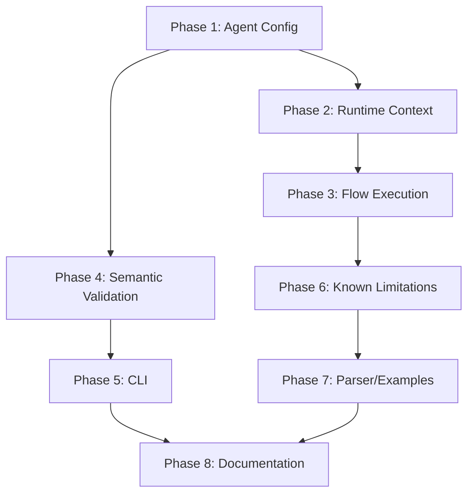

# DSL Compiler Implementation TODO

> **Task Definition**: [017-dsl-compiler-task.md](./017-dsl-compiler-task.md)
> **Code Review**: [017-dsl-compiler-task-code-review.md](./017-dsl-compiler-task-code-review.md)
> **Design Doc**: [/home/data/repos/github.com/streetrace-ai/rfc/design/017-dsl-compiler.md](file:///home/data/repos/github.com/streetrace-ai/rfc/design/017-dsl-compiler.md)
> **Branch**: `feature/017-streetrace-dsl-2`

---

## Gap Analysis Summary

The current implementation has working parser, AST, semantic analysis, code generation, and basic CLI. The main gaps are in **runtime integration** - specifically:

1. **Agent Configuration**: DSL-defined tools, instructions, and models aren't properly loaded
2. **Flow Execution**: Flows generate Python code but don't integrate with ADK
3. **Error Handling**: Some semantic errors (E0008, E0010) not triggered appropriately
4. **CLI Options**: `--no-comments` filtering is naive

### Placeholder Comments Found (Expectation 7)

The following files contain "placeholder", "simplified", or "not yet implemented" comments that need resolution:

| File | Line | Comment |
|------|------|---------|
| `src/streetrace/agents/dsl_agent_loader.py` | 395 | "Tool loading from DSL is not yet fully implemented" |
| `src/streetrace/dsl/runtime/context.py` | 29 | "Placeholder: actual masking logic will be implemented later" |
| `src/streetrace/dsl/runtime/context.py` | 45 | "Placeholder: actual guardrail checking will be implemented later" |
| `src/streetrace/dsl/runtime/context.py` | 118 | "Placeholder: actual agent execution will be implemented later" |
| `src/streetrace/dsl/runtime/context.py` | 145 | "Placeholder: actual LLM call will be implemented later" |
| `src/streetrace/dsl/runtime/context.py` | 168 | "Placeholder: drift detection will be implemented later" |
| `src/streetrace/dsl/runtime/context.py` | 182 | "Placeholder: processing will be implemented later" |
| `src/streetrace/dsl/runtime/context.py` | 220 | "Placeholder: actual escalation will be implemented later" |
| `src/streetrace/dsl/grammar/parser.py` | 62-64 | "Use Earley parser for now... will be resolved in a future grammar refactoring phase" |
| `src/streetrace/dsl/codegen/visitors/flows.py` | 361 | "Placeholder: move preceding code here" |
| `src/streetrace/dsl/codegen/visitors/expressions.py` | 69 | Warning "Unknown expression node type" - incomplete Token handling |
| `agents/examples/dsl/match.sr` | 2 | "simplified for now" |

---

## Phase 1: Agent Configuration Loading (Critical Path)

**Goal**: DSL agents load with exactly the configuration defined in the DSL file.

### 1.1 Fix Tool Loading from DSL

**File**: `src/streetrace/agents/dsl_agent_loader.py`

**Current State**: Tools defined in DSL are stored in `_tools` dict but never passed to `LlmAgent`.

**Tests First** (TDD):
```
tests/dsl/test_agent_loader_tools.py
- test_builtin_tool_loading_from_dsl()
- test_mcp_tool_loading_from_dsl()
- test_multiple_tools_loading_from_dsl()
- test_tool_loading_matches_yaml_equivalent()
```

**Implementation**:
- [ ] Parse `_tools` dict and create `ToolRef` objects
- [ ] Integrate with `ToolProvider` to resolve tool specs
- [ ] Map DSL tool definitions to ADK tool format:
  - `builtin streetrace.fs` → streetrace fs tools
  - `mcp "url"` → MCP server connection
- [ ] Pass tools to `LlmAgent` constructor

**Acceptance Criteria**:
- `poetry run streetrace --agent agents/generic.sr --prompt="describe this repo"` loads all 3 tools (fs, github mcp, context7 mcp)
- Tools actually execute and return results

---

### 1.2 Fix Instruction Resolution

**File**: `src/streetrace/agents/dsl_agent_loader.py`

**Current State**: Lines 376-393 use keyword matching ("instruction" or "greeting" in key.lower()) to find prompts.

**Tests First**:
```
tests/dsl/test_agent_loader_instruction.py
- test_instruction_loaded_from_dsl_agent_definition()
- test_instruction_not_guessed_by_keyword()
- test_missing_instruction_raises_error()
- test_named_instruction_loaded_correctly()
```

**Implementation**:
- [ ] Read `agent.instruction` directly from `_agents` dict
- [ ] Look up the instruction name in `_prompts` dict
- [ ] Remove keyword-matching fallback logic
- [ ] Evaluate prompt lambda with context to get final string

**Acceptance Criteria**:
- Agent uses exactly the instruction specified in DSL `instruction` field
- No keyword guessing behavior

---

### 1.3 Fix Model Resolution

**File**: `src/streetrace/agents/dsl_agent_loader.py`

**Current State**: Lines 362-372 use "main" model or first available model.

**Design Spec** (Expectation 6):
1. Model specified in instruction's `using model "X"` takes precedence
2. Fall back to model named "main"
3. CLI `--model` argument overrides everything

**Tests First**:
```
tests/dsl/test_agent_loader_model.py
- test_model_from_prompt_using_clause()
- test_model_fallback_to_main()
- test_cli_model_overrides_dsl()
- test_no_first_model_guessing()
```

**Implementation**:
- [ ] Store `prompt.model` in codegen for each prompt
- [ ] Look up agent's instruction prompt, get its model
- [ ] Use that model for the agent
- [ ] Add CLI override parameter passthrough

**Acceptance Criteria**:
- `agents/examples/dsl/specific_model.sr` runs with `anthropic/claude-sonnet-4-5` as specified in `prompt greeting using model "agent"`

---

### 1.4 Align generic.sr with generic.yml

**Files**: `agents/generic.sr`, compare with `agents/generic.yml`

**Current State**: generic.sr defines only `fs` tool, generic.yml defines fs + filesystem MCP + github MCP + context7 MCP + cli.

**Implementation**:
- [ ] Update `agents/generic.sr` to include all tools from generic.yml
- [ ] Ensure tool syntax matches DSL grammar for MCP servers

---

## Phase 2: Runtime Context Implementation

**Goal**: Implement all placeholder methods in WorkflowContext to enable actual execution.

### 2.1 Implement WorkflowContext.run_agent()

**File**: `src/streetrace/dsl/runtime/context.py`

**Current State**: Line 118 - "Placeholder: actual agent execution will be implemented later"

**Tests First**:
```
tests/dsl/test_context_run_agent.py
- test_run_agent_creates_adk_agent()
- test_run_agent_passes_args_as_prompt()
- test_run_agent_returns_final_response()
- test_run_agent_uses_correct_model()
```

**Implementation**:
- [ ] Look up agent config from `self._agents[agent_name]`
- [ ] Get instruction from `self._prompts`
- [ ] Get model from prompt's model reference or `_models['main']`
- [ ] Create LlmAgent with proper configuration
- [ ] Execute via ADK Runner and return result

---

### 2.2 Implement WorkflowContext.call_llm()

**File**: `src/streetrace/dsl/runtime/context.py`

**Current State**: Line 145 - "Placeholder: actual LLM call will be implemented later"

**Tests First**:
```
tests/dsl/test_context_call_llm.py
- test_call_llm_uses_named_prompt()
- test_call_llm_interpolates_args()
- test_call_llm_respects_model_override()
- test_call_llm_returns_response()
```

**Implementation**:
- [ ] Look up prompt from `self._prompts[prompt_name]`
- [ ] Evaluate lambda with context to get prompt string
- [ ] Resolve model from parameter or prompt's model reference
- [ ] Make LLM call via LiteLLM client
- [ ] Return response content

---

### 2.3 Implement Guardrail Methods

**File**: `src/streetrace/dsl/runtime/context.py`

**Current State**:
- Line 29: "Placeholder: actual masking logic"
- Line 45: "Placeholder: actual guardrail checking"

**Tests First**:
```
tests/dsl/test_guardrails.py
- test_mask_pii_replaces_sensitive_data()
- test_check_jailbreak_detects_attempts()
- test_guardrail_integration_with_handler()
```

**Implementation**:
- [ ] Integrate with existing guardrail infrastructure (if any)
- [ ] Implement basic PII masking regex patterns
- [ ] Implement jailbreak detection (LLM-based or pattern-based)

---

### 2.4 Implement Other Context Methods

**File**: `src/streetrace/dsl/runtime/context.py`

**Current State**:
- Line 168: "Placeholder: drift detection"
- Line 182: "Placeholder: processing"
- Line 220: "Placeholder: actual escalation"

**Tests First**:
```
tests/dsl/test_context_methods.py
- test_detect_drift_compares_trajectory()
- test_process_applies_pipeline()
- test_escalate_to_human_triggers_callback()
```

**Implementation**:
- [ ] `process`: Apply transformation pipeline (may require design clarification)
- [ ] `escalate_to_human`: Integrate with UI/notification system

---

## Phase 3: Flow Execution with ADK Integration

**Goal**: Flows generate async generators that use ADK agents for execution.

### 3.1 Refactor DslAgentWorkflow for Flow-Based Execution

**Files**:
- `src/streetrace/dsl/runtime/workflow.py`
- `src/streetrace/dsl/runtime/context.py`

**Current State**: `DslAgentWorkflow` has event handlers but no actual agent execution logic.

**Design Doc Reference** (Expectation 11):
- Flows should produce async generators yielding ADK events
- Sequential agents → `SequentialAgent`
- Data transformations between agents → individual runs with processing

**Tests First**:
```
tests/dsl/test_flow_execution.py
- test_simple_flow_runs_agent()
- test_sequential_flow_uses_adk_sequential_agent()
- test_flow_with_data_transformation()
- test_flow_variable_passing()
- test_flow_yields_events()
```

**Implementation**:
- [ ] Add `create_agent(agent_name: str) -> LlmAgent` method to DslAgentWorkflow
  - Read agent config from `_agents`
  - Get instruction from `_prompts`
  - Get model from prompt's `using model` clause
  - Get tools and resolve via ToolProvider
- [ ] Add `run_root_adk_agent(agent, prompt) -> AsyncGenerator` method
  - Create ADK Runner/Session
  - Execute agent and yield events
- [ ] Modify flow code generation to use these methods:
  - Single agent: `async for event in run_root_adk_agent(...): yield event`
  - Sequential agents: Create `SequentialAgent` with sub_agents

**Code Generation Example** (from design):
```python
# DSL: flow process_document:
#     $analysis = run agent main_agent
#     $validated = run agent summarizer $analysis
#     return $validated

# Generated Python:
async def flow_process_document(self, ctx: WorkflowContext):
    async for event in self.run_agent('main_agent', ctx.vars['input_prompt']):
        if event.is_final_response():
            ctx.vars['analysis'] = event.data
        yield event
    async for event in self.run_agent('summarizer', ctx.vars['analysis']):
        yield event
```

---

### 3.2 Fix ExpressionVisitor Token Handling

**File**: `src/streetrace/dsl/codegen/visitors/expressions.py`

**Current State**: Running `dump-python agents/examples/dsl/flow.sr` produces warning:
```
Unknown expression node type: Token
```
This indicates that the AST transformer isn't fully converting some expressions, leaving raw Lark `Token` objects.

**Tests First**:
```
tests/dsl/test_expression_visitor.py
- test_all_flow_expressions_handled()
- test_no_token_warnings_on_dump_python()
- test_token_produces_clear_error_message()
```

**Implementation**:
- [ ] Add `Token` handling to `ExpressionVisitor._dispatch`
- [ ] Investigate which expressions in flow.sr produce raw Tokens
- [ ] Either fix AST transformer to convert these properly, OR handle Token in visitor
- [ ] Change warning to error with clear message including token value and location

---

### 3.3 Update FlowVisitor Code Generation

**File**: `src/streetrace/dsl/codegen/visitors/flows.py`

**Current State**:
- Generates `await ctx.run_agent(...)` but ctx.run_agent doesn't exist/work
- Line 361: `_visit_failure_block` emits "Placeholder: move preceding code here"

**Implementation**:
- [ ] Change `run agent` to generate async for loop with yield
- [ ] Handle variable capture from final response
- [ ] Detect sequential agent patterns and optimize
- [ ] Generate proper async generator signature
- [ ] Fix `_visit_failure_block` to properly wrap code in try/except

---

### 3.4 Integrate Flows with Main Entry Point

**Files**:
- `src/streetrace/agents/dsl_agent_loader.py`
- `src/streetrace/workflow/supervisor.py` (reference)

**Implementation**:
- [ ] `create_agent` should return agent that executes the default/specified flow
- [ ] Wire up flow execution to ADK Runner lifecycle
- [ ] Ensure `--prompt` argument is passed to flow as initial input

---

## Phase 4: Semantic Validation Improvements

### 4.1 Add E0010 for Missing Required Properties

**Files**:
- `src/streetrace/dsl/semantic/analyzer.py`
- `src/streetrace/dsl/semantic/errors.py`

**Status**: COMPLETED

**Tests**:
```
tests/dsl/test_semantic_required_properties.py
- test_agent_without_instruction_triggers_e0010()
- test_agent_with_instruction_passes()
- test_unnamed_agent_without_instruction_triggers_e0010()
- test_multiple_agents_one_missing_instruction()
- test_agent_missing_instruction_has_helpful_suggestion()
```

**Implementation**:
- [x] In `_validate_agent_refs`, check if `agent.instruction` is None/empty
- [x] Add SemanticError.missing_required_property factory method
- [x] Emit E0010 error with helpful message

---

### 4.2 Add E0008 for Indentation Errors

**Files**:
- `src/streetrace/dsl/compiler.py`

**Status**: COMPLETED

**Tests**:
```
tests/dsl/test_indentation_errors.py
- test_inconsistent_indentation_triggers_e0008()
- test_wrong_dedent_level_triggers_e0008()
- test_proper_indentation_passes()
- test_indentation_error_has_line_info()
- test_indentation_error_has_helpful_message()
```

**Implementation**:
- [x] Catch Lark DedentError exception specifically
- [x] Map to E0008 with line/column information
- [x] Provide helpful suggestion about consistent indentation

---

## Phase 5: CLI Improvements

### 5.1 Fix --no-comments Flag

**File**: `src/streetrace/dsl/cli.py`

**Status**: COMPLETED

**Tests**:
```
tests/dsl/test_cli_dump_python.py
- test_no_comments_removes_source_comments()
- test_no_comments_preserves_code()
- test_no_comments_preserves_docstrings()
```

**Implementation**:
- [x] Use regex pattern to identify source comments: `^\s*# .*\.sr:\d+$`
- [x] Filter only lines matching the source comment pattern
- [x] Preserve all other code, docstrings, and comments

---

## Phase 6: Known Limitations Resolution

**Source**: `docs/user/dsl/getting-started.md` lines 241-304

### 6.1 Comma-Separated Tool Lists

**Current State**: "Multiple tools may cause issues"

**Implementation**:
- [ ] Verify grammar handles `tools fs, cli, github` correctly
- [ ] Ensure semantic analyzer validates all tools in list
- [ ] Test multiple tools in single agent

---

### 6.2 Flow Parameters and Variables

**Current State**: "Flow parameters and variables have limited support"

**Implementation**:
- [ ] Verify flow parameters are correctly bound in scope
- [ ] Generate parameter binding code at flow start
- [ ] Test variable passing between flow steps

---

### 6.3 Compaction Policies

**Current State**: "properties like strategy and preserve have limited support"

**Implementation**:
- [ ] Implement `strategy` property handling
- [ ] Implement `preserve` property handling with variable list
- [ ] Generate runtime configuration for compaction

---

### 6.4 Runtime Integration

**Current State**: "DSL agents compile to Python workflow classes but are not yet integrated with the main streetrace --agent command"

**Resolution**: Covered in Phase 3 - this is the main flow execution work.

---

## Phase 7: Parser and Example Updates

### 7.1 Parser Optimization (Future)

**File**: `src/streetrace/dsl/grammar/parser.py`

**Current State**: Lines 62-64 - "Use Earley parser for now... These will be resolved in a future grammar refactoring phase"

**Note**: This is a performance optimization, not a correctness issue. Earley parser works correctly but is slower than LALR.

**Tests First**:
```
tests/dsl/test_parser_lalr.py
- test_all_examples_parse_with_lalr()
- test_lalr_parse_performance()
```

**Implementation**:
- [ ] Identify grammar constructs causing reduce/reduce conflicts
- [ ] Refactor grammar to be LALR-compatible
- [ ] Benchmark performance improvement

---

### 7.2 Update Example Files

**Files**:
- `agents/examples/dsl/match.sr` - Line 2: "simplified for now"
- `agents/examples/dsl/flow.sr` - Needs user prompt passing

**Implementation**:
- [ ] Update match.sr to demonstrate full pattern matching functionality
- [ ] Update flow.sr to pass `$input_prompt` to main_agent as shown in Expectation 11
- [ ] Add comprehensive examples for each DSL feature

---

## Phase 8: Update Documentation

### 8.1 Remove Known Limitations

**File**: `docs/user/dsl/getting-started.md`

- [ ] Remove "Comma-Separated Tool Lists" limitation after implementation
- [ ] Remove "Flow Variables" limitation after implementation
- [ ] Remove "Compaction Policies" limitation after implementation
- [ ] Remove "Runtime Integration" limitation after implementation

### 8.2 Update Example Files

- [ ] Ensure all example files in `agents/examples/dsl/` work correctly
- [ ] Add documentation for each fixed feature

---

## Testing Strategy

### Unit Test Coverage Targets

| Module | Target |
|--------|--------|
| `dsl_agent_loader.py` | 90%+ |
| `flows.py` (codegen) | 90%+ |
| `workflow.py` (runtime) | 90%+ |
| `analyzer.py` | 90%+ |
| `cli.py` | 80%+ |

### Integration Tests

```
tests/dsl/test_integration.py
- test_generic_sr_matches_generic_yml_behavior()
- test_flow_sr_executes_with_prompt()
- test_specific_model_sr_uses_correct_model()
```

### E2E Tests

```
tests/e2e/test_dsl_e2e.py
- test_streetrace_run_dsl_agent()
- test_streetrace_check_validation()
- test_streetrace_dump_python()
```

---

## Execution Order



**Critical Path**: Phase 1 → Phase 2 → Phase 3 (unblocks E2E testing)

**Parallel Work**: Phase 4 and Phase 5 can proceed independently after Phase 1.

---

## Success Criteria Checklist

From code review expectations:

- [ ] **E1**: generic.sr tools match generic.yml (Phase 1.4)
- [ ] **E2**: Tools loaded when running generic.sr (Phase 1.1)
- [ ] **E3**: Tools execute and return results (Phase 1.1)
- [ ] **E4**: Model from prompt's `using model` used (Phase 1.3)
- [ ] **E5**: Agent loads exact DSL config, no guessing (Phase 1.2)
- [ ] **E6**: Model resolution follows spec (Phase 1.3)
- [ ] **E7**: All placeholder comments implemented (Phase 2 + 3 + 7)
  - [ ] `dsl_agent_loader.py:395` - Tool loading
  - [ ] `context.py` - All 7 placeholder methods
  - [ ] `flows.py:361` - Failure block code gen
  - [ ] `expressions.py:69` - Token handling warning → error or fix
  - [ ] `match.sr:2` - Example file update
- [x] **E8**: --no-comments works correctly (Phase 5.1)
- [x] **E9**: Agents without instruction trigger E0010 (Phase 4.1)
- [x] **E10**: Indentation errors use E0008 (Phase 4.2)
- [ ] **E11**: Flows execute with ADK integration (Phase 3)
- [ ] **E12**: Known limitations resolved (Phase 6)

---

## Appendix: Key File References

| Component | File |
|-----------|------|
| Agent Loader | `src/streetrace/agents/dsl_agent_loader.py` |
| Flow Code Gen | `src/streetrace/dsl/codegen/visitors/flows.py` |
| Workflow Base | `src/streetrace/dsl/runtime/workflow.py` |
| Context | `src/streetrace/dsl/runtime/context.py` |
| Semantic Analyzer | `src/streetrace/dsl/semantic/analyzer.py` |
| Error Codes | `src/streetrace/dsl/errors/codes.py` |
| CLI | `src/streetrace/dsl/cli.py` |
| Parser Factory | `src/streetrace/dsl/grammar/parser.py` |
| Grammar | `src/streetrace/dsl/grammar/streetrace.lark` |
| Generic DSL Agent | `agents/generic.sr` |
| Generic YAML Agent | `agents/generic.yml` |
| Flow Example | `agents/examples/dsl/flow.sr` |
| Match Example | `agents/examples/dsl/match.sr` |
| Model Example | `agents/examples/dsl/specific_model.sr` |
