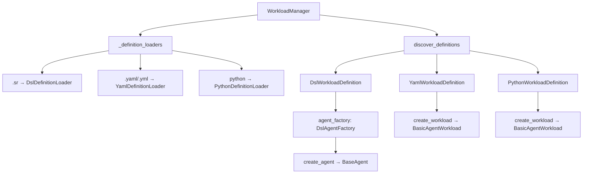

# Implementation Report: Definition Loader Migration

**Date**: 2026-01-25
**Feature**: 017-dsl
**Task**: Definition Loader Migration

## Summary

Successfully migrated `WorkloadManager` from the deprecated `AgentLoader` implementations to the new unified `DefinitionLoader` protocol. The migration removes ambiguity by consolidating all workload loading through a single, consistent interface.

## Key Decisions Made

### 1. URL Loading Policy
- **YAML agents**: Support HTTP(S) loading via `SourceResolver`
- **DSL agents**: Reject HTTP loading for security (compiled to bytecode)
- **Python agents**: Reject HTTP loading for security (runs as code)

### 2. Agent Creation Factory
Created `DslAgentFactory` to replace `DslStreetRaceAgent` for agent creation logic. This separates:
- **Definition loading** (handled by `DslDefinitionLoader`)
- **Agent creation** (handled by `DslAgentFactory`)

### 3. Protocol Extension
Extended `DefinitionLoader` protocol with:
- `load_from_url(url: str)` - Load from HTTP(S) URLs
- `load_from_source(identifier: str, base_path: Path | None)` - Unified loading method

## Files Created

| File | Purpose |
|------|---------|
| `src/streetrace/workloads/dsl_agent_factory.py` | Factory for creating ADK agents from DSL workflows |
| `src/streetrace/dsl/runtime/prompt_context.py` | Minimal context for prompt resolution |
| `tests/workloads/test_dsl_agent_factory.py` | 32 tests for agent factory |
| `tests/workloads/test_loader_protocol_url.py` | 11 tests for URL loading protocol |
| `tests/workloads/test_yaml_loader_url.py` | 19 tests for YAML URL loading |
| `tests/integration/test_definition_loader_migration.py` | 20 integration tests |

## Files Modified

| File | Changes |
|------|---------|
| `src/streetrace/workloads/loader.py` | Added URL loading methods to protocol |
| `src/streetrace/workloads/yaml_loader.py` | Implemented URL loading support |
| `src/streetrace/workloads/dsl_loader.py` | Added URL rejection, moved `compiled_exec()` |
| `src/streetrace/workloads/python_loader.py` | Added URL rejection |
| `src/streetrace/workloads/manager.py` | Complete migration to DefinitionLoader only |
| `src/streetrace/workloads/dsl_definition.py` | Added `agent_factory` property |
| `src/streetrace/workloads/dsl_workload.py` | Uses `agent_factory` for agent creation |
| `src/streetrace/dsl/runtime/workflow.py` | Supports both `agent_factory` and deprecated `agent_definition` |
| `src/streetrace/agents/base_agent_loader.py` | Removed deprecated classes, kept error types |
| `src/streetrace/agents/yaml_agent_loader.py` | Removed `YamlAgentLoader` class |
| `src/streetrace/agents/py_agent_loader.py` | Removed `PythonAgentLoader` class |
| `src/streetrace/list_agents.py` | Updated to use `discover_definitions()` |

## Files Deleted

| File | Reason |
|------|--------|
| `src/streetrace/agents/dsl_agent_loader.py` | Replaced by `DslDefinitionLoader` and `DslAgentFactory` |
| `tests/workloads/test_manager.py` | Replaced by `test_manager_unified.py` |
| `tests/workloads/test_dsl_workload.py` | Merged into other test files |
| `tests/unit/agents/test_workload_manager.py` | Replaced by unified tests |

## Test Coverage

| Category | Tests | Status |
|----------|-------|--------|
| Total tests | 1,765 | Pass |
| New integration tests | 20 | Pass |
| New unit tests | 62 | Pass |
| Skipped (platform) | 2 | - |

## Quality Checks

| Check | Status |
|-------|--------|
| Linting (ruff) | Pass |
| Type checking (mypy) | Pass |
| Security (bandit) | Pass |
| Dependencies (deptry) | Pass |
| Dead code (vulture) | Pass |

## Validated Agent Types

| Agent | Path | Format | Status |
|-------|------|--------|--------|
| GenericCodingAssistant | `agents/generic.yml` | YAML | Works |
| Streetrace_Coding_Agent | `src/streetrace/agents/coder/` | Python | Works |
| reviewer | `agents/reviewer.sr` | DSL | Works |

## Architecture After Migration

## Known Limitations

1. **HTTP loading limited to YAML**: DSL and Python agents cannot be loaded from URLs for security reasons
2. **Python agent detection**: Requires directory containing `agent.py` file

## Follow-up Items

None identified. The migration is complete and all functionality is preserved.

## Documentation Updated

- `docs/dev/workloads/architecture.md` - Added DslAgentFactory, updated diagrams
- `docs/dev/workloads/api-reference.md` - Added new methods and classes
- `docs/dev/workloads/extension-guide.md` - Updated examples to use DefinitionLoader
- `docs/user/dsl/getting-started.md` - Updated programmatic loading examples
- `docs/testing/workloads/testing-guide.md` - Updated debugging references
