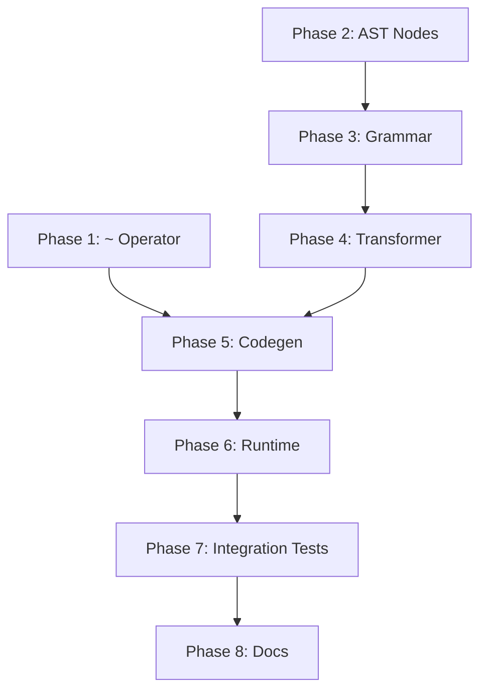

# Implementation Plan: Normalized Comparison and Prompt Escalation

## Overview

This plan implements the `~` (normalized equals) operator and prompt-level escalation with
minimal changes to the existing codebase. The implementation follows the established DSL
pipeline: Grammar → Transformer → AST → Codegen → Runtime.

## Phase 1: Normalized Comparison Operator (`~`) - COMPLETED

The `~` operator is self-contained and can be implemented first without dependencies.

### 1.1 Grammar Change

**File**: `src/streetrace/dsl/grammar/streetrace.lark`

**Tasks**:
- [x] Add `"~"` to `comparison_op` rule (line 398)
  ```lark
  comparison_op: ">" | "<" | ">=" | "<=" | "==" | "!=" | "contains" | "~"
  ```

### 1.2 Runtime Normalization Function

**File**: `src/streetrace/dsl/runtime/utils.py` (new file)

**Tasks**:
- [x] Create `utils.py` module
- [x] Implement `normalize_for_comparison(text: str) -> str`:
  - Remove markdown modifiers (`**`, `*`, `_`, `` ` ``, `#`)
  - Remove punctuation
  - Convert to lowercase
  - Strip whitespace
  - Collapse multiple whitespace to single space
- [x] Implement `normalized_equals(left: object, right: object) -> bool`
- [x] Export from `__init__.py`

### 1.3 Code Generation

**File**: `src/streetrace/dsl/codegen/visitors/expressions.py`

**Tasks**:
- [x] Add import for `normalized_equals` in generated code header
- [x] Add special handling for `~` operator in `_visit_binary_op()`:
  ```python
  if op == "~":
      return f"normalized_equals({left}, {right})"
  ```

### 1.4 Update Generated Imports

**File**: `src/streetrace/dsl/codegen/visitors/workflow.py`

**Tasks**:
- [x] Add `normalized_equals` to generated imports (around line 33-48)

### 1.5 Unit Tests

**File**: `tests/unit/dsl/test_normalized_equals.py` (new)

**Tasks**:
- [x] Test `normalize_for_comparison()`:
  - Markdown removal: `"**bold**"` → `"bold"`
  - Punctuation removal: `"Hello!"` → `"Hello"`
  - Case normalization: `"HELLO"` → `"hello"`
  - Whitespace handling: `"  hello  world  "` → `"hello world"`
  - Combined: `"**Drifting.**\n"` → `"drifting"`
- [x] Test `normalized_equals()`:
  - Matching cases from spec
  - Non-matching cases
  - Non-string inputs (converted to string)

**File**: `tests/dsl/test_normalized_operator.py` (new)

**Tasks**:
- [x] Test `~` in if conditions
- [x] Test `~` in assignments
- [x] Test `~` in match blocks (if supported)
- [x] Test with actual LLM-like outputs

## Phase 2: AST Node Extensions - COMPLETED

Extend AST nodes for escalation support before grammar changes.

### 2.1 Add Escalation Nodes

**File**: `src/streetrace/dsl/ast/nodes.py`

**Tasks**:
- [x] Add `EscalationCondition` dataclass:
  ```python
  @dataclass
  class EscalationCondition:
      """Escalation condition for prompt outputs."""
      op: str  # "~", "==", "!=", "contains", "expr"
      value: str | AstNode
      meta: SourcePosition | None = None
  ```
- [x] Add `EscalationHandler` dataclass:
  ```python
  @dataclass
  class EscalationHandler:
      """Handler for agent escalation."""
      action: str  # "return", "continue", "abort"
      value: AstNode | None = None
      meta: SourcePosition | None = None
  ```
- [x] Modify `PromptDef` to add `escalation_condition: EscalationCondition | None = None`
- [x] Modify `RunStmt` to add `escalation_handler: EscalationHandler | None = None`

### 2.2 Unit Tests for Nodes

**File**: `tests/unit/dsl/test_escalation_nodes.py` (new)

**Tasks**:
- [x] Test `EscalationCondition` creation
- [x] Test `EscalationHandler` creation
- [x] Test modified `PromptDef` with escalation
- [x] Test modified `RunStmt` with handler

## Phase 3: Grammar Extensions - COMPLETED

### 3.1 Prompt Escalation Clause

**File**: `src/streetrace/dsl/grammar/streetrace.lark`

**Tasks**:
- [x] Add `escalation_clause` rule after `prompt_body`:
  ```lark
  prompt_def: "prompt" NAME prompt_modifiers? ":" prompt_body escalation_clause?

  escalation_clause: "escalate" "if" escalation_condition _NL

  escalation_condition: "~" STRING
                      | comparison_op STRING
                      | expression
  ```

### 3.2 Run Statement Escalation Handler

**File**: `src/streetrace/dsl/grammar/streetrace.lark`

**Tasks**:
- [x] Modify `run_stmt` to include optional `escalation_handler`:
  ```lark
  run_stmt: variable "=" "run" "agent" identifier expression* escalation_handler?
          | "run" "agent" identifier expression* escalation_handler?
          | variable "=" "run" identifier expression* escalation_handler?  -> run_flow_assign
          | "run" identifier expression* escalation_handler?  -> run_flow

  escalation_handler: "," "on" "escalate" escalation_action

  escalation_action: "return" expression          -> escalation_return
                   | "continue"                   -> escalation_continue
                   | "abort"                      -> escalation_abort
  ```

### 3.3 Parser Tests

**File**: `tests/dsl/test_escalation_grammar.py` (new)

**Tasks**:
- [x] Test parsing prompt with escalation clause
- [x] Test parsing run statement with escalation handler
- [x] Test all escalation action variants
- [x] Test grammar without escalation (backward compat)

## Phase 4: AST Transformer - COMPLETED

### 4.1 Escalation Clause Transformer

**File**: `src/streetrace/dsl/ast/transformer.py`

**Tasks**:
- [x] Add `escalation_clause()` method:
  ```python
  def escalation_clause(self, items: TransformerItems) -> EscalationCondition:
      """Transform escalation_clause rule."""
      return items[0]  # escalation_condition result
  ```
- [x] Add `escalation_condition()` method to handle all condition variants
- [x] Modify `prompt_def()` to extract and attach escalation condition

### 4.2 Escalation Handler Transformer

**File**: `src/streetrace/dsl/ast/transformer.py`

**Tasks**:
- [x] Add `escalation_handler()` method:
  ```python
  def escalation_handler(self, items: TransformerItems) -> EscalationHandler:
      """Transform escalation_handler rule."""
      return items[0]  # escalation_action result
  ```
- [x] Add `escalation_return()`, `escalation_continue()`, `escalation_abort()` methods
- [x] Modify `run_stmt()` to extract and attach escalation handler

### 4.3 Transformer Tests

**File**: `tests/dsl/test_escalation_transformer.py` (new)

**Tasks**:
- [x] Test prompt with escalation transforms to correct AST
- [x] Test run statement with handler transforms correctly
- [x] Test all escalation condition operators
- [x] Test all escalation actions

## Phase 5: Code Generation - COMPLETED

### 5.1 Prompt Specification Runtime Support

**File**: `src/streetrace/dsl/runtime/workflow.py`

**Tasks**:
- [x] Add `EscalationSpec` dataclass for holding escalation conditions
- [x] Add `PromptSpec` dataclass with body, model, and escalation fields
- [x] Update `_prompts` type annotation to `dict[str, PromptSpec]`

### 5.2 Workflow Codegen for Prompts

**File**: `src/streetrace/dsl/codegen/visitors/workflow.py`

**Tasks**:
- [x] Modify `_emit_prompts()` to emit `PromptSpec` objects with optional `EscalationSpec`
- [x] Add `EscalationSpec` and `PromptSpec` to generated imports

### 5.3 Flow Codegen for Run Statements

**File**: `src/streetrace/dsl/codegen/visitors/flows.py`

**Tasks**:
- [x] Modify `_visit_run_stmt()` to handle escalation handlers
- [x] Generate `run_agent_with_escalation()` calls when handler present
- [x] Generate escalation check with `if _escalated:` block
- [x] Add `_emit_escalation_action()` helper method for return/continue/abort

### 5.4 Codegen Tests

**File**: `tests/dsl/test_escalation_codegen.py` (new)

**Tasks**:
- [x] Test generated code for prompt with escalation
- [x] Test generated code for run with `on escalate return`
- [x] Test generated code for run with `on escalate continue`
- [x] Test generated code for run with `on escalate abort`
- [x] Verify generated code is syntactically valid Python

## Phase 6: Runtime Escalation Support - COMPLETED

### 6.1 Escalation Check in Context

**File**: `src/streetrace/dsl/runtime/context.py`

**Tasks**:
- [x] Add `_last_escalated` field to track escalation state
- [x] Add `run_agent_with_escalation()` async generator method
- [x] Add `_get_escalation_condition()` helper to retrieve condition from agent's prompt
- [x] Add `_evaluate_escalation_condition()` for condition evaluation
- [x] Add `get_last_result_with_escalation()` method returning (result, escalated) tuple

### 6.2 Agent Factory Update

**File**: `src/streetrace/workloads/dsl_agent_factory.py`

**Tasks**:
- [x] Update `_resolve_instruction()` to handle `PromptSpec` objects
- [x] Add `_get_prompt_value()` helper for prompt lookup
- [x] Add `_evaluate_prompt()` helper for evaluating prompt body

### 6.3 Runtime Tests

**File**: `tests/unit/dsl/test_context_escalation.py` (new)

**Tasks**:
- [x] Test `run_agent_with_escalation()` returns correct generator
- [x] Test escalation condition evaluation for `~`
- [x] Test escalation condition evaluation for `==`
- [x] Test escalation condition evaluation for `!=`
- [x] Test escalation condition evaluation for `contains`
- [x] Test no escalation when condition not met
- [x] Test no escalation when no condition defined
- [x] Test backward compatibility with lambda prompts
- [x] Test `get_last_result_with_escalation()` returns correct tuple

## Phase 7: Integration Testing

### 7.1 End-to-End Tests

**File**: `tests/integration/dsl/test_escalation_e2e.py` (new)

**Tasks**:
- [ ] Test full pipeline: DSL → Parse → Transform → Codegen → Execute
- [ ] Test `resolver.sr` example with new syntax
- [ ] Test escalation triggers return correctly
- [ ] Test escalation triggers continue correctly
- [ ] Test escalation triggers abort correctly

### 7.2 Example Agent Update

**File**: `agents/resolver.sr`

**Tasks**:
- [ ] Update to use new escalation syntax:
  ```sr
  prompt pi_enhancer using model "main": '''...'''
      escalate if ~ "DRIFTING"

  agent peer1:
      instruction pi_enhancer

  agent peer2:
      instruction pi_enhancer

  flow default:
      $current = $input_prompt
      loop max 3 do
          $current = run agent peer1 $current, on escalate return $current
          $current = run agent peer2 $current, on escalate return $current
      end
      return $current
  ```

## Phase 8: Documentation and Cleanup

### 8.1 Update Grammar Documentation

**File**: `docs/dev/dsl/api-reference.md`

**Tasks**:
- [ ] Document `~` operator with examples
- [ ] Document `escalate if` clause on prompts
- [ ] Document `on escalate` handlers on run statements

### 8.2 Update User Guide

**File**: `docs/user/dsl/getting-started.md`

**Tasks**:
- [ ] Add escalation pattern example
- [ ] Explain when to use `~` vs `==`

### 8.3 Run Full Test Suite

**Tasks**:
- [ ] Run `make check`
- [ ] Fix any regressions
- [ ] Ensure test coverage maintained

---

## File Summary

### New Files

| File | Purpose |
|------|---------|
| `src/streetrace/dsl/runtime/utils.py` | Normalization functions |
| `tests/unit/dsl/test_normalized_equals.py` | Normalization unit tests |
| `tests/dsl/test_normalized_operator.py` | `~` operator integration tests |
| `tests/unit/dsl/test_escalation_nodes.py` | AST node tests |
| `tests/dsl/test_escalation_grammar.py` | Parser tests |
| `tests/dsl/test_escalation_transformer.py` | Transformer tests |
| `tests/dsl/test_escalation_codegen.py` | Codegen tests |
| `tests/unit/dsl/test_context_escalation.py` | Runtime tests |
| `tests/integration/dsl/test_escalation_e2e.py` | E2E tests |

### Modified Files

| File | Changes |
|------|---------|
| `src/streetrace/dsl/grammar/streetrace.lark` | Add `~`, `escalation_clause`, `escalation_handler` |
| `src/streetrace/dsl/ast/nodes.py` | Add `EscalationCondition`, `EscalationHandler`; modify `PromptDef`, `RunStmt` |
| `src/streetrace/dsl/ast/transformer.py` | Add escalation transformers |
| `src/streetrace/dsl/codegen/visitors/expressions.py` | Handle `~` operator |
| `src/streetrace/dsl/codegen/visitors/workflow.py` | Emit `PromptSpec` with escalation |
| `src/streetrace/dsl/codegen/visitors/flows.py` | Handle `on escalate` handlers |
| `src/streetrace/dsl/runtime/context.py` | Add `run_agent_with_escalation()` |
| `src/streetrace/dsl/runtime/workflow.py` | Add `PromptSpec` dataclass |
| `agents/resolver.sr` | Update to use new syntax |
| `docs/dev/dsl/api-reference.md` | Document new features |
| `docs/user/dsl/getting-started.md` | Add examples |

---

## Dependencies Between Phases



**Critical Path**: P2 → P3 → P4 → P5 → P6 → P7
**Parallel Work**: P1 can proceed independently until Phase 5 merge

---

## Risk Mitigation

| Risk | Mitigation |
|------|------------|
| Grammar conflicts | Test parser extensively in Phase 3 |
| Breaking existing code | All new syntax is optional; existing code unchanged |
| Complex transformer logic | Add comprehensive tests in Phase 4 |
| Runtime performance | Normalization is simple string ops; profile if needed |
