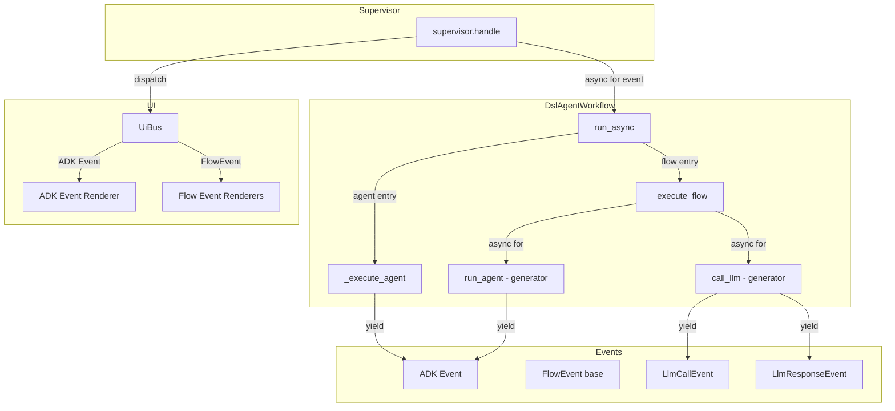

# Task Definition: Flow Event Yielding

## Feature Information
- **Feature ID**: 017-dsl
- **Task ID**: flow-event-yielding
- **Branch**: feature/017-streetrace-dsl-2

## Design Documents
- **Tech Debt Reference**: `docs/tasks/017-dsl/tech_debt.md` (Section: "Flow Execution Does Not Yield ADK Events")
- **Architecture Reference**: `docs/dev/dsl/architecture.md` (Section: "Flow Event Streaming")
- **Implementation Plan**: `docs/tasks/017-dsl/flow-event-yielding/todo.md`

## Summary

Implement event yielding for DSL flows so that all operations within a flow (agent runs, LLM
calls, etc.) produce events that stream to the supervisor and UI, enabling progress monitoring
and consistent user experience.

### Problem Statement

Currently, DSL flows consume events internally without streaming them to the supervisor:

1. **Agent execution in flows** (`workflow.py:285-339`): The `run_agent()` method iterates
   through ADK events but only captures the final response text. All intermediate events
   (function calls, tool responses, thinking) are discarded.

2. **Direct LLM calls** (`context.py:295-368`): The `call_llm()` method uses LiteLLM directly
   without producing any events at all. No visibility into LLM call progress.

3. **Multi-agent flows**: When multiple agents run sequentially within a flow, users have no
   visibility into which agent is active or its progress.

**Current Behavior**:
```python
# workflow.py:run_agent() - events are consumed but not yielded
async for event in runner.run_async(...):
    if event.is_final_response():
        final_response = event.content.parts[0].text
        break  # All other events discarded
return final_response
```

**Desired Behavior**:
```python
# Events yielded to supervisor for UI rendering
async for event in runner.run_async(...):
    yield event  # Forward to supervisor
    if event.is_final_response():
        final_response = event.content.parts[0].text
return final_response  # Also capture for flow logic
```

### Solution: Flow Event with Side-Channel Dispatch

Introduce a minimal event hierarchy for non-ADK operations while forwarding ADK events
directly. Events are yielded from `run_async()` and dispatched via UI Bus.

**Architecture**:



**Key Design Decisions**:

1. **Single base class with typed subclasses**: `FlowEvent` base class with `type` discriminator
   field enables easy serialization and single `isinstance` check in supervisor.

2. **ADK events pass through unchanged**: No wrapping of ADK events - they yield directly
   from `run_async()` and use existing `adk_event_renderer.py`.

3. **Custom events only for non-ADK operations**: `LlmCallEvent`, `LlmResponseEvent` for
   `call llm` statements. Minimal surface area.

4. **Generator pattern for flow methods**: Flow methods become async generators that yield
   events while also capturing final responses for flow logic.

## Event Class Design

```python
# src/streetrace/dsl/runtime/events.py

@dataclass
class FlowEvent:
    """Base class for all non-ADK flow events."""
    type: str  # Discriminator for serialization/dispatch

@dataclass
class LlmCallEvent(FlowEvent):
    """Direct LLM call initiated (call llm statement)."""
    prompt_name: str
    model: str
    prompt_text: str
    type: str = field(default="llm_call", init=False)

@dataclass
class LlmResponseEvent(FlowEvent):
    """Response from direct LLM call."""
    prompt_name: str
    content: str
    is_final: bool = True
    type: str = field(default="llm_response", init=False)
```

**Supervisor Integration**:
```python
# supervisor.py
async for event in workload.run_async(session, content):
    if isinstance(event, FlowEvent):
        # Our custom event
        self.ui_bus.dispatch_ui_update(event)
        if isinstance(event, LlmResponseEvent) and event.is_final:
            final_response_text = event.content
    else:
        # ADK Event - existing handling
        self.ui_bus.dispatch_ui_update(Event(event=event))
        if event.is_final_response():
            final_response_text = event.content.parts[0].text
```

## Success Criteria

- [ ] `FlowEvent` base class and subclasses defined in `dsl/runtime/events.py`
- [ ] Renderers registered for `LlmCallEvent` and `LlmResponseEvent`
- [ ] `DslAgentWorkflow._execute_flow()` yields events
- [ ] `DslAgentWorkflow.run_agent()` becomes generator yielding ADK events
- [ ] `WorkflowContext.call_llm()` yields `LlmCallEvent` and `LlmResponseEvent`
- [ ] `Supervisor.handle()` handles both ADK and Flow events
- [ ] Generated flow methods support async generator pattern
- [ ] All existing tests pass
- [ ] New unit tests for event yielding
- [ ] Integration test for multi-agent flow with event visibility

## Code Pointers

### Files to Create
- `src/streetrace/dsl/runtime/events.py` - FlowEvent classes

### Files to Modify

| File | Change |
|------|--------|
| `src/streetrace/dsl/runtime/workflow.py` | `_execute_flow()` and `run_agent()` become generators |
| `src/streetrace/dsl/runtime/context.py` | `call_llm()` yields events |
| `src/streetrace/workflow/supervisor.py` | Handle FlowEvent type in event loop |
| `src/streetrace/workloads/protocol.py` | Update return type annotation |
| `src/streetrace/ui/flow_event_renderer.py` | New file for FlowEvent renderers |
| `src/streetrace/dsl/codegen/visitors/flows.py` | Generate async generator flow methods |

### Reference Implementation Points

| Concept | File | Line |
|---------|------|------|
| Current event consumption | `workflow.py` | 285-339 |
| Current call_llm | `context.py` | 295-368 |
| Supervisor event loop | `supervisor.py` | 115-116 |
| ADK Event wrapper | `adk_event_renderer.py` | 129-138 |
| Renderer registration | `render_protocol.py` | 23-37 |
| UI event dispatch | `ui_bus.py` | 66-73 |

## Dependencies

### Existing Code (to be modified)
- `src/streetrace/workflow/supervisor.py` - Add FlowEvent handling
- `src/streetrace/dsl/runtime/workflow.py` - Generator pattern for flow execution
- `src/streetrace/dsl/runtime/context.py` - Event yielding for call_llm
- `src/streetrace/workloads/protocol.py` - Type annotation update
- `src/streetrace/dsl/codegen/visitors/flows.py` - Code generation changes

### Existing Code (unchanged)
- `src/streetrace/ui/adk_event_renderer.py` - ADK events continue to use this
- `src/streetrace/ui/ui_bus.py` - No changes needed, dispatch_ui_update is polymorphic
- `src/streetrace/ui/render_protocol.py` - No changes, just register new renderers

### New Files
- `src/streetrace/dsl/runtime/events.py` - FlowEvent hierarchy
- `src/streetrace/ui/flow_event_renderer.py` - Renderers for FlowEvent types

## Risk Assessment

| Risk | Impact | Mitigation |
|------|--------|------------|
| Breaking flow return values | High | Generator captures final response internally |
| Breaking code generation | Medium | Phased approach, thorough testing |
| Performance overhead | Low | Events are already being generated, just not yielded |
| Type annotation complexity | Low | Union type `Event \| FlowEvent` is straightforward |

## Technical Challenges

### Challenge 1: Generator Return Value

Flow methods need to both yield events AND return a final value for `ctx.vars` assignment.
Python async generators cannot use `return value` directly.

**Solution**: Use a sentinel event or context variable:
```python
async def run_agent(self, agent_name: str, *args: object) -> AsyncGenerator[Event, None]:
    final_response = None
    async for event in runner.run_async(...):
        yield event
        if event.is_final_response():
            final_response = event.content.parts[0].text
    # Store in context for flow to retrieve
    self._last_agent_result = final_response
```

### Challenge 2: Code Generation for Async Generators

Currently generated flow code:
```python
async def flow_main(self, ctx: WorkflowContext) -> Any:
    ctx.vars['result'] = await ctx.run_agent('analyzer', ctx.vars['input'])
```

Needs to become:
```python
async def flow_main(self, ctx: WorkflowContext) -> AsyncGenerator[Event | FlowEvent, None]:
    async for event in ctx.run_agent('analyzer', ctx.vars['input']):
        yield event
    ctx.vars['result'] = ctx.get_last_result()
```

**Solution**: Update `flows.py` visitor to generate async generator pattern.

### Challenge 3: Nested Flow Calls

When flows call other flows (`run flow X`), events should propagate up the call chain.

**Solution**: Same generator pattern - inner flow yields events, outer flow re-yields them.

## Out of Scope

- **SequentialAgent optimization**: Using ADK's SequentialAgent for consecutive agent runs
  (tracked separately in tech_debt.md)
- **Event persistence**: Storing events for replay/debugging
- **Custom event types**: Additional event types beyond LLM call/response
- **Event filtering**: Allowing flows to filter which events are yielded
