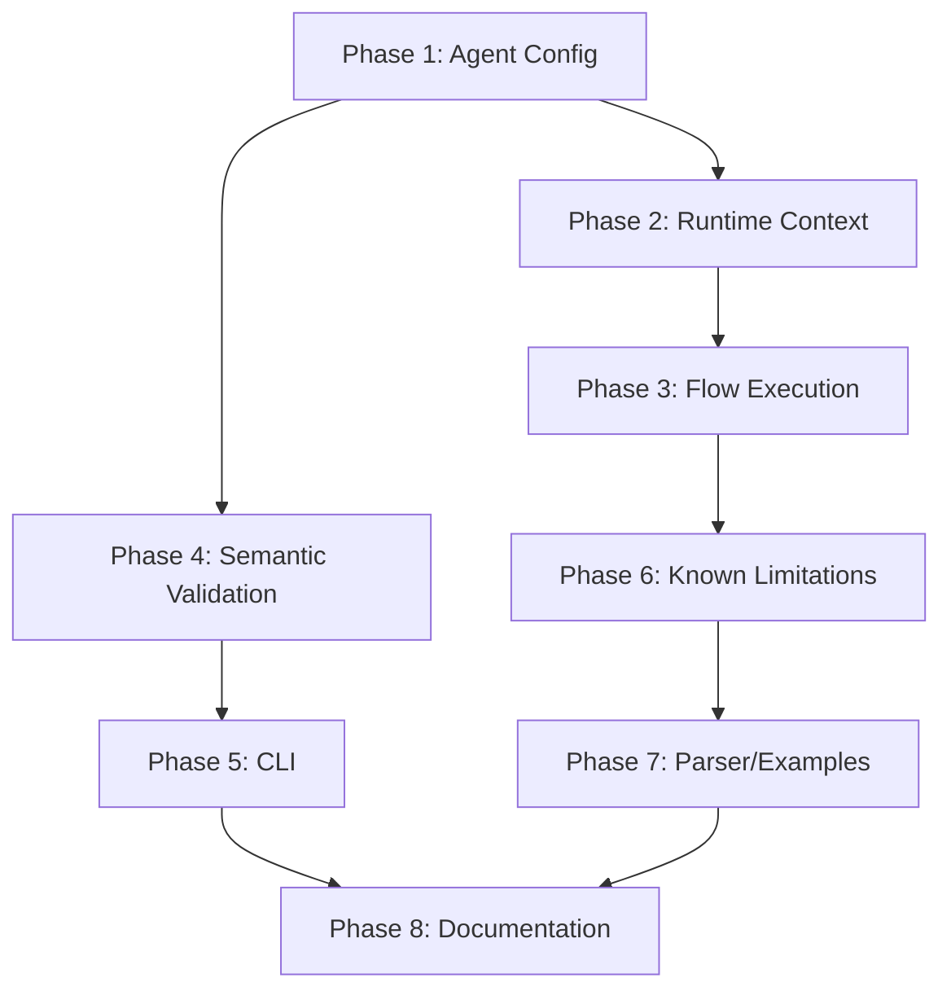

# Implementation Plan: DSL Compiler Runtime Integration

This document tracks the implementation progress for completing the DSL compiler runtime integration.

## Phase 1: Agent Configuration Loading (Critical Path)

**Goal**: DSL agents load with exactly the configuration defined in the DSL file.

### 1.1 Fix Tool Loading from DSL

- [ ] Create unit tests for tool loading (`tests/dsl/test_agent_loader_tools.py`)
  - [ ] `test_builtin_tool_loading_from_dsl()`
  - [ ] `test_mcp_tool_loading_from_dsl()`
  - [ ] `test_multiple_tools_loading_from_dsl()`
  - [ ] `test_tool_loading_matches_yaml_equivalent()`
- [ ] Parse `_tools` dict and create `ToolRef` objects
- [ ] Integrate with `ToolProvider` to resolve tool specs
- [ ] Map DSL tool definitions to ADK tool format
- [ ] Pass tools to `LlmAgent` constructor
- [ ] Run tests and ensure they pass
- [ ] Remove placeholder comment at `dsl_agent_loader.py:395`

### 1.2 Fix Instruction Resolution

- [ ] Create unit tests for instruction loading (`tests/dsl/test_agent_loader_instruction.py`)
  - [ ] `test_instruction_loaded_from_dsl_agent_definition()`
  - [ ] `test_instruction_not_guessed_by_keyword()`
  - [ ] `test_missing_instruction_raises_error()`
  - [ ] `test_named_instruction_loaded_correctly()`
- [ ] Read `agent.instruction` directly from `_agents` dict
- [ ] Look up the instruction name in `_prompts` dict
- [ ] Remove keyword-matching fallback logic (lines 376-393)
- [ ] Evaluate prompt lambda with context to get final string
- [ ] Run tests and ensure they pass

### 1.3 Fix Model Resolution

- [ ] Create unit tests for model resolution (`tests/dsl/test_agent_loader_model.py`)
  - [ ] `test_model_from_prompt_using_clause()`
  - [ ] `test_model_fallback_to_main()`
  - [ ] `test_cli_model_overrides_dsl()`
  - [ ] `test_no_first_model_guessing()`
- [ ] Store `prompt.model` in codegen for each prompt
- [ ] Look up agent's instruction prompt, get its model
- [ ] Use that model for the agent
- [ ] Add CLI override parameter passthrough
- [ ] Run tests and ensure they pass

### 1.4 Align generic.sr with generic.yml

- [ ] Read `agents/generic.yml` to identify all tools
- [ ] Update `agents/generic.sr` to include all tools from generic.yml
- [ ] Ensure tool syntax matches DSL grammar for MCP servers
- [ ] Verify with `streetrace check agents/generic.sr`

### Phase 1 Validation

- [ ] Run: `poetry run streetrace --agent agents/generic.sr --prompt="describe this repo"`
- [ ] Verify: All tools (fs, github mcp, context7 mcp) are loaded
- [ ] Verify: Tools actually execute and return results
- [ ] Analyze test coverage and add missing tests

---

## Phase 2: Runtime Context Implementation

**Goal**: Implement all placeholder methods in WorkflowContext to enable actual execution.

### 2.1 Implement WorkflowContext.run_agent()

- [ ] Create unit tests (`tests/dsl/test_context_run_agent.py`)
  - [ ] `test_run_agent_creates_adk_agent()`
  - [ ] `test_run_agent_passes_args_as_prompt()`
  - [ ] `test_run_agent_returns_final_response()`
  - [ ] `test_run_agent_uses_correct_model()`
- [ ] Look up agent config from `self._agents[agent_name]`
- [ ] Get instruction from `self._prompts`
- [ ] Get model from prompt's model reference or `_models['main']`
- [ ] Create LlmAgent with proper configuration
- [ ] Execute via ADK Runner and return result
- [ ] Run tests and ensure they pass
- [ ] Remove placeholder comment at `context.py:118`

### 2.2 Implement WorkflowContext.call_llm()

- [ ] Create unit tests (`tests/dsl/test_context_call_llm.py`)
  - [ ] `test_call_llm_uses_named_prompt()`
  - [ ] `test_call_llm_interpolates_args()`
  - [ ] `test_call_llm_respects_model_override()`
  - [ ] `test_call_llm_returns_response()`
- [ ] Look up prompt from `self._prompts[prompt_name]`
- [ ] Evaluate lambda with context to get prompt string
- [ ] Resolve model from parameter or prompt's model reference
- [ ] Make LLM call via LiteLLM client
- [ ] Return response content
- [ ] Run tests and ensure they pass
- [ ] Remove placeholder comment at `context.py:145`

### 2.3 Implement Guardrail Methods

- [ ] Create unit tests (`tests/dsl/test_guardrails.py`)
  - [ ] `test_mask_pii_replaces_sensitive_data()`
  - [ ] `test_check_jailbreak_detects_attempts()`
  - [ ] `test_guardrail_integration_with_handler()`
- [ ] Implement basic PII masking regex patterns
- [ ] Implement jailbreak detection (pattern-based for now)
- [ ] Run tests and ensure they pass
- [ ] Remove placeholder comments at `context.py:29` and `context.py:45`

### 2.4 Implement Other Context Methods

- [ ] Create unit tests (`tests/dsl/test_context_methods.py`)
  - [ ] `test_detect_drift_compares_trajectory()`
  - [ ] `test_process_applies_pipeline()`
  - [ ] `test_escalate_to_human_triggers_callback()`
- [ ] Implement `process()` - apply transformation pipeline
- [ ] Implement `escalate_to_human()` - integrate with UI/callback system
- [ ] Run tests and ensure they pass
- [ ] Remove placeholder comments at `context.py:168`, `context.py:182`, `context.py:220`

### Phase 2 Validation

- [ ] Run all context tests: `poetry run pytest tests/dsl/test_context*.py -v`
- [ ] Verify all placeholder comments are removed from `context.py`
- [ ] Analyze test coverage and add missing tests

---

## Phase 3: Flow Execution with ADK Integration

**Goal**: Flows generate async generators that use ADK agents for execution.

### 3.1 Refactor DslAgentWorkflow for Flow-Based Execution

- [ ] Create unit tests (`tests/dsl/test_flow_execution.py`)
  - [ ] `test_simple_flow_runs_agent()`
  - [ ] `test_sequential_flow_uses_adk_sequential_agent()`
  - [ ] `test_flow_with_data_transformation()`
  - [ ] `test_flow_variable_passing()`
  - [ ] `test_flow_yields_events()`
- [ ] Add `create_agent(agent_name: str) -> LlmAgent` method to DslAgentWorkflow
- [ ] Add `run_root_adk_agent(agent, prompt) -> AsyncGenerator` method
- [ ] Modify flow code generation to use these methods
- [ ] Run tests and ensure they pass

### 3.2 Fix ExpressionVisitor Token Handling

- [ ] Create unit tests (`tests/dsl/test_expression_visitor.py`)
  - [ ] `test_all_flow_expressions_handled()`
  - [ ] `test_no_token_warnings_on_dump_python()`
  - [ ] `test_token_produces_clear_error_message()`
- [ ] Investigate which expressions produce raw Tokens
- [ ] Add `Token` handling to `ExpressionVisitor._dispatch`
- [ ] Change warning to error with clear message
- [ ] Run tests and ensure they pass

### 3.3 Update FlowVisitor Code Generation

- [ ] Change `run agent` to generate async for loop with yield
- [ ] Handle variable capture from final response
- [ ] Detect sequential agent patterns and optimize to SequentialAgent
- [ ] Generate proper async generator signature
- [ ] Fix `_visit_failure_block` to properly wrap code in try/except
- [ ] Remove placeholder comment at `flows.py:361`

### 3.4 Integrate Flows with Main Entry Point

- [ ] Ensure `create_agent` returns agent that executes the default/specified flow
- [ ] Wire up flow execution to ADK Runner lifecycle
- [ ] Ensure `--prompt` argument is passed to flow as initial input

### Phase 3 Validation

- [ ] Run: `poetry run streetrace --agent agents/examples/dsl/flow.sr --prompt="describe this repo"`
- [ ] Verify: Flow executes with ADK integration
- [ ] Verify: Events are yielded from agents
- [ ] Analyze test coverage and add missing tests

---

## Phase 4: Semantic Validation Improvements

### 4.1 Add E0010 for Missing Required Properties

- [x] Create unit tests (`tests/dsl/test_semantic_required_properties.py`)
  - [x] `test_agent_without_instruction_triggers_e0010()`
  - [x] `test_agent_with_instruction_passes()`
  - [x] `test_unnamed_agent_without_instruction_triggers_e0010()`
- [x] In `_validate_agent_refs`, check if `agent.instruction` is None/empty
- [x] Add `SemanticError.missing_required_property` factory method
- [x] Emit E0010 error with helpful message
- [x] Run tests and ensure they pass

### 4.2 Add E0008 for Indentation Errors

- [x] Create unit tests (`tests/dsl/test_indentation_errors.py`)
  - [x] `test_inconsistent_indentation_triggers_e0008()`
  - [x] `test_proper_indentation_passes()`
  - [x] `test_wrong_dedent_level_triggers_e0008()`
- [x] Catch Lark indentation exceptions specifically (DedentError)
- [x] Map to E0008 with line/column information
- [x] Provide helpful suggestion
- [x] Run tests and ensure they pass

### Phase 4 Validation

- [x] Run all semantic tests: `poetry run pytest tests/dsl/test_semantic*.py -v`
- [x] Verify E0008 and E0010 work as expected
- [x] Analyze test coverage and add missing tests

---

## Phase 5: CLI Improvements

### 5.1 Fix --no-comments Flag

- [x] Create unit tests (`tests/dsl/test_cli_dump_python.py`)
  - [x] `test_no_comments_removes_source_comments()`
  - [x] `test_no_comments_preserves_code()`
  - [x] `test_no_comments_preserves_docstrings()`
- [x] Use regex pattern to match source comments: `# *.sr:<line_number>`
- [x] Filter only source comment lines (pattern: `^\s*# .*\.sr:\d+$`)
- [x] Run tests and ensure they pass

### Phase 5 Validation

- [x] Run: `streetrace dump-python agents/generic.sr --no-comments`
- [x] Verify: Only source comments are removed
- [x] Verify: Code and docstrings are preserved
- [x] Analyze test coverage and add missing tests

---

## Phase 6: Known Limitations Resolution

### 6.1 Comma-Separated Tool Lists

- [ ] Verify grammar handles `tools fs, cli, github` correctly
- [ ] Ensure semantic analyzer validates all tools in list
- [ ] Test multiple tools in single agent
- [ ] Update user docs if limitation is resolved

### 6.2 Flow Parameters and Variables

- [ ] Verify flow parameters are correctly bound in scope
- [ ] Generate parameter binding code at flow start
- [ ] Test variable passing between flow steps
- [ ] Update user docs if limitation is resolved

### 6.3 Compaction Policies

- [ ] Implement `strategy` property handling
- [ ] Implement `preserve` property handling with variable list
- [ ] Generate runtime configuration for compaction
- [ ] Update user docs if limitation is resolved

### Phase 6 Validation

- [ ] Test each resolved limitation manually
- [ ] Update `docs/user/dsl/getting-started.md` to remove resolved limitations
- [ ] Analyze test coverage and add missing tests

---

## Phase 7: Parser and Example Updates

### 7.1 Update Example Files

- [x] Update `agents/examples/dsl/match.sr` to demonstrate full pattern matching
- [x] Update `agents/examples/dsl/flow.sr` to pass `$input_prompt` to main_agent
- [x] Add comprehensive examples for each DSL feature
- [x] Remove "simplified for now" comment from `match.sr:2`
- [x] Fix `specific_model.sr` - renamed model from "agent" to "sonnet" (reserved keyword issue)
- [x] Update `parallel.sr` to demonstrate `parallel do` block
- [x] Remove "(simplified)" comments from handlers.sr, policies.sr, complete.sr, flow.sr

### 7.2 Verify All Examples Work

- [x] Run `streetrace check` on all example files
- [x] Run `streetrace dump-python` on all example files
- [x] Test execution of key examples (via unit tests)

### 7.3 Bug Fixes Made During Phase 7

- [x] Fixed `match_else` transformer in `transformer.py` - was returning "else" Token instead of flow_statement

### Phase 7 Validation

- [x] All files in `agents/examples/dsl/` pass validation
- [x] All files produce clean Python output with no warnings
- [x] Test coverage added in `tests/dsl/test_example_files.py`

---

## Phase 8: Documentation Updates

### 8.1 Remove Known Limitations from User Docs

- [ ] Update `docs/user/dsl/getting-started.md`
- [ ] Remove "Comma-Separated Tool Lists" limitation if resolved
- [ ] Remove "Flow Variables" limitation if resolved
- [ ] Remove "Compaction Policies" limitation if resolved
- [ ] Remove "Runtime Integration" limitation if resolved

### 8.2 Update Developer Documentation

- [ ] Create/update `docs/dev/dsl/` documentation
- [ ] Document architecture and API reference
- [ ] Document extension guide

### 8.3 Create Testing Documentation

- [ ] Create `docs/testing/dsl/` documentation
- [ ] Document feature scope and user journeys
- [ ] Document how to test features manually
- [ ] Document debugging and diagnostics

### Phase 8 Validation

- [ ] All documentation is accurate and up-to-date
- [ ] Examples in documentation work correctly
- [ ] No outdated information remains

---

## Execution Order

**Critical Path**: Phase 1 → Phase 2 → Phase 3 (unblocks E2E testing)

**Parallel Work**: Phase 4 and Phase 5 can proceed independently after Phase 1.

---

## Success Criteria Checklist

From code review expectations:

- [ ] **E1**: generic.sr tools match generic.yml (Phase 1.4)
- [ ] **E2**: Tools loaded when running generic.sr (Phase 1.1)
- [ ] **E3**: Tools execute and return results (Phase 1.1)
- [ ] **E4**: Model from prompt's `using model` used (Phase 1.3)
- [ ] **E5**: Agent loads exact DSL config, no guessing (Phase 1.2)
- [ ] **E6**: Model resolution follows spec (Phase 1.3)
- [ ] **E7**: All placeholder comments implemented (Phase 2 + 3 + 7)
  - [ ] `dsl_agent_loader.py:395` - Tool loading
  - [ ] `context.py` - All 7 placeholder methods
  - [ ] `flows.py:361` - Failure block code gen
  - [ ] `expressions.py:69` - Token handling warning → error or fix
  - [x] `match.sr:2` - Example file update (Phase 7 complete)
- [x] **E8**: --no-comments works correctly (Phase 5.1)
- [x] **E9**: Agents without instruction trigger E0010 (Phase 4.1)
- [x] **E10**: Indentation errors use E0008 (Phase 4.2)
- [ ] **E11**: Flows execute with ADK integration (Phase 3)
- [ ] **E12**: Known limitations resolved (Phase 6)
