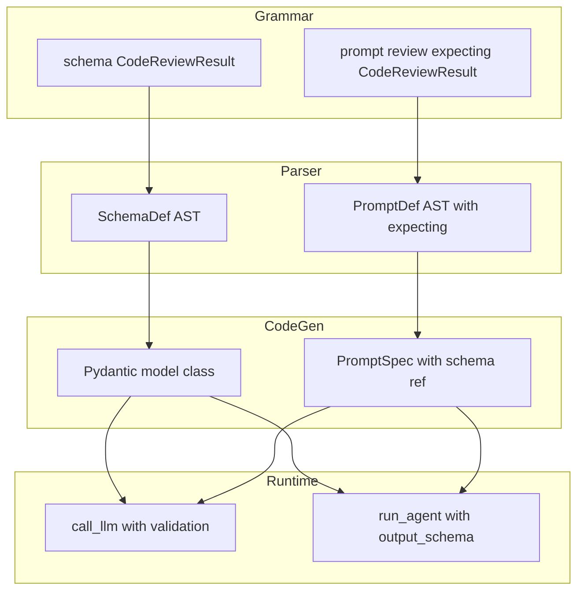

# Task Definition: Schema Support for Structured Outputs

## Feature Information
- **Feature ID**: 017-dsl
- **Task ID**: schema-support
- **Branch**: feature/017-streetrace-dsl-2

## Design Documents
- **Grammar Reference**: `src/streetrace/dsl/grammar/streetrace.lark` (Lines 74-93, 290-316)
- **AST Nodes**: `src/streetrace/dsl/ast/nodes.py` (Lines 344-402, 464-474)
- **Example DSL**: `agents/examples/dsl/schema.sr`

## Summary

Implement structured output support for the StreetRace DSL, enabling prompts to declare expected
response schemas that are validated at runtime. When a prompt has `expecting SchemaName`, the
system should ensure LLM responses conform to the schema structure.

### Problem Statement

The DSL grammar and parser already support schema definitions and the `expecting` modifier on
prompts, but the backend (code generation, runtime) does not use this information:

1. **Code generation ignores schemas**: Schemas are collected in `workflow.py:76,114` but never
   emitted to generated Python code.

2. **PromptSpec lacks schema field**: The `PromptSpec` dataclass (`workflow.py:49-64`) has `body`,
   `model`, and `escalation` but no schema reference.

3. **`call llm` ignores schema**: The `call_llm()` method (`context.py:471-566`) makes plain LLM
   calls without JSON format instructions or response validation.

4. **Agent creation ignores schema**: `DslAgentFactory.create_agent()` creates `LlmAgent` without
   passing `output_schema` parameter.

**Current Behavior** (schema silently ignored):
```python
# Generated code - no schema information
_prompts = {
    "review_code": PromptSpec(body=lambda ctx: "..."),  # No schema
}

# Runtime - plain text response
async def call_llm(self, prompt_name, ...):
    response = await litellm.acompletion(model, messages)
    return response.choices[0].message.content  # Unvalidated text
```

**Desired Behavior**:
```python
# Generated code - schema linked to prompt
_schemas = {
    "CodeReviewResult": CodeReviewResult,  # Pydantic model
}
_prompts = {
    "review_code": PromptSpec(body=lambda ctx: "...", schema="CodeReviewResult"),
}

# Runtime - structured output with validation
async def call_llm(self, prompt_name, ...):
    # 1. Enrich prompt with JSON format instructions
    # 2. Call LLM
    # 3. Parse JSON response (handle markdown code blocks)
    # 4. Validate with Pydantic
    # 5. Retry on failure, raise SchemaValidationError after exhaustion
```

### Solution: Pydantic-Based Schema Support

Use Pydantic's `create_model()` to dynamically generate model classes from DSL schemas at code
generation time. This provides:

1. **ADK compatibility**: ADK's `LlmAgent` accepts `output_schema: type[BaseModel]`
2. **JSON Schema for free**: `model.model_json_schema()` for prompt enrichment
3. **Built-in validation**: Pydantic validates responses automatically
4. **Future extensibility**: Can add constraints, descriptions, validators later

**Architecture**:



## POC Results: ADK output_schema Behavior

A proof-of-concept confirmed that ADK's `LlmAgent` with `output_schema` parameter:

1. **Auto-enriches prompts**: ADK adds JSON format instructions automatically
2. **Returns valid JSON**: Response is structured JSON matching the schema
3. **Uses Pydantic models**: Expects `type[pydantic.BaseModel]`

```python
# POC code
agent = LlmAgent(
    name="test",
    model="anthropic/claude-sonnet-4-5",
    instruction="Answer honestly.",
    output_schema=YesNoAnswer,  # Pydantic model
)

# Response: {"answer": true, "reason": "Yes, the sky appears blue..."}
```

**Implication**: For `run agent`, we pass the Pydantic model to ADK and let it handle everything.
For `call llm`, we handle prompt enrichment, parsing, and validation ourselves.

## Type Mapping

| DSL Type | Python Type | Pydantic Field |
|----------|-------------|----------------|
| `string` | `str` | `(str, ...)` |
| `int` | `int` | `(int, ...)` |
| `float` | `float` | `(float, ...)` |
| `bool` | `bool` | `(bool, ...)` |
| `list[T]` | `list[T]` | `(list[T], ...)` |
| `T?` | `T \| None` | `(T \| None, None)` |

## Success Criteria

- [ ] Schema-to-Pydantic converter in `dsl/runtime/schema_factory.py`
- [ ] `SchemaValidationError` in `dsl/runtime/errors.py`
- [ ] `PromptSpec.schema` field added
- [ ] Code generation emits `_schemas` dict with Pydantic models
- [ ] Code generation links prompts to schemas
- [ ] `call_llm()` enriches prompt, parses response, validates, retries
- [ ] `DslAgentFactory.create_agent()` passes `output_schema` to `LlmAgent`
- [ ] Response parsing handles markdown code blocks
- [ ] `SchemaValidationError` raised after retry exhaustion (triggers escalation)
- [ ] All existing tests pass
- [ ] New unit tests for schema conversion
- [ ] New unit tests for response parsing
- [ ] New unit tests for validation and retry
- [ ] Integration test with `agents/examples/dsl/schema.sr`

## Code Pointers

### Files to Create

| File | Purpose |
|------|---------|
| `src/streetrace/dsl/runtime/schema_factory.py` | DSL SchemaDef to Pydantic model converter |

### Files to Modify

| File | Change | Lines |
|------|--------|-------|
| `src/streetrace/dsl/runtime/errors.py` | Add `SchemaValidationError` | After line 41 |
| `src/streetrace/dsl/runtime/workflow.py` | Add `schema` field to `PromptSpec` | Lines 49-64 |
| `src/streetrace/dsl/runtime/context.py` | Schema handling in `call_llm()` | Lines 471-566 |
| `src/streetrace/dsl/codegen/visitors/workflow.py` | Emit schemas, link to prompts | Lines 76, 227-289 |
| `src/streetrace/workloads/dsl_agent_factory.py` | Pass `output_schema` to `LlmAgent` | Lines 301-366 |

### Reference Implementation Points

| Concept | File | Line |
|---------|------|------|
| Schema grammar | `grammar/streetrace.lark` | 74-93 |
| Schema AST nodes | `ast/nodes.py` | 344-402 |
| Schema transformer | `ast/transformer.py` | 540-630 |
| Prompt with expecting | `ast/nodes.py` | 464-474 |
| Prompt transformer | `ast/transformer.py` | 1410, 1480-1486 |
| PromptSpec class | `runtime/workflow.py` | 49-64 |
| call_llm implementation | `runtime/context.py` | 471-566 |
| Prompt codegen | `codegen/visitors/workflow.py` | 227-289 |
| Agent creation | `workloads/dsl_agent_factory.py` | 301-366 |
| Existing errors | `runtime/errors.py` | 1-41 |

### Example DSL with Schema

```
# agents/examples/dsl/schema.sr (existing)
model main = anthropic/claude-sonnet

schema CodeReviewResult:
    approved: bool
    severity: string
    issues: list[string]
    suggestions: list[string]
    confidence: float

prompt review_code expecting CodeReviewResult: """
You are an expert code reviewer...
"""

agent code_reviewer:
    instruction review_code
    description "Reviews code and provides structured feedback"
```

## Detailed Design

### 1. Schema Factory (`schema_factory.py`)

```python
from pydantic import BaseModel, create_model
from streetrace.dsl.ast.nodes import SchemaDef, TypeExpr

DSL_TYPE_MAP: dict[str, type] = {
    "string": str,
    "int": int,
    "float": float,
    "bool": bool,
}

def type_expr_to_python_type(type_expr: TypeExpr) -> type:
    """Convert DSL TypeExpr to Python type annotation."""
    base = DSL_TYPE_MAP.get(type_expr.base_type, str)

    if type_expr.is_list:
        result = list[base]
    else:
        result = base

    if type_expr.is_optional:
        result = result | None

    return result

def schema_to_pydantic(schema_def: SchemaDef) -> type[BaseModel]:
    """Convert DSL SchemaDef to a Pydantic model class."""
    field_definitions: dict[str, tuple[type, object]] = {}

    for field in schema_def.fields:
        python_type = type_expr_to_python_type(field.type_expr)

        if field.type_expr.is_optional:
            field_definitions[field.name] = (python_type, None)
        else:
            field_definitions[field.name] = (python_type, ...)

    return create_model(schema_def.name, **field_definitions)
```

### 2. SchemaValidationError

```python
# In errors.py
class SchemaValidationError(DslRuntimeError):
    """Raised when LLM response fails schema validation after retries.

    This error triggers escalation as the agent cannot reliably continue
    without a valid structured response.
    """

    def __init__(self, schema_name: str, errors: list[str], raw_response: str):
        self.schema_name = schema_name
        self.errors = errors
        self.raw_response = raw_response
        super().__init__(
            f"Schema validation failed for '{schema_name}': {'; '.join(errors)}"
        )
```

### 3. PromptSpec Extension

```python
# In workflow.py
@dataclass
class PromptSpec:
    """Prompt specification with optional schema and escalation."""

    body: Callable[[object], str]
    model: str | None = None
    schema: str | None = None  # NEW: Schema name reference
    escalation: EscalationSpec | None = None
```

### 4. Code Generation Changes

```python
# Generated code structure
from pydantic import create_model, BaseModel

# Schema definitions (Pydantic models)
CodeReviewResult = create_model(
    "CodeReviewResult",
    approved=(bool, ...),
    severity=(str, ...),
    issues=(list[str], ...),
    suggestions=(list[str], ...),
    confidence=(float, ...),
)

class SchemaWorkflow(DslAgentWorkflow):
    _schemas: dict[str, type[BaseModel]] = {
        "CodeReviewResult": CodeReviewResult,
    }

    _prompts = {
        "review_code": PromptSpec(
            body=lambda ctx: "...",
            schema="CodeReviewResult",  # NEW
        ),
    }
```

### 5. call_llm with Schema Validation

```python
# In context.py
MAX_SCHEMA_RETRIES = 3

async def call_llm(self, prompt_name: str, *args, model: str | None = None):
    prompt_spec = self._prompts.get(prompt_name)
    schema_model = self._get_schema_model(prompt_spec)

    # Build initial prompt
    prompt_text = self._evaluate_prompt(prompt_spec)

    # Enrich with JSON instructions if schema expected
    if schema_model:
        json_schema = schema_model.model_json_schema()
        prompt_text = self._enrich_prompt_with_schema(prompt_text, json_schema)

    messages = [{"role": "user", "content": prompt_text}]

    for attempt in range(MAX_SCHEMA_RETRIES):
        yield LlmCallEvent(prompt_name=prompt_name, ...)

        response = await litellm.acompletion(model=resolved_model, messages=messages)
        content = self._extract_content(response)

        yield LlmResponseEvent(prompt_name=prompt_name, content=content)

        if not schema_model:
            self._last_call_result = content
            return

        # Parse and validate
        try:
            parsed = self._parse_json_response(content)
            validated = schema_model.model_validate(parsed)
            self._last_call_result = validated.model_dump()
            return
        except (JSONParseError, ValidationError) as e:
            if attempt < MAX_SCHEMA_RETRIES - 1:
                messages.append({"role": "assistant", "content": content})
                messages.append({"role": "user", "content": f"Error: {e}. Please fix."})
            else:
                raise SchemaValidationError(
                    schema_name=schema_model.__name__,
                    errors=[str(e)],
                    raw_response=content,
                )
```

### 6. Response Parsing (Markdown Code Blocks)

```python
def _parse_json_response(self, content: str) -> dict:
    """Parse JSON from LLM response, handling markdown code blocks."""
    import json
    import re

    # Find markdown code blocks
    code_blocks = re.findall(r'```(?:json)?\s*([\s\S]*?)```', content)

    if len(code_blocks) == 0:
        # No code blocks - treat entire response as JSON
        return json.loads(content.strip())
    elif len(code_blocks) == 1:
        # Single code block - extract contents
        return json.loads(code_blocks[0].strip())
    else:
        # Multiple code blocks - ambiguous
        raise JSONParseError(
            "Response contains multiple code blocks. "
            "Please return a single JSON object."
        )
```

### 7. DslAgentFactory Changes

```python
# In dsl_agent_factory.py
async def create_agent(self, agent_name: str, ...):
    # ... existing code ...

    # NEW: Resolve output_schema from prompt's expecting clause
    output_schema = self._resolve_output_schema(agent_def)

    agent_kwargs = {
        "name": agent_name,
        "model": model,
        "instruction": instruction,
        "tools": tools,
        "description": description,
    }

    if output_schema:
        agent_kwargs["output_schema"] = output_schema

    if sub_agents:
        agent_kwargs["sub_agents"] = sub_agents

    return LlmAgent(**agent_kwargs)

def _resolve_output_schema(self, agent_def: dict) -> type[BaseModel] | None:
    """Resolve output_schema from agent's instruction prompt."""
    instruction_name = agent_def.get("instruction")
    if not instruction_name:
        return None

    prompt_spec = self._workflow_class._prompts.get(instruction_name)
    if not prompt_spec or not hasattr(prompt_spec, "schema"):
        return None

    schema_name = prompt_spec.schema
    if not schema_name:
        return None

    schemas = getattr(self._workflow_class, "_schemas", {})
    return schemas.get(schema_name)
```

## Risk Assessment

| Risk | Impact | Mitigation |
|------|--------|------------|
| Breaking existing DSL files | High | Schema is optional, no-schema prompts unchanged |
| Pydantic version compatibility | Medium | Use stable create_model API |
| LLM returns invalid JSON | Medium | Retry with error feedback, escalate after exhaustion |
| Code generation complexity | Low | Isolated to new _emit_schemas method |
| Performance overhead | Low | Pydantic validation is fast |

## Technical Challenges

### Challenge 1: Dynamic Pydantic Model at Import Time

Generated code creates Pydantic models using `create_model()` at module import time. This is safe
because:
- `create_model()` is a stable Pydantic API
- Models are created once per workflow class
- No caching needed (per user requirement)

### Challenge 2: Nested Schemas (Out of Scope)

The current design does NOT support nested schemas like:
```
schema Inner:
    value: int

schema Outer:
    inner: Inner  # NOT SUPPORTED
```

This would require schema dependency ordering in code generation. Keeping simple for now.

### Challenge 3: Type Annotation for list[T]

Python's `list[str]` syntax requires Python 3.9+. StreetRace already requires Python 3.12,
so this is not an issue.

## Out of Scope

- **Nested/recursive schemas**: Schemas referencing other schemas
- **Field constraints**: `@min`, `@max`, `@pattern` decorators
- **Field descriptions**: Documentation for better LLM understanding
- **Schema inheritance**: Extending from other schemas
- **Union types**: `string | int` field types
- **Enum types**: Constrained string values
- **Retry configuration**: Hard-coded 3 retries (per user requirement)

## Dependencies

### Existing Code (to be modified)
- `src/streetrace/dsl/runtime/errors.py` - Add SchemaValidationError
- `src/streetrace/dsl/runtime/workflow.py` - Extend PromptSpec
- `src/streetrace/dsl/runtime/context.py` - Schema handling in call_llm
- `src/streetrace/dsl/codegen/visitors/workflow.py` - Emit schemas
- `src/streetrace/workloads/dsl_agent_factory.py` - Pass output_schema

### New Files
- `src/streetrace/dsl/runtime/schema_factory.py` - DSL to Pydantic converter

### External Dependencies
- `pydantic` (already in project dependencies)
