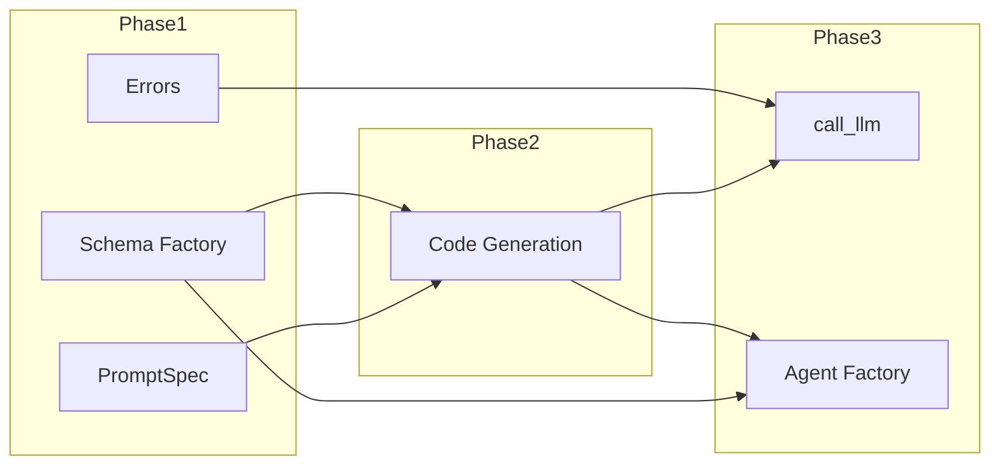

# Implementation Plan: Schema Support for Structured Outputs

## Overview

This plan implements schema support in three phases:
1. **Phase 1**: Core infrastructure (schema factory, errors, PromptSpec)
2. **Phase 2**: Code generation (emit schemas, link to prompts)
3. **Phase 3**: Runtime integration (call_llm validation, agent output_schema)

## Phase 1: Core Infrastructure

### 1.1 Create Schema Factory

**File**: `src/streetrace/dsl/runtime/schema_factory.py`

- [x] Create new file with module docstring
- [x] Define `DSL_TYPE_MAP` constant mapping DSL types to Python types
- [x] Implement `type_expr_to_python_type(type_expr: TypeExpr) -> type`
  - Handle base types: string, int, float, bool
  - Handle list types: `list[T]`
  - Handle optional types: `T | None`
- [x] Implement `schema_to_pydantic(schema_def: SchemaDef) -> type[BaseModel]`
  - Iterate over schema fields
  - Build field definitions dict
  - Use `pydantic.create_model()` to create model class
- [x] Add unit tests in `tests/unit/dsl/runtime/test_schema_factory.py`
  - Test simple types (string, int, float, bool)
  - Test list types
  - Test optional types
  - Test combined (optional list)

### 1.2 Add SchemaValidationError

**File**: `src/streetrace/dsl/runtime/errors.py`

- [x] Add `SchemaValidationError` class after `AbortError`
  - Inherit from `DslRuntimeError`
  - Properties: `schema_name`, `errors`, `raw_response`
  - Meaningful error message in `__init__`
- [x] Add `JSONParseError` class for response parsing failures
  - Inherit from `DslRuntimeError`
  - Properties: `raw_response`, `parse_error`

### 1.3 Extend PromptSpec

**File**: `src/streetrace/dsl/runtime/workflow.py`

- [x] Add `schema: str | None = None` field to `PromptSpec` dataclass (line ~64)
- [x] Update docstring to document new field
- [x] Add `_schemas: ClassVar[dict[str, type[BaseModel]]] = {}` to `DslAgentWorkflow`

## Phase 2: Code Generation

### 2.1 Emit Schema Definitions

**File**: `src/streetrace/dsl/codegen/visitors/workflow.py`

- [x] Add `pydantic` imports to `_emit_imports()` (conditionally when schemas present)
  - `from pydantic import BaseModel, create_model`
- [x] Create `_emit_schemas()` method
  - Skip if no schemas defined (emit `_schemas: dict[str, type] = {}`)
  - For each schema, emit `create_model()` call as class-level variable
  - Emit `_schemas` class attribute mapping names to models
- [x] Add `_type_expr_to_string()` helper to convert TypeExpr to Python type string
- [x] Call `_emit_schemas()` from `_emit_class_definition()` (before `_emit_prompts()`)

### 2.2 Link Prompts to Schemas

**File**: `src/streetrace/dsl/codegen/visitors/workflow.py`

- [x] Modify `_emit_prompts()` to include schema reference
  - Check if `prompt.expecting` is set
  - Include `schema='{prompt.expecting}'` in PromptSpec constructor
  - Use multiline format when schema or escalation is present

### 2.3 Update Generated Code Tests

- [x] Add new test file `tests/unit/dsl/codegen/test_schema_codegen.py`
  - Test simple schema generates create_model call
  - Test all basic types (string, int, float, bool)
  - Test list types
  - Test optional types
  - Test optional list types
  - Test _schemas class attribute generated
  - Test multiple schemas in dict
  - Test empty schemas dict when no schemas
  - Test prompt-schema linking
  - Test prompt without expecting has no schema
  - Test Pydantic imports present when schemas defined
  - Test no Pydantic imports when no schemas
  - Test generated code compiles
  - Test schema.sr example patterns

### 2.4 DSL Loader Fix

**File**: `src/streetrace/workloads/dsl_loader.py`

- [x] Add `__name__` to namespace before exec to enable Pydantic create_model()

## Phase 3: Runtime Integration

### 3.1 Response Parsing Utility

**File**: `src/streetrace/dsl/runtime/context.py`

- [x] Add `_parse_json_response(content: str) -> dict` method
  - Detect markdown code blocks with regex
  - Handle zero blocks: parse entire content as JSON
  - Handle one block: extract and parse block contents
  - Handle multiple blocks: raise `JSONParseError`
- [x] Add unit tests for response parsing
  - Plain JSON response
  - JSON in ```json code block
  - JSON in ``` code block (no language)
  - Multiple code blocks (error case)
  - Invalid JSON (error case)

### 3.2 Schema Validation in call_llm

**File**: `src/streetrace/dsl/runtime/context.py`

- [x] Add constant `MAX_SCHEMA_RETRIES = 3`
- [x] Add method `_get_schema_model(prompt_spec) -> type[BaseModel] | None`
  - Look up schema name from PromptSpec
  - Look up model from `_schemas` dict
- [x] Add method `_enrich_prompt_with_schema(prompt_text, json_schema) -> str`
  - Append JSON format instructions to prompt
  - Include schema definition
- [x] Modify `call_llm()` to support schema validation
  - Get schema model if prompt has expecting
  - Enrich prompt with JSON instructions
  - Implement retry loop with max attempts
  - Parse response using `_parse_json_response`
  - Validate using `schema_model.model_validate()`
  - On validation failure: add error to messages, retry
  - After exhaustion: raise `SchemaValidationError`
- [x] Add unit tests for call_llm with schema
  - Successful validation
  - Retry on parse error
  - Retry on validation error
  - SchemaValidationError after exhaustion

### 3.3 Agent output_schema Integration

**File**: `src/streetrace/workloads/dsl_agent_factory.py`

- [x] Add method `_resolve_output_schema(agent_def) -> type[BaseModel] | None`
  - Get instruction name from agent_def
  - Look up PromptSpec from workflow prompts
  - Get schema name from PromptSpec
  - Look up Pydantic model from workflow schemas
- [x] Modify `create_agent()` to pass `output_schema`
  - Call `_resolve_output_schema()`
  - Add to `agent_kwargs` if not None
- [x] Modify `create_root_agent()` similarly
- [x] Add unit tests for agent creation with schema
  - Agent with schema-expecting prompt
  - Agent without schema (unchanged behavior)

### 3.4 WorkflowContext Schema Access

**File**: `src/streetrace/dsl/runtime/context.py`

- [x] Add `_schemas: dict[str, type[BaseModel]] = {}` to WorkflowContext
- [x] Add `set_schemas()` method
- [x] Update `create_context()` in `workflow.py` to call `set_schemas()`

## Testing

### Unit Tests

- [x] `tests/unit/dsl/runtime/test_schema_factory.py`
  - Type expression conversion
  - Schema to Pydantic model conversion
  - All DSL types (string, int, float, bool, list, optional)

- [x] `tests/unit/dsl/runtime/test_context_schema.py`
  - Response parsing (JSON, code blocks)
  - Schema validation in call_llm
  - Retry behavior
  - SchemaValidationError

- [x] `tests/unit/dsl/codegen/test_schema_codegen.py`
  - Schema emission
  - Prompt-schema linking
  - Generated code validity

- [x] `tests/unit/workloads/test_dsl_agent_factory_schema.py`
  - output_schema resolution
  - LlmAgent creation with schema

### Integration Tests

- [ ] `tests/integration/dsl/test_schema_integration.py`
  - End-to-end test with `schema.sr` example
  - Verify structured output from agent
  - Verify structured output from call llm

## File Summary

### New Files
| File | Purpose |
|------|---------|
| `src/streetrace/dsl/runtime/schema_factory.py` | DSL to Pydantic converter |
| `tests/unit/dsl/runtime/test_schema_factory.py` | Schema factory tests |
| `tests/unit/dsl/runtime/test_context_schema.py` | Context schema tests |
| `tests/unit/dsl/codegen/test_schema_codegen.py` | Codegen schema tests |
| `tests/integration/dsl/test_schema_integration.py` | Integration tests |

### Modified Files
| File | Changes |
|------|---------|
| `src/streetrace/dsl/runtime/errors.py` | Add SchemaValidationError, JSONParseError |
| `src/streetrace/dsl/runtime/workflow.py` | Add schema to PromptSpec, _schemas to workflow |
| `src/streetrace/dsl/runtime/context.py` | Schema validation in call_llm |
| `src/streetrace/dsl/codegen/visitors/workflow.py` | Emit schemas, link to prompts |
| `src/streetrace/workloads/dsl_agent_factory.py` | Pass output_schema to LlmAgent |

## Verification Checklist

After implementation:

- [x] `make check` passes (lint, type check, tests)
- [x] Existing DSL tests pass (no regression)
- [x] `agents/examples/dsl/schema.sr` compiles without errors
- [x] Generated code from schema.sr includes Pydantic models
- [x] Generated code from schema.sr links prompts to schemas
- [ ] Manual test: agent returns structured JSON
- [ ] Manual test: call llm returns validated dict
- [ ] Manual test: invalid response triggers retry
- [ ] Manual test: SchemaValidationError raised after retries

## Estimated Complexity

| Phase | Complexity | Notes |
|-------|------------|-------|
| Phase 1 | Low | New file, small additions |
| Phase 2 | Medium | Code generation changes |
| Phase 3 | Medium-High | call_llm changes, retry logic |

## Dependencies Between Tasks


