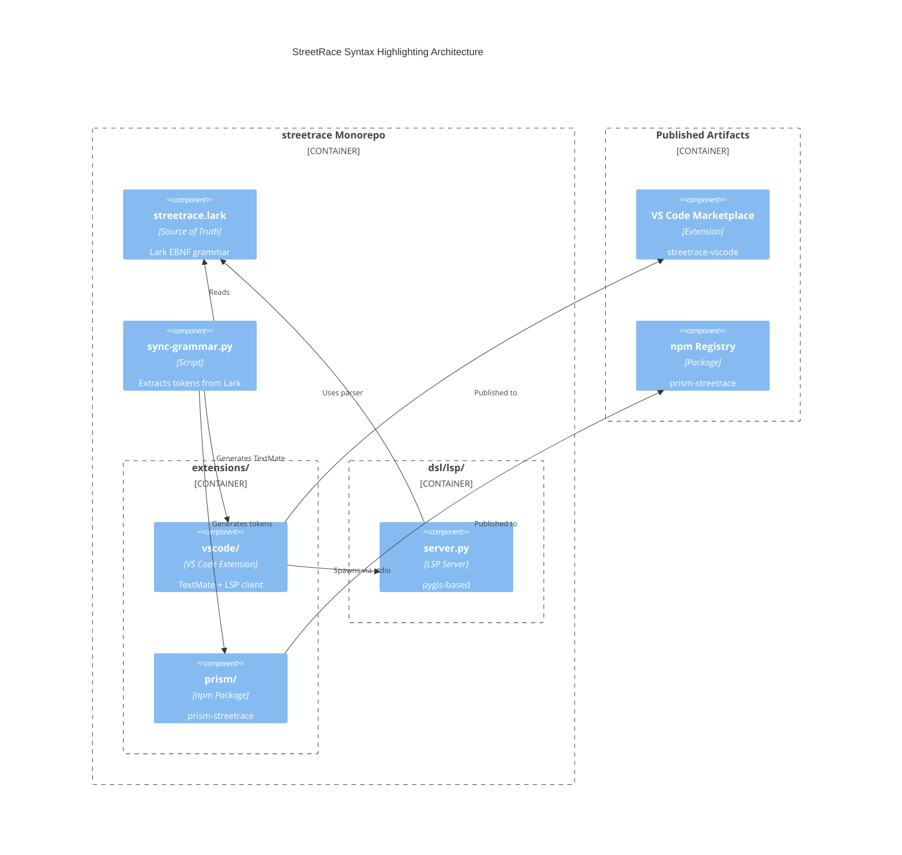

# DSL Syntax Highlighting Infrastructure

## Overview

Create a syntax highlighting infrastructure for StreetRace DSL (`.sr` files) that serves two platforms:
1. **VS Code Extension** with LSP support for real-time editing
2. **Web Portal** using PrismJS for display

The Lark grammar (`streetrace.lark`) is the single source of truth. All token definitions must derive from it.

## Goals

1. Enable syntax highlighting for `.sr` files in VS Code
2. Provide diagnostic feedback (errors/warnings) in VS Code Problems tab via LSP
3. Enable syntax highlighting in the web portal (Shift)
4. Establish monorepo structure for centralized grammar management
5. Create CI pipeline for publishing VS Code extension and npm package

## Non-Goals (Future Work)

- CodeLens for "Run Agent" hints (Phase 2)
- Debug Adapter Protocol integration (Phase 2)
- Auto-completion beyond keyword completion (Phase 2)
- Semantic highlighting (Phase 2)

## Architecture



## Source of Truth: Lark Grammar

The grammar at `src/streetrace/dsl/grammar/streetrace.lark` defines:

| Rule | Token Category | Examples |
|------|----------------|----------|
| `contextual_keyword` | Keywords | `agent`, `flow`, `prompt`, `if`, `for` (94 total) |
| `simple_type` | Types | `string`, `int`, `float`, `bool` |
| `VERSION` | Special tokens | `v1`, `v1.2` |
| `NAME` | Identifiers | `my_agent`, `process_data` |
| `DOTTED_NAME` | Qualified names | `lib.convert`, `$result.data` |
| `STRING` | Strings | `"hello"`, `'world'` |
| `TRIPLE_QUOTED_STRING` | Multi-line strings | `"""..."""`, `'''...'''` |
| `INTERPOLATED_STRING` | Interpolation | `"${env:API_KEY}"` |
| `PROVIDER_MODEL` | Model refs | `anthropic/claude-sonnet` |
| `SH_COMMENT` | Comments | `# comment` |
| `comparison_op` | Operators | `==`, `!=`, `>=`, `<=`, `~`, `contains` |

## Token Extraction Strategy

Since no automated Lark-to-TextMate converter exists, use regex extraction:

```python
# scripts/sync-grammar.py
def extract_keywords(grammar: str) -> list[str]:
    """Extract keywords from contextual_keyword rule."""
    match = re.search(
        r'contextual_keyword:(.+?)(?=\n\n|\ncontextual_name)',
        grammar,
        re.DOTALL
    )
    return re.findall(r'"([^"]+)"', match.group(1)) if match else []
```

This approach is robust because:
- Lark grammar syntax is predictable (EBNF)
- The `contextual_keyword` rule explicitly lists all keywords
- CI verifies generated files match grammar

## Component Details

### 1. VS Code Extension (`extensions/vscode/`)

**Structure:**
```
extensions/vscode/
├── package.json              # Extension manifest
├── tsconfig.json
├── src/
│   ├── extension.ts          # Extension activation
│   └── client.ts             # LSP client setup
├── syntaxes/
│   └── streetrace.tmLanguage.json  # Generated TextMate grammar
├── language-configuration.json     # Brackets, comments
└── README.md
```

**TextMate Grammar Scopes:**
| Token | TextMate Scope |
|-------|----------------|
| Keywords | `keyword.control.streetrace` |
| Storage | `storage.type.streetrace` (agent, flow, schema) |
| Types | `support.type.streetrace` |
| Variables | `variable.other.streetrace` |
| Strings | `string.quoted.double.streetrace` |
| Comments | `comment.line.number-sign.streetrace` |
| Operators | `keyword.operator.streetrace` |
| Provider/Model | `entity.name.tag.streetrace` |

**LSP Capabilities (Phase 1):**
- `textDocument/publishDiagnostics` - Syntax and semantic errors
- `textDocument/completion` - Keyword completion

### 2. LSP Server (`src/streetrace/dsl/lsp/`)

**Structure:**
```
src/streetrace/dsl/lsp/
├── __init__.py
├── server.py         # pygls LanguageServer
├── diagnostics.py    # Error-to-Diagnostic conversion
└── capabilities.py   # Feature configuration
```

**Integration with Existing Code:**

The LSP server reuses existing compiler infrastructure:

```python
# server.py (sketch)
from pygls.server import LanguageServer
from streetrace.dsl.grammar.parser import ParserFactory
from streetrace.dsl.ast import transform
from streetrace.dsl.semantic.analyzer import SemanticAnalyzer
from streetrace.dsl.semantic.errors import SemanticError

class StreetraceLanguageServer(LanguageServer):
    def __init__(self):
        super().__init__("streetrace-lsp", "v0.1.0")
        self.parser = ParserFactory.create()
        self.analyzer = SemanticAnalyzer()

    def validate_document(self, uri: str, text: str) -> list[Diagnostic]:
        try:
            tree = self.parser.parse(text)
            ast = transform(tree)
            result = self.analyzer.analyze(ast)
            return [self._to_diagnostic(e) for e in result.errors]
        except Exception as e:
            return [self._parse_error_to_diagnostic(e)]

    def _to_diagnostic(self, error: SemanticError) -> Diagnostic:
        # Convert SemanticError to LSP Diagnostic
        severity = DiagnosticSeverity.Warning if error.is_warning else DiagnosticSeverity.Error
        return Diagnostic(
            range=self._position_to_range(error.position),
            message=error.message,
            severity=severity,
            code=error.code.name,
            source="streetrace",
        )
```

### 3. Prism Package (`extensions/prism/`)

**Structure:**
```
extensions/prism/
├── package.json
├── tsconfig.json
├── src/
│   └── streetrace.ts    # Prism language definition
├── dist/                # Built output
└── README.md
```

**Portal Integration:**

Minimal change to existing `yaml-editor.tsx`:

```typescript
// Before
import "prismjs/components/prism-yaml"
Prism.highlight(value, Prism.languages.yaml, "yaml")

// After
import "prism-streetrace"
Prism.highlight(value, Prism.languages.streetrace, "streetrace")
```

## File Structure (Monorepo)

```
streetrace/
├── src/streetrace/
│   └── dsl/
│       ├── grammar/
│       │   └── streetrace.lark      # Source of Truth
│       ├── lsp/                      # NEW: LSP server
│       │   ├── __init__.py
│       │   ├── server.py
│       │   └── diagnostics.py
│       └── ... (existing)
├── extensions/                        # NEW: Extension packages
│   ├── vscode/
│   │   ├── package.json
│   │   ├── src/
│   │   └── syntaxes/
│   └── prism/
│       ├── package.json
│       └── src/
├── scripts/
│   └── sync-grammar.py               # NEW: Token extraction
└── .github/workflows/
    ├── ci.yml                        # Existing + extension tests
    ├── release-vscode.yml            # NEW: Marketplace publish
    └── release-prism.yml             # NEW: npm publish
```

## CI/CD Pipeline

### On Pull Request

```yaml
jobs:
  python:
    - poetry install
    - make check

  grammar-sync:
    - python scripts/sync-grammar.py
    - git diff --exit-code extensions/  # Fail if generated files outdated

  vscode-extension:
    - cd extensions/vscode && npm ci && npm test

  prism-package:
    - cd extensions/prism && npm ci && npm test
```

### On Release Tag

```yaml
# Triggered by: git tag v1.2.3 && git push --tags

jobs:
  publish-pypi:
    - poetry publish

  publish-vscode:
    - cd extensions/vscode
    - npx vsce publish -p $VSCE_PAT

  publish-npm:
    - cd extensions/prism
    - npm publish
```

## Version Strategy

**Synchronized Versioning**: All artifacts share the same version from Git tags.

| Artifact | Registry | Version Source |
|----------|----------|----------------|
| `streetrace` | PyPI | `pyproject.toml` |
| `streetrace-vscode` | VS Code Marketplace | `extensions/vscode/package.json` |
| `prism-streetrace` | npm | `extensions/prism/package.json` |

A single tag `v1.2.3` triggers all three releases.

## Dependencies

### VS Code Extension

```json
{
  "devDependencies": {
    "vscode-languageclient": "^9.0.0",
    "@vscode/vsce": "^2.22.0",
    "typescript": "^5.0.0"
  }
}
```

### LSP Server (Python)

```toml
[tool.poetry.dependencies]
pygls = "^1.3.0"
```

### Prism Package

```json
{
  "peerDependencies": {
    "prismjs": "^1.29.0"
  }
}
```

## Risk Assessment

| Risk | Likelihood | Impact | Mitigation |
|------|------------|--------|------------|
| Grammar changes break extension | Medium | High | CI validation of generated files |
| pygls incompatibility | Low | Medium | Pin versions, test matrix |
| VS Code API changes | Low | Low | Use stable APIs, test on multiple versions |

## Success Criteria

1. ✅ `.sr` files in VS Code show syntax highlighting
2. ✅ Syntax errors appear in Problems tab
3. ✅ Semantic errors (undefined reference, etc.) appear in Problems tab
4. ✅ Portal displays highlighted DSL code
5. ✅ CI prevents grammar drift
6. ✅ Single command publishes all artifacts

## Code Pointers

### Existing Infrastructure to Reuse

| Component | Location | Purpose |
|-----------|----------|---------|
| Lark Grammar | `src/streetrace/dsl/grammar/streetrace.lark` | Token definitions |
| Parser | `src/streetrace/dsl/grammar/parser.py` | Parse `.sr` files |
| Transformer | `src/streetrace/dsl/ast/transformer.py` | Build AST |
| Analyzer | `src/streetrace/dsl/semantic/analyzer.py` | Semantic validation |
| Errors | `src/streetrace/dsl/semantic/errors.py` | Error codes with positions |
| SourcePosition | `src/streetrace/dsl/ast/nodes.py:12` | Line/column tracking |

### Portal Integration Point

| Component | Location | Change Required |
|-----------|----------|-----------------|
| YamlEditor | `shift/apps/portal/src/components/agents/yaml-editor.tsx` | Import `prism-streetrace` |
| Prism themes | `shift/apps/portal/src/app/prism-themes.css` | No change needed |

## Related Documents

- [DSL Architecture](../../../dev/dsl/architecture.md)
- [Grammar Development Guide](../../../dev/dsl/grammar.md)
- [Semantic Errors](../../../dev/dsl/api-reference.md)
