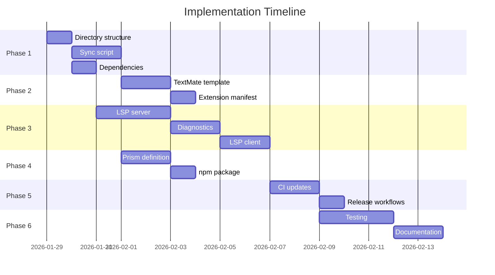

# DSL Syntax Highlighting - Implementation Plan

## Phase 1: Infrastructure Setup

### 1.1 Create Extension Directory Structure
- [ ] Create `extensions/vscode/` directory
- [ ] Create `extensions/prism/` directory
- [ ] Create `scripts/sync-grammar.py` scaffold

### 1.2 Grammar Token Extraction Script
- [ ] Implement `extract_keywords()` - parse `contextual_keyword` rule
- [ ] Implement `extract_types()` - parse `simple_type` rule
- [ ] Implement `extract_terminals()` - parse uppercase terminal definitions
- [ ] Generate `tokens.json` intermediate format
- [ ] Add CLI to run extraction: `poetry run python scripts/sync-grammar.py`

### 1.3 Add Python Dependencies
- [ ] Add `pygls>=1.3.0` to dev dependencies in `pyproject.toml`
- [ ] Run `poetry install`

---

## Phase 2: TextMate Grammar

### 2.1 Create TextMate Grammar Template
- [ ] Create `extensions/vscode/syntaxes/streetrace.tmLanguage.json` template
- [ ] Define scope mappings:
  - `keyword.control.streetrace` - control flow keywords
  - `storage.type.streetrace` - agent, flow, schema, tool, prompt
  - `support.type.streetrace` - string, int, float, bool
  - `variable.other.streetrace` - `$variable` patterns
  - `string.quoted.double.streetrace` - single/double quotes
  - `string.quoted.triple.streetrace` - triple quotes
  - `comment.line.number-sign.streetrace` - `#` comments
  - `keyword.operator.streetrace` - operators
  - `entity.name.tag.streetrace` - provider/model refs
  - `constant.numeric.streetrace` - numbers

### 2.2 Update Sync Script for TextMate Output
- [ ] Generate TextMate grammar from `tokens.json`
- [ ] Handle regex escaping for special characters
- [ ] Add indentation-aware patterns (block markers after `:`)

### 2.3 Create VS Code Extension Manifest
- [ ] Create `extensions/vscode/package.json` with:
  - Extension metadata (name, version, publisher)
  - Language contribution (`.sr` file association)
  - Grammar contribution (TextMate grammar)
  - Configuration contribution (LSP settings)
- [ ] Create `extensions/vscode/language-configuration.json`:
  - Comment markers (`#`)
  - Bracket pairs
  - Auto-closing pairs
  - Indentation rules

---

## Phase 3: LSP Server

### 3.1 Create LSP Server Module
- [ ] Create `src/streetrace/dsl/lsp/__init__.py`
- [ ] Create `src/streetrace/dsl/lsp/server.py`:
  - `StreetraceLanguageServer` class extending `pygls.LanguageServer`
  - Document sync (full sync mode initially)
  - `textDocument/didOpen` handler
  - `textDocument/didChange` handler
  - `textDocument/didSave` handler

### 3.2 Implement Diagnostic Publishing
- [ ] Create `src/streetrace/dsl/lsp/diagnostics.py`:
  - `SemanticError` to LSP `Diagnostic` conversion
  - `SourcePosition` to LSP `Range` conversion
  - Lark parse error to `Diagnostic` conversion
- [ ] Register diagnostic publishing in server
- [ ] Test with intentional errors (undefined reference, syntax error)

### 3.3 Create LSP Entry Point
- [ ] Add `__main__.py` for `python -m streetrace.dsl.lsp`
- [ ] Support stdio transport (default for VS Code)
- [ ] Add logging configuration

### 3.4 Create LSP Client in Extension
- [ ] Create `extensions/vscode/src/extension.ts`
- [ ] Create `extensions/vscode/src/client.ts`:
  - Configure server spawn via Python
  - Set up document selectors for `.sr` files
  - Handle server lifecycle
- [ ] Create `extensions/vscode/tsconfig.json`
- [ ] Add TypeScript dependencies

---

## Phase 4: Prism Package

### 4.1 Create Prism Language Definition
- [ ] Create `extensions/prism/src/streetrace.ts`
- [ ] Define token patterns:
  - `comment`: `/#.*/`
  - `triple-string`: `""" ... """` and `''' ... '''`
  - `string`: single and double quoted
  - `variable`: `$name` and `$name.path`
  - `keyword`: extracted from grammar
  - `builtin`: type names
  - `operator`: comparison operators
  - `punctuation`: brackets, colons
  - `number`: int and float
- [ ] Export Prism language registration

### 4.2 Update Sync Script for Prism Output
- [ ] Generate Prism tokens from `tokens.json`
- [ ] Create TypeScript output format

### 4.3 Create npm Package
- [ ] Create `extensions/prism/package.json`:
  - Package name: `prism-streetrace`
  - Peer dependency on `prismjs`
  - Main entry point
- [ ] Create `extensions/prism/tsconfig.json`
- [ ] Add build script for TypeScript compilation
- [ ] Create type declarations

---

## Phase 5: CI/CD

### 5.1 Update Main CI Workflow
- [ ] Add `grammar-sync` job:
  - Run `python scripts/sync-grammar.py`
  - Fail if generated files differ from committed
- [ ] Add `vscode-extension` job:
  - `npm ci` in `extensions/vscode`
  - `npm run lint`
  - `npm run test` (if tests exist)
- [ ] Add `prism-package` job:
  - `npm ci` in `extensions/prism`
  - `npm run build`
  - `npm run test`

### 5.2 Create VS Code Release Workflow
- [ ] Create `.github/workflows/release-vscode.yml`:
  - Trigger on tag push matching `v*`
  - Build extension
  - Package with `vsce`
  - Publish to VS Code Marketplace
- [ ] Add `VSCE_PAT` secret to repository

### 5.3 Create npm Release Workflow
- [ ] Create `.github/workflows/release-prism.yml`:
  - Trigger on tag push matching `v*`
  - Build package
  - Publish to npm registry
- [ ] Add `NPM_TOKEN` secret to repository

### 5.4 Version Synchronization
- [ ] Create script to update all `package.json` versions from Git tag
- [ ] Integrate version sync into release workflows

---

## Phase 6: Testing & Documentation

### 6.1 LSP Server Tests
- [ ] Create `tests/dsl/lsp/` directory
- [ ] Test parse error diagnostics
- [ ] Test semantic error diagnostics (undefined reference, duplicate)
- [ ] Test warning diagnostics
- [ ] Test document sync

### 6.2 Extension Tests
- [ ] Create VS Code extension tests (vscode-test)
- [ ] Test activation on `.sr` file open
- [ ] Test syntax highlighting (snapshot tests)
- [ ] Test diagnostic display

### 6.3 Prism Tests
- [ ] Test token patterns match expected output
- [ ] Test highlighting of sample `.sr` files

### 6.4 Documentation
- [ ] Update `docs/dev/dsl/architecture.md` with LSP section
- [ ] Create `docs/user/dsl/ide-support.md`:
  - VS Code extension installation
  - Features overview
  - Troubleshooting
- [ ] Create extension README for Marketplace
- [ ] Create prism package README for npm

---

## Implementation Order

## Estimated Effort

| Phase | Tasks | Estimate |
|-------|-------|----------|
| Phase 1: Infrastructure | 3 | 1 day |
| Phase 2: TextMate Grammar | 3 | 2 days |
| Phase 3: LSP Server | 4 | 4 days |
| Phase 4: Prism Package | 3 | 2 days |
| Phase 5: CI/CD | 4 | 2 days |
| Phase 6: Testing & Docs | 4 | 3 days |
| **Total** | **21** | **~14 days** |

## Dependencies Between Phases

- Phase 2 (TextMate) depends on Phase 1 (sync script)
- Phase 3 (LSP) depends on Phase 1 (dependencies)
- Phase 4 (Prism) depends on Phase 1 (sync script)
- Phase 5 (CI) depends on Phases 2, 3, 4
- Phase 6 (Testing) depends on Phases 3, 4, 5

## Acceptance Criteria

### Phase 1 Complete When:
- [ ] `poetry run python scripts/sync-grammar.py` generates `tokens.json`
- [ ] `tokens.json` contains 94 keywords, 4 types, terminal patterns

### Phase 2 Complete When:
- [ ] VS Code recognizes `.sr` files
- [ ] Basic syntax highlighting works (keywords, strings, comments)
- [ ] No errors in extension host

### Phase 3 Complete When:
- [ ] Parse errors appear in Problems tab
- [ ] Semantic errors (E0001, E0002, etc.) appear in Problems tab
- [ ] Warnings (W0002) appear with appropriate severity
- [ ] Errors update on file save

### Phase 4 Complete When:
- [ ] `npm install prism-streetrace` works
- [ ] Portal displays highlighted `.sr` code
- [ ] Tokens match VS Code highlighting

### Phase 5 Complete When:
- [ ] CI fails if grammar changes without regenerating tokens
- [ ] Tag push triggers Marketplace release
- [ ] Tag push triggers npm release

### Phase 6 Complete When:
- [ ] LSP server has >90% test coverage
- [ ] Extension activates correctly in clean VS Code
- [ ] Documentation includes installation and troubleshooting
